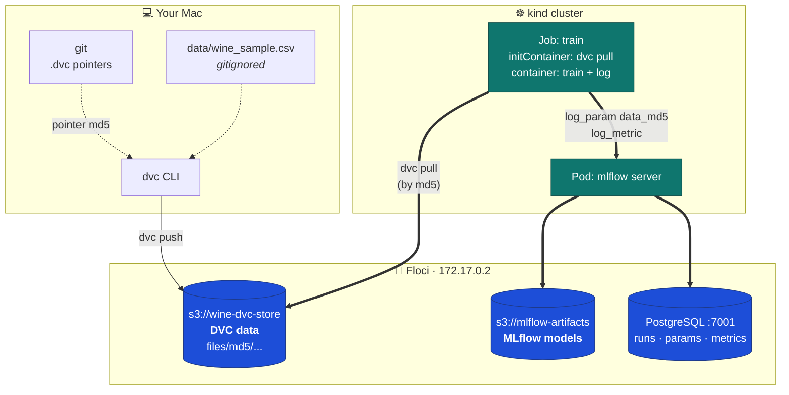
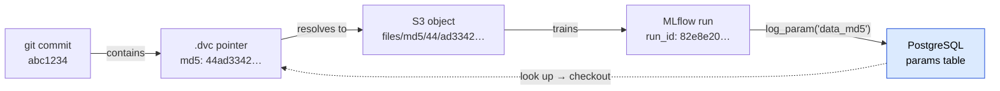
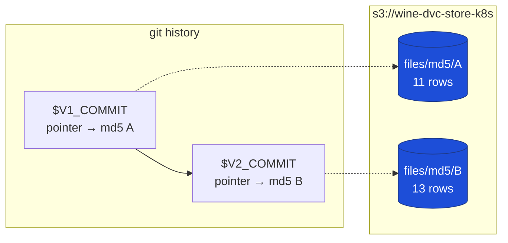
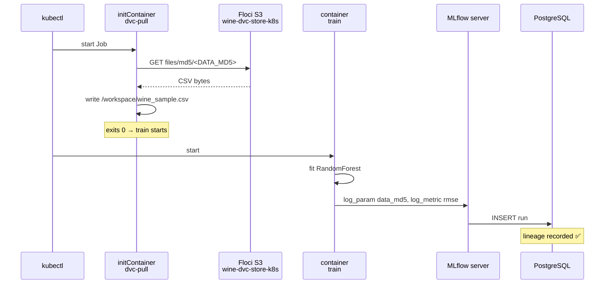
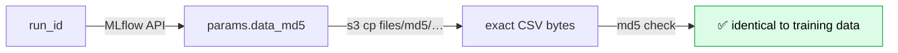

# DVC Data Versioning — Test Plan (K8s + Floci + RDS + MLflow)

A plan for adding **DVC data versioning** to the stack built in
[MLFLOW_PRODUCTION_PLAN.md](MLFLOW_PRODUCTION_PLAN.md), so that every MLflow run records
*which version of the data* it trained on — and you can prove it by reproducing an old run.

- **Builds on:** the `kind` + Floci + RDS PostgreSQL + MLflow setup from the MLflow runbook.
- **Learning reference:** [`mlops-02-wine-perdiction-demo`](../../mlops-02-wine-perdiction-demo)
  already has a **working DVC + Floci S3 remote**. This plan reuses its conventions and
  extends them into Kubernetes.
- **Status:** planning only — nothing here has been executed.
- **Time:** ~25 minutes on top of the MLflow runbook.
- **Cost:** $0 (everything local).

---

## Contents

1. [What mlops-02 already proved](#1-what-mlops-02-already-proved)
2. [What this plan adds](#2-what-this-plan-adds)
3. [Architecture](#3-architecture)
4. [Step 1 — Project and DVC setup](#4-step-1--project-and-dvc-setup)
5. [Step 2 — Wire the Floci S3 remote](#5-step-2--wire-the-floci-s3-remote)
6. [Step 3 — Version the dataset](#6-step-3--version-the-dataset)
7. [Step 4 — Link data version to MLflow runs](#7-step-4--link-data-version-to-mlflow-runs)
8. [Step 5 — Run training inside Kubernetes](#8-step-5--run-training-inside-kubernetes)
9. [Test cases](#9-test-cases)
10. [Cleanup](#10-cleanup)
11. [Troubleshooting](#11-troubleshooting)

---

## 1. What mlops-02 already proved

Read this first — it is the reference implementation, and it **works today**. Verified while
writing this plan:

```bash
# in mlops-02-wine-perdiction-demo
dvc status --cloud
# → Cache and remote 'floci' are in sync.
```

Its committed [`.dvc/config`](../../mlops-02-wine-perdiction-demo/.dvc/config):

```ini
[core]
    remote = floci
['remote "floci"']
    url = s3://wine-dvc-store
    endpointurl = http://localhost:4566
```

### The key insight: content-addressed storage

DVC stores objects by **hash**, not filename. mlops-02's git history has three data
versions, and all three objects are still in the Floci bucket:

| Commit | Message | `.dvc` md5 | Object in S3 | Size |
| --- | --- | --- | --- | --- |
| `e9638b0` | Configure Floci S3 as DVC remote | `9fa1d344…ac34` | `files/md5/9f/a1d344…` | 337 B |
| `ecf0a15` | Update wine_sample.csv to v2 | `77b80a5d…c2b2` | `files/md5/77/b80a5d…` | 363 B |
| `019937e` | Update row 9 fixed_acidity | `44ad3342…8383` | `files/md5/44/ad3342…` | 363 B |

```bash
aws s3 ls s3://wine-dvc-store --recursive
# files/md5/44/ad334235b5efb230fdeebf40098383   363
# files/md5/77/b80a5db7f5b70462b71ca5cd69c2b2   363
# files/md5/9f/a1d344ed54764679f556a79208ac34   337
```

**This is the whole mechanism.** Git holds a tiny `.dvc` pointer file; S3 holds the bytes
keyed by their md5. `git checkout <commit>` + `dvc checkout` restores the exact dataset
that commit referred to. That is the time machine the test cases below exercise.

### Conventions worth carrying forward

| From mlops-02 | Why keep it |
| --- | --- |
| `uv` for dependency management | Same toolchain as this project |
| `dvc[s3]>=3.67.1` | The `[s3]` extra pulls the S3 filesystem support |
| Endpoint in `.dvc/config` (committed), credentials in `.dvc/config.local` (gitignored) | Endpoint is not a secret; keys never get committed |
| Data file gitignored, only `.dvc` pointer committed | Git stays small |
| Verify via **ETag == `.dvc` md5** | Proves the bytes in S3 are exactly what DVC tracked |

> 📌 **Two things to change for Kubernetes.**
> 1. `endpointurl = http://localhost:4566` works from your Mac but **not from inside a pod**
>    — `localhost` there is the pod itself. In-cluster jobs need `http://<floci-ip>:4566`
>    ([§5.2](#52-the-in-cluster-endpoint-problem)).
> 2. mlops-02's `.venv` currently has a **stale shebang** (the folder was renamed), so
>    `dvc` fails with `bad interpreter`. Use `python -m dvc`, or `uv sync` to rebuild.
>    Unrelated to DVC itself — just don't copy the broken venv.

---

## 2. What this plan adds

mlops-02 versions data on a laptop. This plan answers: **which data version produced this
model, and can I reproduce it?**

| Capability | mlops-02 | This plan |
| --- | --- | --- |
| Data versioned in S3 | ✅ | ✅ (same pattern) |
| Data version recorded on the MLflow run | ❌ | ✅ logged as params/tags |
| Training runs in Kubernetes | ❌ | ✅ as a K8s Job |
| Reproduce an old run from its data version | ❌ | ✅ [test case C](#test-case-c--reproduce-an-old-run-) |
| Detect silently-mutated data | ❌ | ✅ [test case D](#test-case-d--catch-mutated-data) |

---

## 3. Architecture

DVC and MLflow both use Floci S3, but for **different things** and in **separate buckets**.



### Who stores what

| Store | Holds | Keyed by |
| --- | --- | --- |
| Git | `.dvc` pointer files, code | commit sha |
| `s3://wine-dvc-store` | **input datasets** | content md5 |
| `s3://mlflow-artifacts` | **output models** | run id |
| PostgreSQL | run metadata, incl. the data md5 | run id |

> 💡 **Separate buckets on purpose.** Inputs and outputs have different lifecycles: you may
> prune old models but must keep training data to stay reproducible. Keeping them apart also
> means `aws s3 rb` on one never destroys the other.

### The link that makes it reproducible



Each MLflow run stores the md5 of the data it used, so **any run can be traced back to its
exact dataset** — and the loop closes: from a run id you can restore the data.

---

## 4. Step 1 — Project and DVC setup

> Assumes the MLflow runbook is up: `floci status` reachable, RDS running, MLflow pod Ready.

### 4.1 Add DVC to this project

```bash
cd /Users/zilongli/Desktop/home/Side-Jobs/AI/mlops-projects/mlops-04-mlflow-production
uv add "dvc[s3]>=3.67.1" mlflow scikit-learn pandas
uv run dvc --version      # expect 3.67.1 or newer
```

> The `[s3]` extra is required — plain `dvc` cannot talk to an S3 remote.

### 4.2 Initialize DVC

This repo already has git, so `dvc init` just adds its own metadata:

```bash
uv run dvc init
git status --short        # expect .dvc/ and .dvcignore
```

### 4.3 Bring in the dataset

Reuse mlops-02's CSV so the two projects share a lineage:

```bash
mkdir -p data
cp ../mlops-02-wine-perdiction-demo/data/wine_sample.csv data/
head -3 data/wine_sample.csv
wc -l data/wine_sample.csv     # 12 lines (header + 11 rows)
```

---

## 5. Step 2 — Wire the Floci S3 remote

### 5.1 Create the bucket and add the remote

```bash
eval $(floci env)                        # AWS_ENDPOINT_URL etc.
export DVC_BUCKET=wine-dvc-store-k8s
aws s3 mb "s3://${DVC_BUCKET}"
```

> Using a **new bucket** keeps this test independent of mlops-02's existing
> `wine-dvc-store`, so nothing you do here can corrupt that reference project.

```bash
uv run dvc remote add -d floci "s3://${DVC_BUCKET}"
uv run dvc remote modify floci endpointurl "http://localhost.floci.io:4566"

# credentials stay local and gitignored — mlops-02's convention
uv run dvc remote modify --local floci access_key_id test
uv run dvc remote modify --local floci secret_access_key test

cat .dvc/config                          # committed: url + endpointurl
cat .dvc/config.local                    # gitignored: keys
```

### 5.2 The in-cluster endpoint problem

`localhost.floci.io` resolves to `127.0.0.1`, which inside a pod means **the pod itself**.
An in-cluster `dvc pull` must use Floci's container IP:

```bash
export FLOCI_IP=$(docker inspect floci \
  --format '{{.NetworkSettings.Networks.bridge.IPAddress}}')
echo "FLOCI_IP=$FLOCI_IP"                # e.g. 172.17.0.2
```

| Runs where | Endpoint to use |
| --- | --- |
| Your Mac (`dvc push`/`pull`) | `http://localhost.floci.io:4566` |
| Inside a pod (K8s Job) | `http://$FLOCI_IP:4566` |

The Job overrides the endpoint by environment variable, so the committed config stays
laptop-friendly:

```bash
# DVC reads this and it wins over .dvc/config
AWS_ENDPOINT_URL=http://${FLOCI_IP}:4566
```

> ⚠️ **The cluster must be joined to Floci's network first** — §6.2 of the MLflow runbook
> (`docker network connect kind floci`). Without it the Job's `dvc pull` cannot reach S3.
> Verify:
>
> ```bash
> docker exec mlflow-demo-control-plane \
>   bash -c "timeout 4 bash -c '</dev/tcp/${FLOCI_IP}/4566' && echo ✅ OK || echo ❌ UNREACHABLE"
> ```

---

## 6. Step 3 — Version the dataset

### 6.1 Track v1 and push

```bash
uv run dvc add data/wine_sample.csv
cat data/wine_sample.csv.dvc             # note the md5
cat data/.gitignore                      # DVC gitignores the CSV for you

uv run dvc push
```

Verify the object landed, and that its **ETag matches the pointer md5** — mlops-02's
strongest check:

```bash
export V1_MD5=$(grep 'md5:' data/wine_sample.csv.dvc | awk '{print $3}')
echo "pointer md5: $V1_MD5"

aws s3api head-object \
  --bucket "${DVC_BUCKET}" \
  --key "files/md5/${V1_MD5:0:2}/${V1_MD5:2}" \
  --query 'ETag' --output text
# → must equal $V1_MD5
```

### 6.2 Commit the pointer

```bash
git add data/wine_sample.csv.dvc data/.gitignore .dvc/config .dvcignore
git commit -m "Track wine dataset v1 with DVC"
export V1_COMMIT=$(git rev-parse --short HEAD)
```

### 6.3 Create v2 and push

```bash
# append two rows — a real data change
cat >> data/wine_sample.csv <<'CSV'
7.9,0.60,0.06,1.6,0.069,5
8.9,0.62,0.18,3.8,0.176,6
CSV

uv run dvc add data/wine_sample.csv
uv run dvc push

export V2_MD5=$(grep 'md5:' data/wine_sample.csv.dvc | awk '{print $3}')
echo "v1=$V1_MD5  v2=$V2_MD5"            # must differ

git add data/wine_sample.csv.dvc
git commit -m "Track wine dataset v2 (2 more rows)"
export V2_COMMIT=$(git rev-parse --short HEAD)
```

Both versions now coexist in the bucket:

```bash
aws s3 ls "s3://${DVC_BUCKET}" --recursive --human-readable --summarize
# expect Total Objects: 2
```



---

## 7. Step 4 — Link data version to MLflow runs

This is the piece mlops-02 does not have: the training script records **which data version
it used**, so the run is traceable.

Create `train.py`:

```python
import hashlib
import os
import subprocess
from pathlib import Path

import mlflow
import pandas as pd
from sklearn.ensemble import RandomForestRegressor
from sklearn.metrics import mean_squared_error
from sklearn.model_selection import train_test_split

DATA = Path("data/wine_sample.csv")


def dvc_md5() -> str | None:
    """Read the md5 DVC recorded for the dataset."""
    import yaml

    pointer = Path(str(DATA) + ".dvc")
    if not pointer.exists():
        return None
    return yaml.safe_load(pointer.read_text())["outs"][0]["md5"]


def file_md5() -> str:
    """Hash the file actually on disk."""
    return hashlib.md5(DATA.read_bytes()).hexdigest()


def git_rev() -> str:
    try:
        return subprocess.check_output(
            ["git", "rev-parse", "--short", "HEAD"], text=True
        ).strip()
    except Exception:
        return "unknown"


df = pd.read_csv(DATA)
X = df.drop(columns=["quality"])
y = df["quality"]
X_tr, X_te, y_tr, y_te = train_test_split(X, y, test_size=0.3, random_state=42)

tracked, actual = dvc_md5(), file_md5()

mlflow.set_experiment("wine-dvc")
with mlflow.start_run() as run:
    model = RandomForestRegressor(n_estimators=50, random_state=42).fit(X_tr, y_tr)
    rmse = mean_squared_error(y_te, model.predict(X_te)) ** 0.5

    # --- the data-lineage record ---
    mlflow.log_param("data_md5", tracked)
    mlflow.log_param("data_rows", len(df))
    mlflow.set_tag("git_commit", git_rev())
    mlflow.set_tag("data_verified", str(tracked == actual))

    mlflow.log_metric("rmse", rmse)
    mlflow.sklearn.log_model(model, name="model")

    print(f"run_id   : {run.info.run_id}")
    print(f"data_md5 : {tracked}")
    print(f"rows     : {len(df)}   rmse: {rmse:.4f}")
    if tracked != actual:
        print(f"⚠️  DATA MISMATCH — on disk {actual}, DVC expects {tracked}")
```

| Logged as | Field | Why |
| --- | --- | --- |
| param | `data_md5` | The version key — resolves to an S3 object |
| param | `data_rows` | Human-readable sanity check |
| tag | `git_commit` | Which pointer commit was used |
| tag | `data_verified` | `False` if the file on disk was tampered with |

> 💡 `data_md5` is a **param**, not a tag, because params are immutable and searchable —
> `mlflow.search_runs(filter_string="params.data_md5 = '...'")` finds every run trained on
> a given dataset version.

---

## 8. Step 5 — Run training inside Kubernetes

Training on the Mac is fine for test case A. To prove the *cluster* can do it, run a Job
whose init container pulls the data.

Create `k8s/train-job.yaml`:

```yaml
apiVersion: batch/v1
kind: Job
metadata:
  name: wine-train
  namespace: mlflow
spec:
  backoffLimit: 0
  template:
    spec:
      restartPolicy: Never
      volumes:
        - name: workspace
          emptyDir: {}
      initContainers:
        # Fetch the exact data version from the DVC remote
        - name: dvc-pull
          image: python:3.12-slim
          env:
            - name: AWS_ENDPOINT_URL
              value: "http://FLOCI_IP_PLACEHOLDER:4566"
            - name: AWS_ACCESS_KEY_ID
              value: "test"
            - name: AWS_SECRET_ACCESS_KEY
              value: "test"
            - name: AWS_DEFAULT_REGION
              value: "us-east-1"
            - name: DATA_MD5
              value: "DATA_MD5_PLACEHOLDER"
          command: ["sh", "-c"]
          args:
            - |
              set -e
              pip install -q "dvc[s3]>=3.67.1"
              # Fetch the object by its content hash, exactly as DVC stores it
              PREFIX=$(echo "$DATA_MD5" | cut -c1-2)
              REST=$(echo "$DATA_MD5" | cut -c3-)
              python -m dvc get-url \
                "s3://DVC_BUCKET_PLACEHOLDER/files/md5/${PREFIX}/${REST}" \
                /workspace/wine_sample.csv
              echo "pulled $DATA_MD5:"
              head -2 /workspace/wine_sample.csv
              wc -l /workspace/wine_sample.csv
          volumeMounts:
            - name: workspace
              mountPath: /workspace
      containers:
        - name: train
          image: python:3.12-slim
          env:
            - name: MLFLOW_TRACKING_URI
              value: "http://mlflow.mlflow.svc.cluster.local:80"
            - name: DATA_MD5
              value: "DATA_MD5_PLACEHOLDER"
          command: ["sh", "-c"]
          args:
            - |
              set -e
              pip install -q mlflow scikit-learn pandas
              python /workspace/train_job.py
          volumeMounts:
            - name: workspace
              mountPath: /workspace
```

> ✅ **The `dvc get-url` mechanism is verified.** Fetching
> `s3://wine-dvc-store/files/md5/44/ad334235b5efb230fdeebf40098383` with only
> `AWS_ENDPOINT_URL` set returned a file whose md5 was exactly `44ad3342…8383` — the
> content-addressed pull works against Floci with no `.dvc/config` present, which is why the
> init container needs nothing but env vars. The Job manifest above also passes
> `kubectl apply --dry-run=client`.

Render the placeholders and submit:

```bash
mkdir -p k8s
# (write the YAML above to k8s/train-job.yaml first)

export DATA_MD5=$(grep 'md5:' data/wine_sample.csv.dvc | awk '{print $3}')

sed -e "s|FLOCI_IP_PLACEHOLDER|${FLOCI_IP}|g" \
    -e "s|DATA_MD5_PLACEHOLDER|${DATA_MD5}|g" \
    -e "s|DVC_BUCKET_PLACEHOLDER|${DVC_BUCKET}|g" \
    k8s/train-job.yaml > /tmp/train-job.rendered.yaml

grep -E "value:" /tmp/train-job.rendered.yaml    # confirm no PLACEHOLDER left
```

The training script has to reach the pod's workspace. Simplest route is a ConfigMap:

```bash
kubectl create configmap train-script -n mlflow \
  --from-file=train_job.py=train.py --dry-run=client -o yaml | kubectl apply -f -
```

> Then add a `configMap` volume for `train-script` mounted at `/workspace`, or have the
> init container copy it in. Keeping the script in a ConfigMap avoids building an image —
> fine for a test, not for production (there, bake it into an image).

```bash
kubectl apply -f /tmp/train-job.rendered.yaml
kubectl wait --for=condition=complete job/wine-train -n mlflow --timeout=5m
kubectl logs -n mlflow job/wine-train -c dvc-pull
kubectl logs -n mlflow job/wine-train -c train
```



---

## 9. Test cases

### Test case A — Data version is recorded on the run ⭐

**The primary test.** Proves the data→model link exists.

```bash
export MLFLOW_TRACKING_URI=http://localhost:5000    # port-forward must be running
uv run python train.py
```

Expected output:

```
run_id   : 3f9a...
data_md5 : 44ad334235b5efb230fdeebf40098383
rows     : 13   rmse: 0.6...
```

Confirm it reached PostgreSQL — the authoritative store:

```bash
psql -h 127.0.0.1 -p 15432 -U "$MASTER_USER" -d mlflow <<'SQL'
SELECT r.run_uuid, p.key, p.value
FROM runs r JOIN params p ON p.run_uuid = r.run_uuid
WHERE p.key IN ('data_md5','data_rows')
ORDER BY r.start_time DESC LIMIT 4;
SQL
```

**Pass criteria**
- `data_md5` equals the md5 in `data/wine_sample.csv.dvc`
- `data_verified` tag is `True`
- In the UI (**Experiments → wine-dvc → run → Parameters**), `data_md5` is visible

---

### Test case B — Two data versions produce two distinguishable runs

```bash
# v1
git checkout "$V1_COMMIT" -- data/wine_sample.csv.dvc
uv run dvc checkout data/wine_sample.csv.dvc
wc -l data/wine_sample.csv          # 12 lines
uv run python train.py              # note run_id + rmse

# v2
git checkout "$V2_COMMIT" -- data/wine_sample.csv.dvc
uv run dvc checkout data/wine_sample.csv.dvc
wc -l data/wine_sample.csv          # 14 lines
uv run python train.py
```

Compare in SQL:

```bash
psql -h 127.0.0.1 -p 15432 -U "$MASTER_USER" -d mlflow <<'SQL'
SELECT substring(r.run_uuid,1,8) AS run,
       MAX(CASE WHEN p.key='data_md5'  THEN p.value END) AS data_md5,
       MAX(CASE WHEN p.key='data_rows' THEN p.value END) AS rows,
       MAX(m.value) AS rmse
FROM runs r
JOIN params p  ON p.run_uuid = r.run_uuid
LEFT JOIN metrics m ON m.run_uuid = r.run_uuid AND m.key='rmse'
GROUP BY r.run_uuid ORDER BY MAX(r.start_time) DESC LIMIT 4;
SQL
```

**Pass:** two runs with **different `data_md5`** and different `rows`.

**UI:** select both runs → **Compare** → `data_md5` differs in the parameters table.

---

### Test case C — Reproduce an old run ⭐

The real payoff: go from a run id back to its exact dataset.

```bash
uv run python - <<'PY'
import mlflow
from mlflow.tracking import MlflowClient

client = MlflowClient()
exp = client.get_experiment_by_name("wine-dvc")
runs = client.search_runs([exp.experiment_id], order_by=["attributes.start_time ASC"])
oldest = runs[0]
print("run_id  :", oldest.info.run_id)
print("data_md5:", oldest.data.params["data_md5"])
print("rows    :", oldest.data.params["data_rows"])
print("git     :", oldest.data.tags.get("git_commit"))
PY
```

Restore that dataset by hash — no guessing which commit it was:

```bash
export OLD_MD5="paste-the-data_md5-printed-above"
aws s3 cp "s3://${DVC_BUCKET}/files/md5/${OLD_MD5:0:2}/${OLD_MD5:2}" /tmp/restored.csv
md5 -q /tmp/restored.csv      # must equal $OLD_MD5
wc -l /tmp/restored.csv       # matches the run's data_rows (+1 for header)
```

**Pass:** the restored file's md5 equals the run's `data_md5`, and the row count matches
what the run recorded. **The run is reproducible from its metadata alone.**



---

### Test case D — Catch mutated data

Proves DVC detects silent corruption that git alone would miss.

```bash
echo "9.9,0.99,0.99,9.9,0.999,9" >> data/wine_sample.csv   # tamper

uv run dvc status                 # expect: modified: data/wine_sample.csv
uv run python train.py            # expect ⚠️ DATA MISMATCH warning
```

Check the run was flagged:

```bash
psql -h 127.0.0.1 -p 15432 -U "$MASTER_USER" -d mlflow -c \
  "SELECT value FROM tags WHERE key='data_verified' ORDER BY run_uuid DESC LIMIT 1;"
```

Restore:

```bash
uv run dvc checkout data/wine_sample.csv.dvc
uv run dvc status                 # expect: Data and pipelines are up to date.
```

**Pass:** `dvc status` reports the modification, the run is tagged
`data_verified=False`, and `dvc checkout` restores the tracked bytes.

---

### Test case E — In-cluster Job pulls the right version

```bash
kubectl apply -f /tmp/train-job.rendered.yaml
kubectl wait --for=condition=complete job/wine-train -n mlflow --timeout=5m
kubectl logs -n mlflow job/wine-train -c dvc-pull | tail -5
```

**Pass:** the init container logs the row count matching `$DATA_MD5`'s version, the train
container logs a run id, and that run appears in the UI with the same `data_md5`.

---

### Results table

| # | Test | Pass criteria |
| --- | --- | --- |
| A | Version recorded | `data_md5` in PostgreSQL matches the `.dvc` pointer ⭐ |
| B | Two versions | Two runs, different `data_md5` and `data_rows` |
| C | Reproduce old run | S3 object md5 == run's `data_md5` ⭐ |
| D | Mutated data | `dvc status` flags it; run tagged `data_verified=False` |
| E | In-cluster Job | Init container pulls by hash; run logged from the pod |

---

## 10. Cleanup

```bash
# Kubernetes
kubectl delete job wine-train -n mlflow --ignore-not-found
kubectl delete configmap train-script -n mlflow --ignore-not-found

# DVC bucket for this test (leaves mlops-02's wine-dvc-store alone)
aws s3 rm "s3://${DVC_BUCKET}" --recursive
aws s3 rb "s3://${DVC_BUCKET}"
aws s3 ls

# Local
rm -f /tmp/train-job.rendered.yaml /tmp/restored.csv
```

Then follow [§9 of the MLflow runbook](MLFLOW_PRODUCTION_PLAN.md#9-cleanup) for RDS, the
sidecar, and the cluster.

> ⚠️ **Do not delete `s3://wine-dvc-store`** — that is mlops-02's reference data, with three
> historical versions worth keeping.

---

## 11. Troubleshooting

### `dvc: bad interpreter` (seen in mlops-02)

The venv was created under a different folder name and its shebangs are stale:

```bash
python -m dvc --version      # workaround
uv sync                      # real fix: rebuild the venv
```

### `dvc push` → `Unable to locate credentials`

Credentials live in `.dvc/config.local`, which is gitignored and does not survive a clone:

```bash
cat .dvc/config.local || echo "missing"
uv run dvc remote modify --local floci access_key_id test
uv run dvc remote modify --local floci secret_access_key test
```

### `dvc push` → `EndpointConnectionError`

```bash
floci status                                    # Reachable: yes?
uv run dvc remote list                          # url + which remote is default
grep endpointurl .dvc/config                    # http://localhost.floci.io:4566
```

### Job's `dvc-pull` init container hangs or cannot connect

| Cause | Check | Fix |
| --- | --- | --- |
| Networks not joined | `docker inspect floci --format '{{range $k,$v := .NetworkSettings.Networks}}{{$k}} {{end}}'` | `docker network connect kind floci` |
| Endpoint is `localhost` | `kubectl get job wine-train -n mlflow -o yaml \| grep ENDPOINT -A1` | use `http://$FLOCI_IP:4566` |
| Object missing | `aws s3 ls "s3://${DVC_BUCKET}" --recursive` | `dvc push` from the Mac first |

```bash
kubectl logs -n mlflow job/wine-train -c dvc-pull
kubectl describe job wine-train -n mlflow | tail -20
```

### Floci restarted and the bucket is empty

Floci's S3 is in-memory by default, so objects vanish on restart while the `.dvc` pointers
in git remain — `dvc status --cloud` then reports everything as missing:

```bash
aws s3 mb "s3://${DVC_BUCKET}"
uv run dvc push                   # re-upload from the local DVC cache
uv run dvc status --cloud         # → in sync
```

> The local cache (`.dvc/cache`) is what makes recovery possible. If both are gone, the data
> is only recoverable from whoever still has it — the argument for `floci snapshot` or a
> persistent remote.

### `data_md5` is `None` on a run

`train.py` could not read the pointer — usually the CSV was never `dvc add`ed:

```bash
ls data/wine_sample.csv.dvc || uv run dvc add data/wine_sample.csv
```

---

## Appendix — Command reference

```bash
# DVC
uv run dvc status                 # local vs pointer
uv run dvc status --cloud         # cache vs remote
uv run dvc remote list
uv run dvc add data/wine_sample.csv
uv run dvc push / pull / checkout

# Version bookkeeping
grep 'md5:' data/wine_sample.csv.dvc
git log --oneline -- data/wine_sample.csv.dvc

# Bucket
aws s3 ls "s3://${DVC_BUCKET}" --recursive --human-readable --summarize
aws s3api head-object --bucket "${DVC_BUCKET}" --key "files/md5/XX/YYY" --query ETag

# Lineage in SQL
psql -h 127.0.0.1 -p 15432 -U "$MASTER_USER" -d mlflow -c \
  "SELECT value, COUNT(*) FROM params WHERE key='data_md5' GROUP BY value;"
```

### Toward production

| This test | Production |
| --- | --- |
| `dvc get-url` by hash in an init container | `dvc pull` against the repo, or a DVC pipeline stage |
| Script in a ConfigMap | Baked into a versioned training image |
| `test`/`test` keys inline | IRSA / External Secrets |
| Floci S3 (in-memory) | Real S3 with versioning + lifecycle rules |
| Manual `git checkout` + `dvc checkout` | `dvc exp` / `dvc repro` with a `dvc.yaml` pipeline |
| md5 logged by hand | `mlflow.log_input()` with a DVC-backed dataset |
