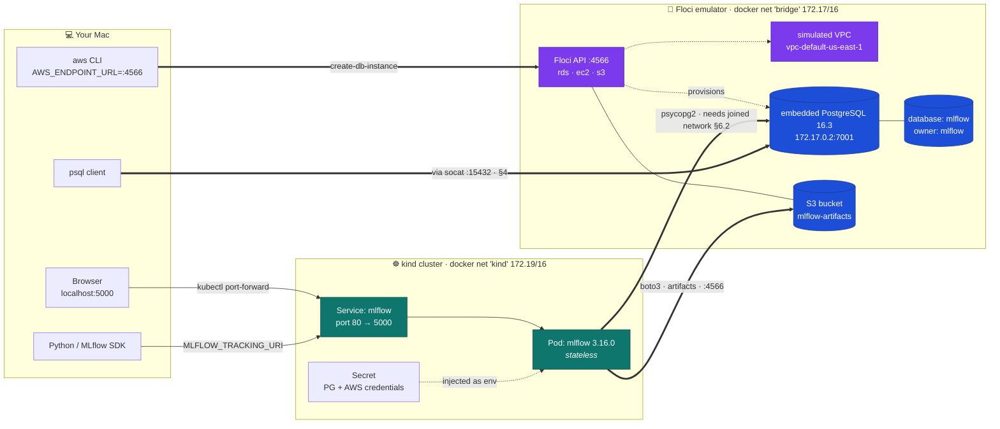
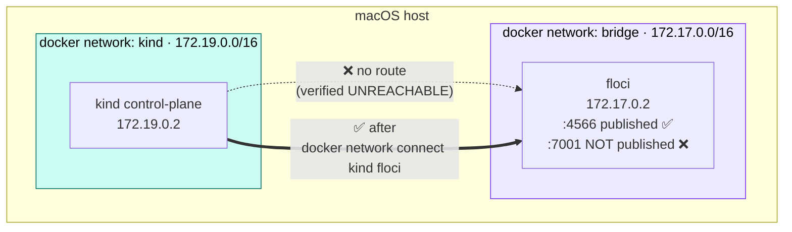
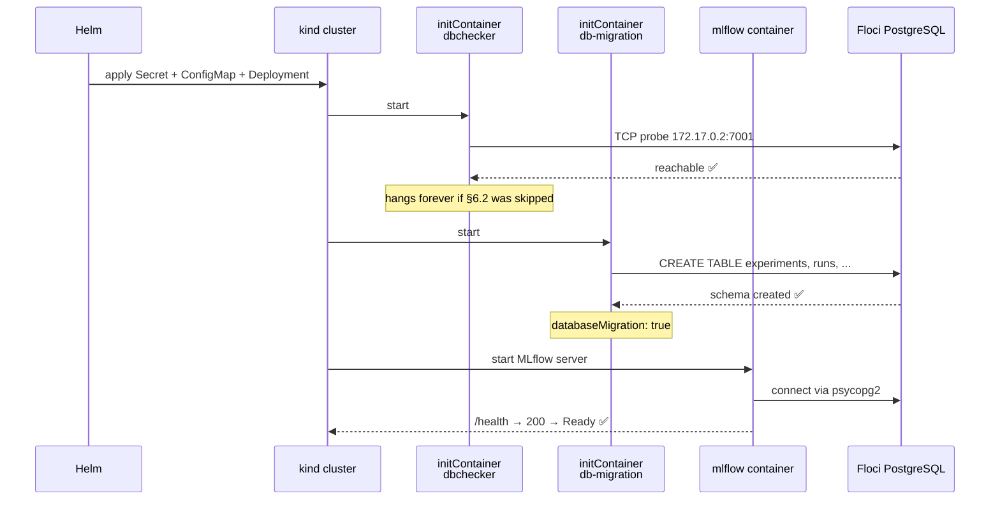
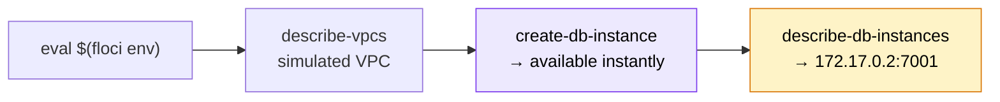
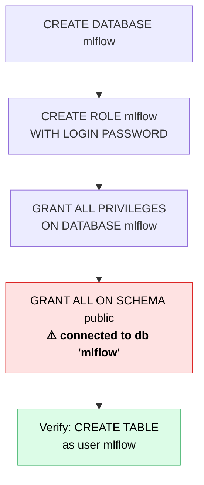
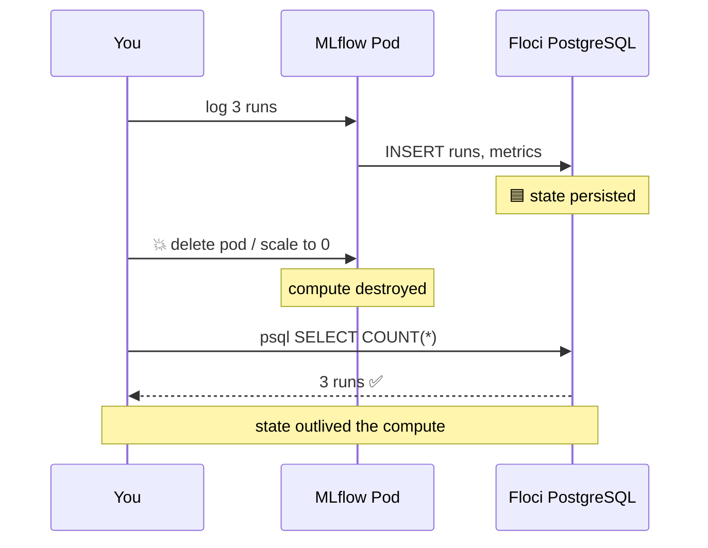
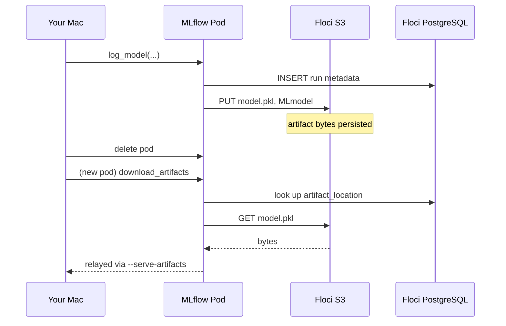
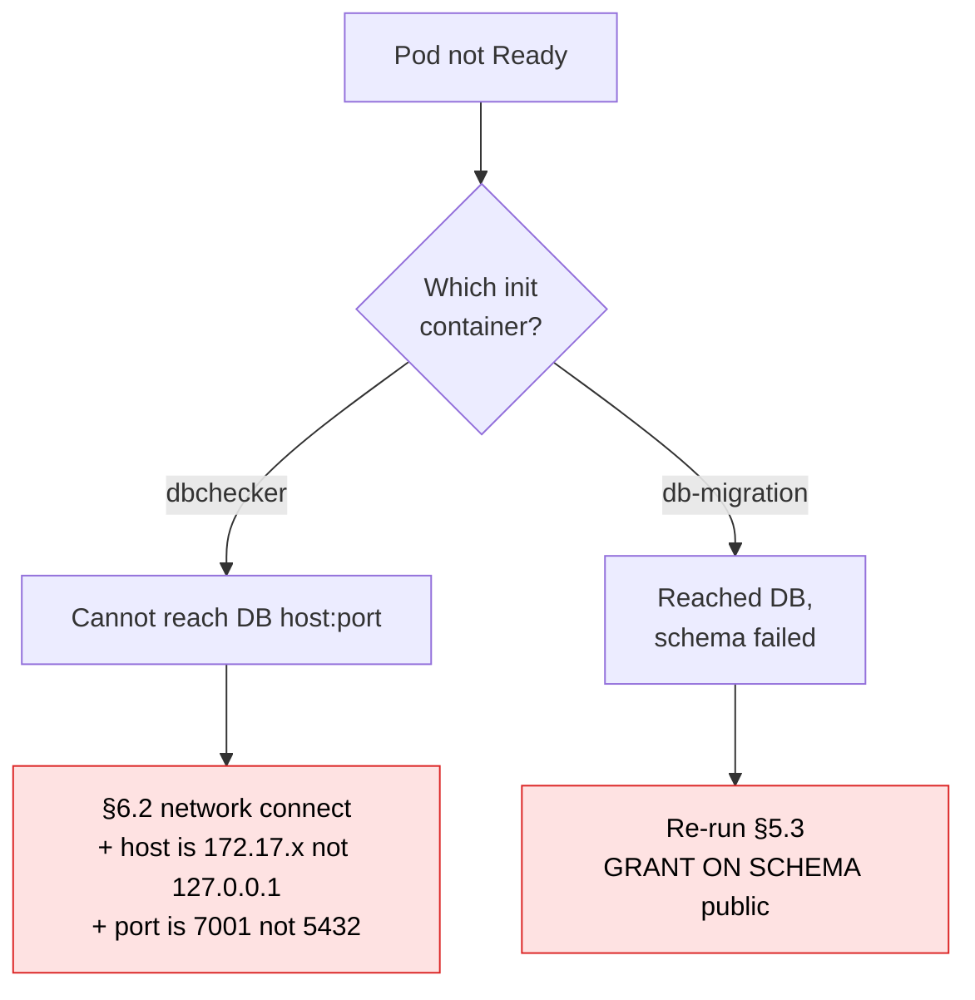

# MLflow on Kubernetes with PostgreSQL — Local Floci Runbook

A step-by-step runbook for standing up MLflow on a local `kind` cluster, backed by a
**stateful PostgreSQL database provisioned through the AWS CLI** against the
**[Floci](https://floci.io) local AWS emulator**. RDS, VPC, and S3 are simulated locally —
**no real AWS account is touched and nothing is billed.**

The point of the exercise is to prove MLflow's state lives *outside* the cluster: metadata
in PostgreSQL, artifacts in S3. You can destroy every pod and both survive.

- **Audience:** an engineer or tester running this end-to-end on a Mac for the first time.
- **Time:** ~15 minutes. Floci provisions RDS instantly, so there is no 10-minute wait.
- **Cost:** $0.
- **Interface:** the ordinary `aws` CLI throughout. Only `AWS_ENDPOINT_URL` differs from real AWS.
- **Next:** [DVC_DATA_VERSIONING_PLAN.md](DVC_DATA_VERSIONING_PLAN.md) adds data versioning on
  top of this stack, so each run records which dataset version it trained on.
- **UI guide (Chinese):** [MLFLOW_UI_使用指南.md](MLFLOW_UI_使用指南.md) — how to read and use
  the MLflow web interface, and how the three documents fit together.
- **Chinese translation:** this runbook split in two —
  [搭建篇](MLFLOW_生产部署_搭建篇.md) (setup, §1–7 + troubleshooting) and
  [测试篇](MLFLOW_生产部署_测试篇.md) (test cases + cleanup). The Chinese version also
  carries three corrections found while actually running this plan: the pod must use
  Floci's **kind-network** address (not the bridge IP), `memory: 1Gi` gets OOMKilled
  (use 3Gi), and `artifact_location` holds a `mlflow-artifacts:/` proxy URI rather than
  `s3://`.

> ### ⚠️ Read this before you start
>
> Two networking facts decide whether this works. Both are verified against the running
> emulator, and both are handled in the steps below — but they are the reason you cannot
> simply copy a real-AWS runbook.
>
> 1. **A Floci RDS endpoint is a Docker-internal address on a non-standard port** — e.g.
>    `172.17.0.2:7001`, not `<id>.rds.amazonaws.com:5432`. Only Floci's API port 4566 is
>    published to your Mac, so the database port is **not** reachable from macOS by default
>    ([§4](#4-step-2--reach-the-database-from-your-mac) fixes this).
> 2. **`kind` and Floci sit on different Docker networks** (`kind` = 172.19.0.0/16,
>    `bridge` = 172.17.0.0/16) with no route between them. A pod cannot reach the database
>    until you join the networks ([§6.2](#62-join-floci-to-the-kind-network--required)).

---

## Contents

1. [Architecture](#1-architecture)
2. [Prerequisites](#2-prerequisites)
3. [Step 1 — Provision RDS + VPC via the AWS CLI](#3-step-1--provision-rds--vpc-via-the-aws-cli)
4. [Step 2 — Reach the database from your Mac](#4-step-2--reach-the-database-from-your-mac)
5. [Step 3 — Create the `mlflow` database, user, and grants](#5-step-3--create-the-mlflow-database-user-and-grants)
6. [Step 4 — Create the kind cluster and install MLflow](#6-step-4--create-the-kind-cluster-and-install-mlflow)
7. [Step 5 & 6 — Verify the pod and port-forward](#7-steps-5--6--verify-the-pod-and-port-forward)
8. [Test cases](#8-test-cases)
9. [Cleanup](#9-cleanup)
10. [Troubleshooting](#10-troubleshooting)
11. [Floci vs. real AWS](#11-floci-vs-real-aws)

---

## 1. Architecture

The idea in one picture: **compute is disposable, state is not.** Everything in the dashed
box is emulated locally by Floci but driven with the real `aws` CLI.



**Legend** — 🟦 durable state · 🟩 disposable compute · 🟪 Floci-simulated AWS control plane.

### Why this shape

| Concern | Where it lives | Why |
| --- | --- | --- |
| Experiments, runs, metrics, model registry | Floci's embedded PostgreSQL | Survives pod restarts and cluster deletion |
| MLflow server process | kind pod | Stateless — safe to kill and rescale |
| DB credentials | Kubernetes Secret | Never baked into the image or pod args |
| RDS / VPC control plane | Floci `:4566` | Real `aws` CLI verbs, no cloud account |
| Artifacts (files, models) | Floci S3 bucket | Survives pod restarts — see note below |

> ✅ **Artifacts are durable too — stored in Floci's emulated S3.** The pod runs
> `readOnlyRootFilesystem: true` with only `/tmp` writable, so the chart's default
> (`./mlruns`) would put artifacts in ephemeral pod storage. Instead we enable
> `artifactRoot.s3` against Floci's S3 ([§6.5](#65-write-the-values-file)), which makes
> **both** metadata *and* artifact files outlive the pod.
> [Test case C](#test-case-c--artifact-durability-in-s3) proves it.
>
> Verified working: MLflow wrote `s3://mlflow-artifacts/...` through Floci and the bytes
> read back intact.

### The two networks (why §6.2 exists)



### Sequence: what happens on `helm install`



---

## 2. Prerequisites

All verified present on this machine:

| Tool | Status | Install if missing |
| --- | --- | --- |
| floci CLI 0.2.1 | ✅ (server 2.0.1) | `brew install floci` |
| AWS CLI 2.31 | ✅ | `brew install awscli` |
| kubectl 1.34 | ✅ | `brew install kubectl` |
| kind 0.33 | ✅ | `brew install kind` |
| Helm 4.3 | ✅ | `brew install helm` |
| Docker 29.2 | ✅ running | Docker Desktop |
| **psql 18.6** | ✅ installed | see §2.1 below |

### 2.1 The PostgreSQL client on macOS

`psql` is already installed here via Homebrew's **`libpq`** — the PostgreSQL *client*
library, with no server attached, which is all this plan needs:

```bash
brew install libpq
brew link --force libpq     # required: libpq is keg-only
```

```bash
command -v psql             # → /opt/homebrew/bin/psql
psql --version              # → psql (PostgreSQL) 18.6
```

> ❗ **`brew link --force` is not optional.** `libpq` is *keg-only* — Homebrew installs it
> but deliberately leaves it out of your `PATH` to avoid clashing with a full `postgresql`
> install. Without the link, `brew install libpq` succeeds and `psql` still reports
> "command not found". If you prefer not to link it, add the directory to your `PATH` instead:
>
> ```bash
> echo 'export PATH="/opt/homebrew/opt/libpq/bin:$PATH"' >> ~/.zshrc && exec zsh
> ```

**Client vs. server — a newer client is fine.** `psql` 18.6 talks to Floci's PostgreSQL
16.3 server without issue; the wire protocol is stable and newer clients are
backward-compatible. `brew install postgresql@16` would also provide `psql`, but it
installs a full database server you do not need.

| Alternative | Verdict |
| --- | --- |
| `brew install libpq` + link | ✅ **recommended** — client only, ~35 MB |
| `brew install postgresql@16` | Works, but installs an unnecessary server |
| Postgres.app | GUI-oriented; bundles a server too |
| **PopSQL** (installed here) | GUI client — fine for browsing (§4), **cannot** run this plan's scripted heredocs |

> 💡 **No psql at all?** Every `psql` command below has a Docker equivalent in
> [§10](#10-troubleshooting) using `postgres:16`, so the plan can run with nothing installed.

### 2.2 Start Floci and load its environment

```bash
floci start          # no-op if already running
floci status         # expect: Reachable: yes
```

```bash
eval $(floci env)
env | grep AWS_
```

`floci env` exports exactly four variables:

```
AWS_ENDPOINT_URL=http://localhost.floci.io:4566
AWS_ACCESS_KEY_ID=test
AWS_SECRET_ACCESS_KEY=test
AWS_DEFAULT_REGION=us-east-1
```

> `AWS_ENDPOINT_URL` is what redirects every `aws` command to the emulator.
> `localhost.floci.io` is a public DNS name that resolves to `127.0.0.1`.
> **Credentials are the literal string `test`** — Floci does not validate them.

Confirm `rds`, `ec2`, and `s3` are enabled:

```bash
floci services | grep -E "✓  (rds|ec2|s3)$"
```

> 🛡️ **Safety check — make sure you are not pointed at real AWS.** If `AWS_ENDPOINT_URL`
> is unset, every command below would hit your real account (`529004977151`). Verify:
>
> ```bash
> echo "${AWS_ENDPOINT_URL:?FATAL: not set — run: eval \$(floci env)}"
> aws sts get-caller-identity --query Account --output text   # Floci → 000000000000
> ```
>
> Real AWS returns `529004977151`. **If you see that, stop and re-run `eval $(floci env)`.**

---

## 3. Step 1 — Provision RDS + VPC via the AWS CLI

> **Goal:** a PostgreSQL instance created with ordinary `aws rds` commands, inside Floci's simulated VPC.

### 3.1 Inspect the simulated VPC

Floci pre-creates a default VPC, so there is nothing to build:

```bash
aws ec2 describe-vpcs \
  --filters "Name=isDefault,Values=true" \
  --query 'Vpcs[0].{VpcId:VpcId,Cidr:CidrBlock}' --output json
```

```json
{ "VpcId": "vpc-default-us-east-1", "Cidr": "172.31.0.0/16" }
```

```bash
aws ec2 describe-subnets \
  --filters "Name=vpc-id,Values=vpc-default-us-east-1" \
  --query 'Subnets[].{Subnet:SubnetId,AZ:AvailabilityZone}' --output table
```

> 🧪 **Simulation boundary.** That `172.31.0.0/16` CIDR is metadata only — no real network
> is created, and the RDS endpoint will **not** be inside it. Security groups are accepted
> and returned but **not enforced**, so there is no laptop-IP allow-listing step here.
> See [§11](#11-floci-vs-real-aws).

### 3.2 Set shell variables

```bash
export DB_ID=mlflow-pg
export DB_CLASS=db.t3.micro
export MASTER_USER=postgres
export MASTER_PW='MasterPw12345'
export MLFLOW_DB_PW='MlflowPw12345'
```

> Fixed passwords are fine for a local emulator with no real data. On real AWS, generate
> them (`LC_ALL=C tr -dc 'A-Za-z0-9' </dev/urandom | head -c 20`) and never commit them.

### 3.3 Create the DB instance

```bash
aws rds create-db-instance \
  --db-instance-identifier "$DB_ID" \
  --db-instance-class "$DB_CLASS" \
  --engine postgres \
  --master-username "$MASTER_USER" \
  --master-user-password "$MASTER_PW" \
  --allocated-storage 20 \
  --publicly-accessible
```

Floci returns `"DBInstanceStatus": "available"` **immediately**. The wait command still
works and returns at once, so the same script runs against real AWS unchanged:

```bash
aws rds wait db-instance-available --db-instance-identifier "$DB_ID"
echo "✅ RDS available"
```

### 3.4 Capture the endpoint — note the port

```bash
export PGHOST=$(aws rds describe-db-instances \
  --db-instance-identifier "$DB_ID" \
  --query 'DBInstances[0].Endpoint.Address' --output text)

export PGPORT=$(aws rds describe-db-instances \
  --db-instance-identifier "$DB_ID" \
  --query 'DBInstances[0].Endpoint.Port' --output text)

echo "PGHOST=$PGHOST  PGPORT=$PGPORT"   # e.g. 172.17.0.2  7001
```

> ❗ **The big difference from real AWS.** You get a **Docker bridge IP and a non-standard
> port** (`172.17.0.2:7001`), not a DNS hostname on 5432. Always use `$PGPORT` — never
> hard-code 5432. This address is reachable from *other containers on the `bridge` network*,
> but not from macOS ([§4](#4-step-2--reach-the-database-from-your-mac)) and not from
> `kind` ([§6.2](#62-join-floci-to-the-kind-network--required)).



---

## 4. Step 2 — Reach the database from your Mac

Floci publishes only its API port 4566, so `172.17.0.2:7001` is unreachable from macOS
(Docker Desktop gives no host route to container IPs). Publish it with a tiny `socat` sidecar:

```bash
docker run -d --name floci-pg-fwd \
  -p 15432:${PGPORT} \
  --network bridge \
  alpine/socat:latest \
  TCP-LISTEN:${PGPORT},fork,reuseaddr TCP:${PGHOST}:${PGPORT}
```

Now your Mac reaches the database at **`127.0.0.1:15432`**:

```bash
nc -z 127.0.0.1 15432 && echo "✅ port open"

export PGPASSWORD="$MASTER_PW"
psql -h 127.0.0.1 -p 15432 -U "$MASTER_USER" -d postgres -c "SELECT version();"
```

Expect a real server banner — Floci runs genuine PostgreSQL, not a stub:

```
PostgreSQL 16.3 on aarch64-unknown-linux-musl, compiled by gcc (Alpine 13.2.1) ...
```

> ✅ **This path is verified working on this machine.** Provisioned via
> `aws rds create-db-instance` against Floci, reached from the Mac terminal through the
> sidecar, then `CREATE DATABASE mlflow`, `CREATE ROLE mlflow`, the §5 grants, and a
> `CREATE TABLE` + `INSERT` **as the `mlflow` user** all succeeded — the table persisted
> across a reconnect and showed `Owner: mlflow`. Test artifacts were removed afterwards.

> 🔑 **Two addresses for one database — keep them straight:**
>
> | From | Address | Used in |
> | --- | --- | --- |
> | Your Mac (`psql`) | `127.0.0.1:15432` | §4, §5, test case B |
> | Inside the cluster (pods) | `172.17.0.2:7001` (`$PGHOST:$PGPORT`) | §6.3 values file |
>
> Putting `127.0.0.1` in the Helm values is the most common mistake — inside a pod that
> means *the pod itself*, and the init container hangs forever.

---

## 5. Step 3 — Create the `mlflow` database, user, and grants

> **Goal:** a dedicated least-privilege role. The MLflow pod never uses the master account.

### 5.1 Create the database

```bash
psql -h 127.0.0.1 -p 15432 -U "$MASTER_USER" -d postgres -c "CREATE DATABASE mlflow;"
psql -h 127.0.0.1 -p 15432 -U "$MASTER_USER" -d postgres -c "\l mlflow"
```

### 5.2 Create the `mlflow` role

```bash
psql -h 127.0.0.1 -p 15432 -U "$MASTER_USER" -d postgres <<SQL
CREATE ROLE mlflow WITH LOGIN PASSWORD '${MLFLOW_DB_PW}';
GRANT ALL PRIVILEGES ON DATABASE mlflow TO mlflow;
ALTER DATABASE mlflow OWNER TO mlflow;
SQL
```

### 5.3 Grant schema privileges (the step everyone forgets)

Since PostgreSQL 15, `GRANT ALL ON DATABASE` does **not** allow creating tables. The
`public` schema must be granted separately — and you must **connect to the `mlflow`
database** to do it, because schema grants are per-database. Floci runs PostgreSQL 16.3,
so this applies:

```bash
psql -h 127.0.0.1 -p 15432 -U "$MASTER_USER" -d mlflow <<SQL
GRANT ALL ON SCHEMA public TO mlflow;
ALTER SCHEMA public OWNER TO mlflow;
SQL
```

> ❗ Skip this and the `db-migration` init container fails with
> `permission denied for schema public`, leaving the pod in `Init:CrashLoopBackOff`.

### 5.4 Verify the role can actually create tables

Do not trust the grants — prove them:

```bash
PGPASSWORD="$MLFLOW_DB_PW" psql -h 127.0.0.1 -p 15432 -U mlflow -d mlflow <<SQL
CREATE TABLE grant_check (id int);
DROP TABLE grant_check;
SELECT '✅ mlflow user can create tables' AS result;
SQL
```



---

## 6. Step 4 — Create the kind cluster and install MLflow

### 6.1 Create the cluster

```bash
kind create cluster --name mlflow-demo
kubectl cluster-info --context kind-mlflow-demo
kubectl get nodes
```

### 6.2 Join Floci to the kind network ⚠️ required

`kind` creates its own Docker network (`kind`, 172.19.0.0/16). Floci is on `bridge`
(172.17.0.0/16). **There is no route between them** — verified: a probe from the kind node
to `172.17.0.2:7001` reports `UNREACHABLE`. Attach Floci to the kind network as well:

```bash
docker network connect kind floci

# Verify floci now has an address on BOTH networks
docker inspect floci \
  --format '{{range $k,$v := .NetworkSettings.Networks}}{{$k}}={{$v.IPAddress}} {{end}}'
# expect: bridge=172.17.0.2 kind=172.19.0.x
```

Confirm the kind node can now reach the database port:

```bash
docker exec mlflow-demo-control-plane \
  bash -c "timeout 4 bash -c '</dev/tcp/${PGHOST}/${PGPORT}' && echo ✅ REACHABLE || echo ❌ UNREACHABLE"
```

> ❗ **Do not continue until this prints `✅ REACHABLE`.** Otherwise the `dbchecker` init
> container retries forever and the pod never starts. A container keeps its original
> `bridge` IP after joining a second network, so `$PGHOST` stays valid.

### 6.3 Create the S3 bucket for artifacts

Same `aws s3` verbs as real AWS — only the endpoint differs:

```bash
export ARTIFACT_BUCKET=mlflow-artifacts
aws s3 mb "s3://${ARTIFACT_BUCKET}"
aws s3 ls
```

The pod reaches Floci's S3 API on the **same container IP as the database**, port 4566:

```bash
export FLOCI_IP=$(docker inspect floci \
  --format '{{.NetworkSettings.Networks.bridge.IPAddress}}')
echo "FLOCI_IP=$FLOCI_IP"        # e.g. 172.17.0.2 — same host as $PGHOST
```

Verify the endpoint is reachable from inside the cluster (this needs [§6.2](#62-join-floci-to-the-kind-network--required)):

```bash
docker exec mlflow-demo-control-plane \
  bash -c "timeout 4 bash -c '</dev/tcp/${FLOCI_IP}/4566' && echo ✅ S3 API REACHABLE || echo ❌ UNREACHABLE"
```

> 🧪 **Floci's S3 is a real object store, not a stub.** Verified: `mb`, `cp`, `ls`, and a
> byte-for-byte `get` round-trip all behave like S3, and MLflow's own boto3 client wrote
> and read artifacts through it successfully.

### 6.4 Add the Helm repo

```bash
helm repo add community-charts https://community-charts.github.io/helm-charts
helm repo update community-charts
helm search repo community-charts/mlflow --versions | head -3
```

### 6.5 Write the values file

Credentials come from environment variables, so **no secret is written to disk by hand**:

```bash
cat > /tmp/mlflow-values.yaml <<YAML
backendStore:
  databaseMigration: true
  databaseConnectionCheck: true
  postgres:
    enabled: true
    host: "${PGHOST}"
    port: ${PGPORT}
    database: "mlflow"
    user: "mlflow"
    password: "${MLFLOW_DB_PW}"
    driver: "psycopg2"

# Artifacts go to Floci's emulated S3, not the pod's ephemeral /tmp.
artifactRoot:
  proxiedArtifactStorage: true
  s3:
    enabled: true
    bucket: "${ARTIFACT_BUCKET}"
    path: "experiments"
    awsAccessKeyId: "test"
    awsSecretAccessKey: "test"

# Point MLflow's boto3 client at Floci instead of real AWS S3.
extraEnvVars:
  MLFLOW_S3_ENDPOINT_URL: "http://${FLOCI_IP}:4566"
  AWS_DEFAULT_REGION: "us-east-1"
  MLFLOW_S3_IGNORE_TLS: "true"

resources:
  requests:
    cpu: 100m
    memory: 256Mi
  limits:
    memory: 1Gi
YAML

grep -E "host:|port:|bucket:|ENDPOINT" /tmp/mlflow-values.yaml
```

| Setting | Value | Why |
| --- | --- | --- |
| `host` | `$PGHOST` → `172.17.0.2` | Container IP — **never** `127.0.0.1` |
| `port` | `$PGPORT` → `7001` | Floci's port, **not** 5432 |
| `databaseMigration` | `true` | Init container creates the MLflow schema |
| `databaseConnectionCheck` | `true` | Fails fast if the DB is unreachable |
| `driver` | `psycopg2` | Builds `postgresql+psycopg2://` |
| `s3.enabled` | `true` | Artifacts to S3 instead of pod storage |
| `s3.bucket` | `mlflow-artifacts` | Created in [§6.3](#63-create-the-s3-bucket-for-artifacts) |
| `proxiedArtifactStorage` | `true` | Pod relays artifacts — **clients need no S3 config** |
| `MLFLOW_S3_ENDPOINT_URL` | `http://$FLOCI_IP:4566` | Redirects boto3 to Floci, **not** real AWS |

> 🔐 The chart puts DB and AWS credentials into Kubernetes **Secrets**
> (`PGUSER`/`PGPASSWORD`, `AWS_ACCESS_KEY_ID`/`AWS_SECRET_ACCESS_KEY`), not into pod args —
> they do not appear in `kubectl describe pod`.

> 💡 **Why `proxiedArtifactStorage: true` matters here.** With it, the server adds
> `--serve-artifacts` and proxies artifact traffic, so your Mac only needs to reach MLflow
> through the port-forward. Set it to `false` and each client uploads to S3 *directly*,
> which means every machine running the tests would also need `MLFLOW_S3_ENDPOINT_URL`
> pointed at a reachable Floci address. Proxied is simpler and is what the test cases assume.

### 6.6 Install

```bash
helm install mlflow community-charts/mlflow \
  --version 1.11.7 \
  --namespace mlflow --create-namespace \
  -f /tmp/mlflow-values.yaml \
  --wait --timeout 5m
```

`--wait` blocks until the pod passes readiness. If it returns successfully, MLflow is
already talking to the Floci database.

---

## 7. Steps 5 & 6 — Verify the pod and port-forward

### 7.1 Check the pod is Running and Ready

```bash
kubectl get pods -n mlflow
```

```
NAME                      READY   STATUS    RESTARTS   AGE
mlflow-7d9f8c6b4d-xk2mp   1/1     Running   0          45s
```

Confirm both init containers completed:

```bash
kubectl get pod -n mlflow -l app.kubernetes.io/name=mlflow \
  -o jsonpath='{.items[0].status.initContainerStatuses[*].state}' | tr ',' '\n'
# both should show "terminated ... reason: Completed"
```

### 7.2 Prove the schema landed in the database

The real confirmation is on the database side:

```bash
psql -h 127.0.0.1 -p 15432 -U "$MASTER_USER" -d mlflow -c "\dt"
```

Expect MLflow's tables — `experiments`, `runs`, `metrics`, `params`, `registered_models`,
`model_versions`, and others.

### 7.3 Port-forward

```bash
kubectl port-forward -n mlflow svc/mlflow 5000:80
```

> The service listens on **80** and the container on **5000**, so the mapping is `5000:80` —
> local port first. Leave this running; open a **second terminal** for the tests.

Open **http://localhost:5000** — the MLflow UI loads.


---

## 8. Test cases

Run these in a **second terminal** while the port-forward stays open in the first.

### Setup

```bash
cd /Users/zilongli/Desktop/home/Side-Jobs/AI/mlops-projects/mlops-04-mlflow-production
uv add mlflow scikit-learn
export MLFLOW_TRACKING_URI=http://localhost:5000
```

---

### Test case A — Log a real run (proves the pod works end-to-end)

```bash
cat > test_a_train.py <<'PY'
import mlflow
from sklearn.datasets import load_iris
from sklearn.ensemble import RandomForestClassifier
from sklearn.model_selection import train_test_split
from sklearn.metrics import accuracy_score

mlflow.set_experiment("iris-demo")

X, y = load_iris(return_X_y=True)
X_tr, X_te, y_tr, y_te = train_test_split(X, y, test_size=0.2, random_state=42)

for n in (10, 50, 100):
    with mlflow.start_run(run_name=f"rf-{n}-trees"):
        model = RandomForestClassifier(n_estimators=n, random_state=42).fit(X_tr, y_tr)
        acc = accuracy_score(y_te, model.predict(X_te))

        mlflow.log_param("n_estimators", n)
        mlflow.log_metric("accuracy", acc)
        mlflow.sklearn.log_model(model, name="model")
        print(f"n_estimators={n:3d}  accuracy={acc:.4f}")

print("\n✅ Test A passed — open http://localhost:5000")
PY

uv run python test_a_train.py
```

**Pass:** three runs print with accuracies, no errors.

**Navigate the UI:**
1. Open **http://localhost:5000**.
2. Left sidebar → experiment **`iris-demo`** → three runs listed.
3. Tick all three → **Compare** → parallel-coordinates plot of `n_estimators` vs `accuracy`.
4. Click **`rf-100-trees`** → **Artifacts** tab → `model` folder with `MLmodel` and `model.pkl`.

---

### Test case B — State sharing from the external DB ⭐

**The core test.** Proves state lives in the Floci-managed database, not the pod.

#### B1. Read the data straight from PostgreSQL

MLflow wrote it; `psql` reads it back independently:

```bash
psql -h 127.0.0.1 -p 15432 -U "$MASTER_USER" -d mlflow <<'SQL'
SELECT e.name AS experiment, r.name AS run, m.key, ROUND(m.value::numeric, 4) AS value
FROM runs r
JOIN experiments e ON e.experiment_id = r.experiment_id
JOIN metrics m ON m.run_uuid = r.run_uuid
WHERE e.name = 'iris-demo'
ORDER BY r.name;
SQL
```

**Pass:** your accuracy values appear. The UI is just a view over this table.

> 🔁 Note the two paths converging on one database: the pod wrote via `172.17.0.2:7001`,
> you are reading via `127.0.0.1:15432`. Same PostgreSQL, two routes.

#### B2. Destroy the pod — data must survive

```bash
kubectl delete pod -n mlflow -l app.kubernetes.io/name=mlflow
kubectl get pods -n mlflow -w   # Ctrl-C once READY 1/1
```

Restart the port-forward (it dies with the old pod):

```bash
kubectl port-forward -n mlflow svc/mlflow 5000:80
```

Refresh **http://localhost:5000** → **all three runs are still there.**

#### B3. Scale to zero and back — the strongest proof

```bash
kubectl scale deployment/mlflow -n mlflow --replicas=0
kubectl get pods -n mlflow          # no pods at all

# Data still queryable with MLflow entirely gone:
psql -h 127.0.0.1 -p 15432 -U "$MASTER_USER" -d mlflow \
  -c "SELECT COUNT(*) AS surviving_runs FROM runs;"

kubectl scale deployment/mlflow -n mlflow --replicas=1
kubectl rollout status deployment/mlflow -n mlflow
```

**Pass:** the run count is unchanged with **zero** MLflow pods running.



#### B4. Bonus — delete the whole cluster

```bash
kind delete cluster --name mlflow-demo
psql -h 127.0.0.1 -p 15432 -U "$MASTER_USER" -d mlflow -c "SELECT COUNT(*) FROM runs;"
```

**Pass:** runs survive with no Kubernetes cluster at all. To continue testing, redo
[§6.1](#61-create-the-cluster)–[§6.6](#66-install) (the `docker network connect` in §6.2 must be repeated — a new
cluster means a new network).

---

### Test case C — Artifact durability in S3

Test B proved *metadata* survives. This proves the **artifact files** do too, now that they
live in Floci's S3 instead of the pod.

#### C1. Confirm the artifacts are actually in S3

Test A logged a model. Look at the bucket directly — MLflow put it there, the `aws` CLI
reads it back independently:

```bash
aws s3 ls "s3://${ARTIFACT_BUCKET}/experiments/" --recursive | head -20
```

Expect `MLmodel`, `model.pkl`, `conda.yaml`, `requirements.txt` under each run id. Confirm
the tracking database agrees on the location:

```bash
psql -h 127.0.0.1 -p 15432 -U "$MASTER_USER" -d mlflow \
  -c "SELECT experiment_id, name, artifact_location FROM experiments;"
```

**Pass:** `artifact_location` starts with `s3://` — not a local path.

#### C2. Destroy the pod — artifacts must survive

```bash
kubectl delete pod -n mlflow -l app.kubernetes.io/name=mlflow
kubectl rollout status deployment/mlflow -n mlflow
kubectl port-forward -n mlflow svc/mlflow 5000:80
```

In the UI, reopen the same run's **Artifacts** tab.

**Pass:** the model files are **still listed and still downloadable**. Without S3 this tab
would be empty after a pod restart.

#### C3. Download an artifact through the MLflow client

```bash
uv run python - <<'PYEOF'
import os
import mlflow
from mlflow.tracking import MlflowClient

client = MlflowClient()
exp = client.get_experiment_by_name("iris-demo")
run = client.search_runs([exp.experiment_id], max_results=1)[0]
path = client.download_artifacts(run.info.run_id, "model")
print("downloaded to:", path)
print("files:", sorted(os.listdir(path)))
PYEOF
```

**Pass:** files download successfully. Because `proxiedArtifactStorage: true`, this works
with **no S3 configuration on your Mac** — the pod fetches from Floci and relays the bytes.



**Takeaway:** metadata in PostgreSQL + artifacts in S3 = the pod holds no state at all.
This is the same split a production deployment uses; only the endpoints change.

---

### Test case D — Model registry round-trip

```bash
cat > test_d_registry.py <<'PY'
import mlflow
from mlflow.tracking import MlflowClient

client = MlflowClient()
exp = client.get_experiment_by_name("iris-demo")
best = client.search_runs(
    [exp.experiment_id], order_by=["metrics.accuracy DESC"], max_results=1
)[0]

print(f"Best run: {best.info.run_name}  accuracy={best.data.metrics['accuracy']:.4f}")

result = mlflow.register_model(f"runs:/{best.info.run_id}/model", "iris-classifier")
client.set_registered_model_alias("iris-classifier", "champion", result.version)
print(f"✅ Registered iris-classifier v{result.version} with alias 'champion'")
PY

uv run python test_d_registry.py
```

Confirm in the database:

```bash
psql -h 127.0.0.1 -p 15432 -U "$MASTER_USER" -d mlflow -c \
  "SELECT name, version, current_stage FROM model_versions;"
```

**Navigate the UI:** top nav → **Models** → **`iris-classifier`** → version 1 with the
`champion` alias.

---

### Results table

| # | Test | Pass criteria |
| --- | --- | --- |
| A | Log runs | 3 runs visible in UI with metrics and artifacts |
| B1 | Read from PostgreSQL | `psql` returns the same accuracies |
| B2 | Delete pod | Runs survive; new pod serves them |
| B3 | Scale to zero | Run count unchanged with 0 pods ⭐ |
| B4 | Delete cluster | Runs survive with no cluster |
| C | Artifact durability | Artifacts in S3 survive pod deletion and download cleanly |
| D | Model registry | `iris-classifier` v1 in UI and `model_versions` |

---

## 9. Cleanup

Nothing here bills, but these steps free ports, containers, and disk.

### 9.1 Kubernetes

```bash
# Stop the port-forward first: Ctrl-C in that terminal
helm uninstall mlflow -n mlflow
kind delete cluster --name mlflow-demo
```

### 9.2 The socat sidecar

```bash
docker rm -f floci-pg-fwd
```

### 9.3 The RDS instance (same AWS CLI verbs as real AWS)

```bash
aws rds delete-db-instance \
  --db-instance-identifier "$DB_ID" \
  --skip-final-snapshot

aws rds describe-db-instances --query 'DBInstances[].DBInstanceIdentifier' --output text
# → empty means gone
```

### 9.4 The S3 artifact bucket

```bash
aws s3 rm "s3://${ARTIFACT_BUCKET}" --recursive
aws s3 rb "s3://${ARTIFACT_BUCKET}"
aws s3 ls          # bucket should be gone
```

> Deleting the bucket destroys the logged models. Keep it if you want to inspect artifacts
> after tearing down the cluster — nothing bills.

### 9.5 Optional — reset or stop Floci

```bash
floci stop                      # stop the emulator (state is lost)
# or keep it running and just verify nothing is left:
floci status
```

> If you joined Floci to the `kind` network and are keeping the emulator, detach it:
> ```bash
> docker network disconnect kind floci 2>/dev/null || true
> ```
> Deleting the kind cluster removes the network anyway.

### 9.6 Local files

```bash
rm -f /tmp/mlflow-values.yaml
unset PGPASSWORD MASTER_PW MLFLOW_DB_PW PGHOST PGPORT FLOCI_IP ARTIFACT_BUCKET
```

---

## 10. Troubleshooting

### Every `aws` command fails with `Could not connect to the endpoint URL`

Floci is not running, or the env vars are missing:

```bash
floci status                    # Reachable: yes ?
eval $(floci env)
floci doctor                    # environment diagnostics
```

### An `aws` command hits real AWS instead

`AWS_ENDPOINT_URL` was lost (new shell, or `unset`):

```bash
echo "$AWS_ENDPOINT_URL"                                  # must be http://localhost.floci.io:4566
aws sts get-caller-identity --query Account --output text  # Floci → 000000000000
eval $(floci env)
```

### `psql` to 127.0.0.1:15432 is refused

The sidecar is gone or `$PGPORT` changed:

```bash
docker ps --filter name=floci-pg-fwd
docker logs floci-pg-fwd | tail -20
echo "PGHOST=$PGHOST PGPORT=$PGPORT"   # re-run §3.4 if empty
```

Recreate it with [§4](#4-step-2--reach-the-database-from-your-mac). If **port 15432** is
taken, pick another and adjust the `psql -p` flag:

```bash
docker run -d --name floci-pg-fwd -p 25432:${PGPORT} --network bridge \
  alpine/socat:latest TCP-LISTEN:${PGPORT},fork,reuseaddr TCP:${PGHOST}:${PGPORT}
```

### No `psql` installed — use Docker instead

Every `psql` command works through a throwaway container. Because it joins the `bridge`
network, it talks to `$PGHOST:$PGPORT` **directly** and needs no sidecar:

```bash
docker run --rm --network bridge -e PGPASSWORD="$MASTER_PW" postgres:16 \
  psql -h "$PGHOST" -p "$PGPORT" -U "$MASTER_USER" -d mlflow -c "\dt"
```

### Pod stuck in `Init:0/2` or `Init:CrashLoopBackOff`



```bash
kubectl logs -n mlflow -l app.kubernetes.io/name=mlflow -c dbchecker
kubectl logs -n mlflow -l app.kubernetes.io/name=mlflow -c mlflow-db-migration
kubectl describe pod -n mlflow -l app.kubernetes.io/name=mlflow | tail -25
```

| Symptom | Cause | Fix |
| --- | --- | --- |
| `dbchecker` retries forever | Networks not joined | [§6.2](#62-join-floci-to-the-kind-network--required) `docker network connect kind floci` |
| `dbchecker` retries forever | `host: 127.0.0.1` in values | Use `$PGHOST` (172.17.x) — [§6.5](#65-write-the-values-file) |
| `Connection refused` | `port: 5432` in values | Use `$PGPORT` (7001) |
| `permission denied for schema public` | Schema grant missing | [§5.3](#53-grant-schema-privileges-the-step-everyone-forgets) |
| `password authentication failed` | Wrong `MLFLOW_DB_PW` | Fix values, `helm upgrade` |
| `database "mlflow" does not exist` | [§5.1](#51-create-the-database) skipped | Create it, delete the pod |

Check what the pod is actually using:

```bash
kubectl get secret -n mlflow mlflow-env-secret -o jsonpath='{.data.PGUSER}' | base64 -d; echo
kubectl get configmap -n mlflow mlflow-env-configmap -o jsonpath='{.data}' | tr ',' '\n' | grep PG
```

### Artifact logging fails, or the Artifacts tab is empty

Check what the server is actually configured with:

```bash
kubectl get pod -n mlflow -l app.kubernetes.io/name=mlflow \
  -o jsonpath='{.items[0].spec.containers[0].args}' | tr ',' '\n' | grep -E "artifact"
# expect: --artifacts-destination=s3://mlflow-artifacts/experiments
#     and: --serve-artifacts
```

```bash
kubectl exec -n mlflow deploy/mlflow -- printenv | grep -E "MLFLOW_S3|AWS_"
# expect MLFLOW_S3_ENDPOINT_URL=http://<floci-ip>:4566
```

| Symptom | Cause | Fix |
| --- | --- | --- |
| `--default-artifact-root=./mlruns` in args | `artifactRoot.s3.enabled` not set | Re-apply [§6.5](#65-write-the-values-file) values |
| `EndpointConnectionError` / botocore timeout | `MLFLOW_S3_ENDPOINT_URL` missing or wrong IP | Set it to `http://$FLOCI_IP:4566`; re-check [§6.3](#63-create-the-s3-bucket-for-artifacts) |
| `NoSuchBucket` | Bucket never created, or Floci restarted | `aws s3 mb "s3://${ARTIFACT_BUCKET}"` |
| Connection refused to `4566` from pod | Networks not joined | [§6.2](#62-join-floci-to-the-kind-network--required) |
| Client-side S3 errors during `log_model` | `proxiedArtifactStorage: false` | Set it `true` so the pod relays artifacts |

> ⚠️ **Floci's S3 is in-memory by default.** Restarting the emulator empties the bucket, so
> artifacts logged before a restart disappear while their PostgreSQL metadata remains —
> runs then show an empty Artifacts tab. Recreate the bucket and re-log, or use
> `floci snapshot`.

### Port-forward drops

It binds to one pod and dies with it. Re-run:

```bash
kubectl port-forward -n mlflow svc/mlflow 5000:80
```

If port 5000 is busy (macOS AirPlay Receiver uses it):

```bash
kubectl port-forward -n mlflow svc/mlflow 5555:80   # → http://localhost:5555
```

### RDS endpoint changed after restarting Floci

Floci state is in-memory by default — restarting discards instances. Either re-run
[§3](#3-step-1--provision-rds--vpc-via-the-aws-cli)–[§5](#5-step-3--create-the-mlflow-database-user-and-grants), or use snapshots:

```bash
floci snapshot --help
```

---

## 11. Floci vs. real AWS

What the emulator does and does not reproduce. **The plan's commands are unchanged
between the two** — only `AWS_ENDPOINT_URL` and the endpoint shape differ.

| Aspect | Floci (local) | Real AWS |
| --- | --- | --- |
| `aws rds create-db-instance` | ✅ same verbs and flags | ✅ |
| Provision time | **instant** | 5–10 min |
| Endpoint address | `172.17.0.2` (container IP) | `<id>.<region>.rds.amazonaws.com` |
| Endpoint port | **7001** | 5432 |
| Reachable from Mac | needs `socat` sidecar (§4) | direct, via security group |
| Reachable from kind | needs `docker network connect` (§6.2) | direct, over the internet |
| PostgreSQL engine | real PostgreSQL **16.3** | 17.6 available |
| `aws s3 mb/cp/ls` | ✅ real object store | ✅ |
| S3 endpoint | `http://<floci-ip>:4566` via `MLFLOW_S3_ENDPOINT_URL` | default AWS endpoints |
| S3 durability | **in-memory — lost on `floci stop`** | 11 nines |
| S3 addressing style | path *and* virtual-host both work | virtual-host |
| VPC / subnets | metadata only, no real network | real isolation |
| **Security groups** | **accepted but NOT enforced** | **enforced — the real gate** |
| Credentials | literal `test` / `test` | real IAM |
| Account id | `000000000000` | `529004977151` |
| Multi-AZ, backups, snapshots | mostly metadata | real |
| Cost | **$0** | ~$0.02/hr for `db.t4g.micro` |

### Porting this to real AWS

Beyond dropping `AWS_ENDPOINT_URL`, three things change:

1. **Add a security group.** Floci ignores them; real RDS is unreachable without one.
   Create a group allowing 5432 from your IP `/32` — **never `0.0.0.0/0`**, which gets
   scanned within minutes.
2. **Drop the sidecar and the network join.** A real endpoint is a public DNS name on 5432;
   §4 and §6.2 become unnecessary.
3. **Remove `MLFLOW_S3_ENDPOINT_URL`.** Without it boto3 talks to real S3. Replace the
   static `test`/`test` keys with an IRSA role (`serviceAccount.annotations`) so no
   credentials are stored in the cluster at all.
4. **Delete the instance when done** — real RDS bills hourly.
   `aws rds wait db-instance-deleted` then release the security group.

| This test | Production |
| --- | --- |
| Floci emulator | Real RDS, private subnets, no public IP |
| kind on Docker | EKS across AZs |
| Artifacts in Floci S3 (in-memory) | Real S3 bucket, versioned, with lifecycle rules |
| Password in a shell variable | AWS Secrets Manager + External Secrets Operator |
| No backups | 7–30 day retention, Multi-AZ |
| No auth | `auth.enabled: true` or OIDC |
| `port-forward` | Ingress + TLS |

---

## Appendix — Command reference

```bash
# Floci
floci status && floci services | grep -E "✓  (rds|ec2|s3)$"
eval $(floci env)
floci logs | tail -50

# AWS CLI against Floci
aws rds describe-db-instances --query 'DBInstances[].{Id:DBInstanceIdentifier,Status:DBInstanceStatus,Host:Endpoint.Address,Port:Endpoint.Port}' --output table
aws ec2 describe-vpcs --query 'Vpcs[].VpcId' --output text

# Kubernetes
kubectl get all -n mlflow
helm list -n mlflow
kubectl logs -n mlflow -l app.kubernetes.io/name=mlflow -f

# Apply a values change
helm upgrade mlflow community-charts/mlflow --version 1.11.7 \
  -n mlflow -f /tmp/mlflow-values.yaml --wait

# Inspect rendered manifests without installing
helm template mlflow community-charts/mlflow --version 1.11.7 \
  -f /tmp/mlflow-values.yaml | less

# S3 artifacts
aws s3 ls "s3://${ARTIFACT_BUCKET}/experiments/" --recursive | head
aws s3 cp "s3://${ARTIFACT_BUCKET}/<key>" -        # print an artifact

# Database (via sidecar)
psql -h 127.0.0.1 -p 15432 -U "$MASTER_USER" -d mlflow -c "\dt"
psql -h 127.0.0.1 -p 15432 -U "$MASTER_USER" -d mlflow -c "SELECT COUNT(*) FROM runs;"

# Networking sanity checks
docker inspect floci --format '{{range $k,$v := .NetworkSettings.Networks}}{{$k}}={{$v.IPAddress}} {{end}}'
docker exec mlflow-demo-control-plane bash -c "</dev/tcp/${PGHOST}/${PGPORT} && echo OK"
```
