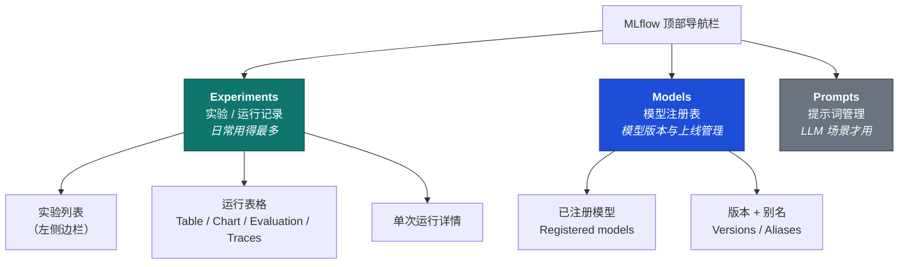
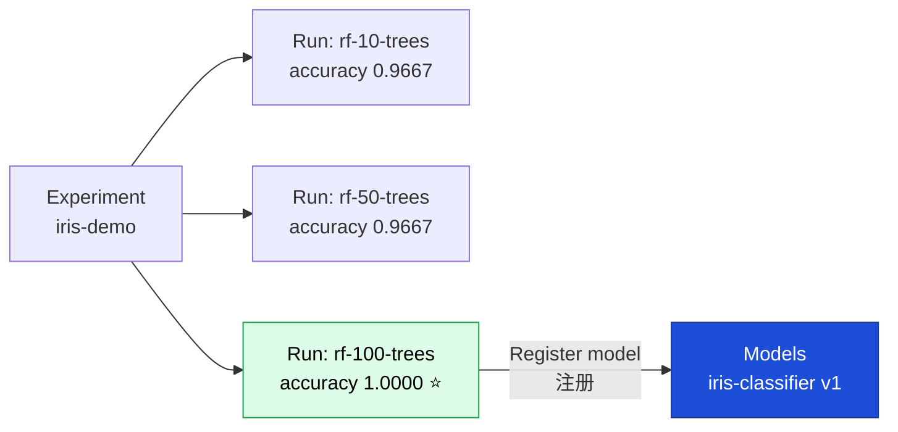
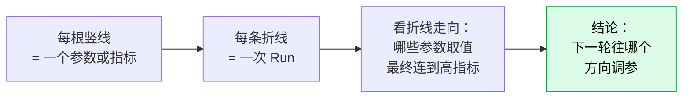
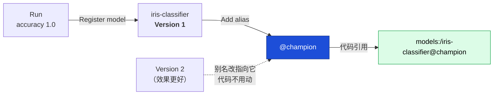
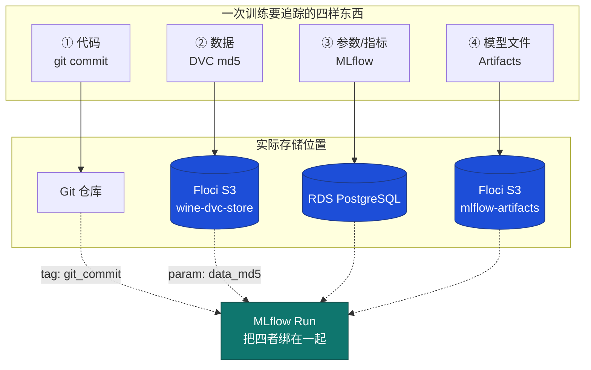
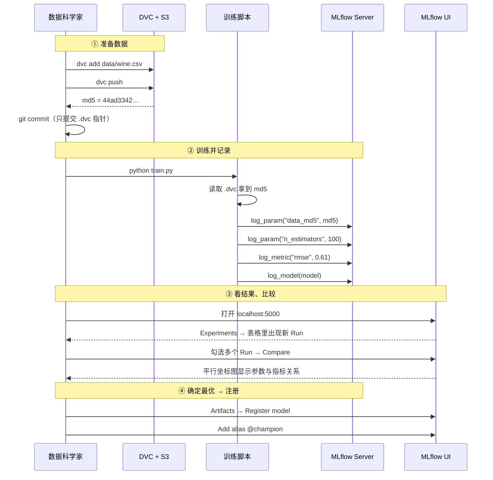
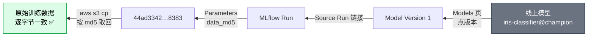
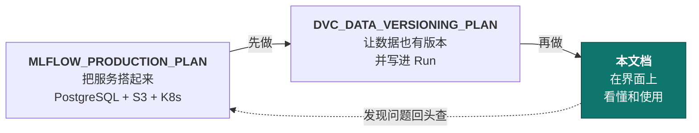

# MLflow UI 使用指南（中文）

面向第一次打开 MLflow 界面的人。配合
[MLFLOW_PRODUCTION_PLAN.md](MLFLOW_PRODUCTION_PLAN.md) 使用：那份文档负责把服务搭起来，
这份文档负责教你**怎么看懂并用好界面**。

- **版本：** MLflow **3.16.0**（Helm chart `community-charts/mlflow` 1.11.7）
- **访问地址：** `http://localhost:5000`（需先做端口转发）

> ### ⚠️ 界面本身是英文的
>
> MLflow 官方 UI **没有中文语言包**（已确认 3.16.0 的前端构建产物中不含 i18n 中文资源）。
> 所以本文采用「**中文讲解 + 英文原文对照**」的写法：正文用中文解释，按钮和标签保留
> 英文原名并加粗，例如 **Experiments**（实验列表）。你在界面上看到的就是加粗的那个英文词。

---

## 目录

1. [先把界面打开](#1-先把界面打开)
2. [整体布局：三个主入口](#2-整体布局三个主入口)
3. [实验页：Experiments](#3-实验页experiments)
4. [单次运行详情：Run](#4-单次运行详情run)
5. [对比多次运行：Compare](#5-对比多次运行compare)
6. [图表页：Chart](#6-图表页chart)
7. [模型注册表：Models](#7-模型注册表models)
8. [搜索与过滤语法](#8-搜索与过滤语法)
9. [**数据科学家如何追踪 ML：完整链路**](#9-数据科学家如何追踪-ml完整链路) ⭐
10. [常见操作速查](#10-常见操作速查)
11. [常见问题](#11-常见问题)

---

## 1. 先把界面打开

MLflow 跑在 Kubernetes 里，需要把集群内的服务端口映射到本机：

```bash
kubectl port-forward -n mlflow svc/mlflow 5000:80
```

> 📌 **为什么是 `5000:80`？** 左边 `5000` 是你本机的端口，右边 `80` 是集群里 Service
> 的端口（容器内部其实是 5000）。写成 `5000:5000` 会连不上。

这个命令要**一直开着**，关掉窗口连接就断了。然后浏览器打开：

```
http://localhost:5000
```

> 💡 **如果 5000 端口被占用**：macOS 的「隔空播放接收器」（AirPlay Receiver）会占用 5000。
> 换一个本机端口即可：
>
> ```bash
> kubectl port-forward -n mlflow svc/mlflow 5555:80   # 然后访问 localhost:5555
> ```

### 让界面里有数据

界面刚打开是空的（会显示 **No runs**）。先跑一段训练代码产生数据：

```bash
export MLFLOW_TRACKING_URI=http://localhost:5000
uv run python test_a_train.py     # MLflow 计划文档里的测试用例 A
```

---

## 2. 整体布局：三个主入口

顶部导航栏有三个主要区域：



| 导航项 | 中文含义 | 什么时候用 |
| --- | --- | --- |
| **Experiments** | 实验与运行记录 | 看训练结果、比参数、比指标。**90% 的时间在这里** |
| **Models** | 模型注册表 | 给模型打版本、标别名、准备上线 |
| **Prompts** | 提示词管理 | 只有做大模型（LLM）应用时才用，传统机器学习可忽略 |

> 🧭 **概念关系**：一个 **Experiment**（实验，比如"预测红酒质量"）下面有多次
> **Run**（运行，比如"树的数量=100 那次"）。每个 Run 记录了参数、指标和产出文件。
> 觉得某个 Run 的模型不错，就把它注册进 **Models** 管起来。



---

## 3. 实验页：Experiments

点击顶部 **Experiments** 进入，这是主战场。

### 3.1 左侧：实验列表

左边栏列出所有实验名。点一个（例如 `iris-demo`）右边就显示它的运行记录。

- **Default** 是默认实验。代码里没写 `mlflow.set_experiment()` 的话，记录都跑到这里。
- 搜索框可以按名字筛实验。

### 3.2 右侧：运行表格

默认是表格视图，每一行是一次 Run。常用列：

| 列名 | 中文含义 | 说明 |
| --- | --- | --- |
| **Run Name** | 运行名称 | 代码里 `run_name=` 指定；没指定会随机生成两个词 |
| **Created** | 创建时间 | 默认按时间倒序，最新的在最上面 |
| **Duration** | 耗时 | 训练花了多久 |
| **Source** | 来源 | 哪个脚本触发的 |
| **Metrics** | 指标 | 如 `accuracy`、`rmse`，**模型效果看这里** |
| **Parameters** | 参数 | 如 `n_estimators`，**超参数看这里** |

### 3.3 顶部四个标签页

表格上方有四个切换标签，这是 MLflow 3.x 的布局：

| 标签 | 中文 | 用途 |
| --- | --- | --- |
| **Table** | 表格 | 默认视图，看全部 Run 的列表 |
| **Chart** | 图表 | 自动画图对比指标，见 [§6](#6-图表页chart) |
| **Evaluation** | 评估 | 对比模型在同一批数据上的逐条输出（LLM 场景常用） |
| **Traces** | 链路追踪 | 记录 LLM 调用链路，传统机器学习用不到 |

### 3.4 表格上方的实用按钮

| 按钮 | 中文 | 作用 |
| --- | --- | --- |
| **Columns** | 列设置 | 勾选要显示哪些指标/参数列。指标一多就靠它整理 |
| **Sort** | 排序 | 按某个指标排序，例如找 accuracy 最高的那次 |
| **Group by** | 分组 | 按某个参数把 Run 归组，看趋势很方便 |
| **Search runs** | 搜索运行 | 按条件过滤，语法见 [§8](#8-搜索与过滤语法) |

> 💡 **最实用的一个动作**：点 **Sort** → 选 `accuracy` → 降序，最好的模型立刻排到第一行。

---

## 4. 单次运行详情：Run

在表格里点任意 **Run Name** 进入详情页。

### 4.1 页面结构

| 区块 | 中文 | 里面有什么 |
| --- | --- | --- |
| 顶部概览 | — | Run ID、状态、耗时、所属实验 |
| **Parameters** | 参数 | 这次训练用的超参数（**只能写一次，不可改**） |
| **Metrics** | 指标 | 准确率、损失等。点指标名可看变化曲线 |
| **Tags** | 标签 | 自定义备注，**可以随时改** |
| **Artifacts** | 产出文件 | 模型文件、图片、CSV 等 |
| **System metrics** | 系统指标 | CPU / 内存占用（需开启才有） |

> 🔍 **Parameters 和 Tags 的区别**（容易搞混）：
> - **Parameters**：训练的输入，写死不可改，适合放超参数、数据版本号。
> - **Tags**：附加说明，可随时修改，适合放"这次是谁跑的""实验结论"。
>
> 想事后补充信息，用 Tags；想精确记录"这次到底用了什么"，用 Parameters。

### 4.2 Artifacts（产出文件）怎么看

点 **Artifacts** 标签，左边是文件树。如果代码里调用了
`mlflow.sklearn.log_model(model, name="model")`，会看到一个 `model` 文件夹：

```
model/
├── MLmodel              ← 模型元信息（框架、输入输出格式）
├── model.pkl            ← 模型本体
├── conda.yaml           ← 环境依赖
├── python_env.yaml
└── requirements.txt
```

点 `MLmodel` 可以直接在页面里预览内容。MLflow 还会贴心地给出加载这个模型的代码片段，
复制就能用。

> ⚠️ **如果 Artifacts 是空的**：本项目把产出文件存到了 Floci S3。如果 Floci 重启过，
> 桶里的对象会丢失（内存存储），但 PostgreSQL 里的参数指标还在，于是就出现
> 「有记录但没文件」。详见计划文档的排查章节。

---

## 5. 对比多次运行：Compare

这是 MLflow 最有价值的功能之一——**调参时用来找最优组合**。

### 操作步骤

1. 进入实验页（**Table** 视图）。
2. 勾选左侧复选框，选中 2 个以上的 Run。
3. 点击上方出现的 **Compare** 按钮。

### 对比页能看什么

| 区块 | 中文 | 怎么读 |
| --- | --- | --- |
| **Run details** | 运行概览 | 各 Run 并排一列，基本信息对照 |
| **Parameters** | 参数对比 | **值不同的行会高亮**，一眼看出差异 |
| **Metrics** | 指标对比 | 哪次效果好一目了然 |
| **Parallel Coordinates Plot** | 平行坐标图 | 参数与指标的关系图，见下 |

### 平行坐标图（Parallel Coordinates Plot）怎么读

这张图最容易被忽略，但它是**调参神器**：



读法举例：如果所有连到「accuracy 高」的折线，在 `n_estimators` 这根竖线上都落在上半部分，
说明**树的数量越多效果越好**，下一轮就该继续加大这个值。

> 💡 可以拖动竖线调整顺序，也可以在某根竖线上拉一个区间做筛选，只保留感兴趣的折线。

---

## 6. 图表页：Chart

实验页顶部切到 **Chart** 标签，MLflow 会自动为每个指标画图，横轴是不同的 Run。

| 操作 | 说明 |
| --- | --- |
| 添加图表 | 手动指定 X / Y 轴，组合出想看的对比 |
| 切换图表类型 | 柱状图 / 折线图 / 散点图等 |
| 鼠标悬停 | 显示该点具体属于哪个 Run 及数值 |

**和 Compare 的区别**：
- **Chart**：看这个实验**所有** Run 的整体分布和趋势。
- **Compare**：把你**手动挑选**的几个 Run 拉出来逐项细看。

先用 Chart 看全局找到可疑区间，再用 Compare 精读几个候选，是比较顺的流程。

---

## 7. 模型注册表：Models

顶部点 **Models** 进入。这里管理的是「**准备用于生产的模型**」，而不是所有实验产物。

### 7.1 把一个 Run 的模型注册进来

1. 进入某个 Run 的详情页 → **Artifacts** 标签。
2. 选中 `model` 文件夹。
3. 点右上角 **Register model**（注册模型）。
4. 选已有模型名，或新建一个（例如 `iris-classifier`）。
5. 确认后生成 **Version 1**（版本 1）。

同一个模型名下再注册，版本号会自动递增（v1 → v2 → v3）。

### 7.2 版本与别名

进入模型详情页可以看到版本列表。MLflow 3.x 推荐用 **Aliases**（别名）标记用途：

| 概念 | 中文 | 说明 |
| --- | --- | --- |
| **Version** | 版本 | 自动递增的数字，不可改 |
| **Aliases** | 别名 | 自定义标记，例如 `champion`（冠军）、`challenger`（挑战者） |
| **Stage** | 阶段 | 旧机制（`Staging` / `Production` / `Archived`），仍在界面上但**已不推荐** |

设置别名：在版本行点 **Add alias**，输入名字（别名是自由输入的，没有预设选项）。

> 💡 **为什么用别名而不用 Stage？** 别名可以随业务自定义、数量不限，而 Stage 只有固定
> 三档且一个模型每档只能放一个版本。代码里可以直接按别名取模型：
>
> ```python
> model = mlflow.sklearn.load_model("models:/iris-classifier@champion")
> ```
>
> 上线切换模型时，只要把 `champion` 别名指向新版本，代码一行都不用改。



---

## 8. 搜索与过滤语法

**Search runs** 搜索框用的是类 SQL 语法，这是效率提升最明显的技巧。

| 目标 | 写法 |
| --- | --- |
| 指标大于某值 | `metrics.accuracy > 0.95` |
| 参数等于某值 | `params.n_estimators = "100"` |
| 标签匹配 | `tags.mlflow.runName = "rf-100-trees"` |
| 多条件并列 | `metrics.accuracy > 0.9 AND params.n_estimators = "100"` |
| 模糊匹配 | `params.model_type LIKE "%forest%"` |
| 按状态 | `attributes.status = "FINISHED"` |

> ⚠️ **两个易错点**：
> 1. **参数值要加引号**，因为参数一律按字符串存储：`params.n_estimators = "100"`
>    （写 `= 100` 查不到）。指标是数字，不用加引号。
> 2. 前缀不能省：指标写 `metrics.`，参数写 `params.`，标签写 `tags.`。

配合本项目的 DVC 数据版本追踪（见
[DVC_DATA_VERSIONING_PLAN.md](DVC_DATA_VERSIONING_PLAN.md)），可以这样查
「用某个数据版本训练出来的所有模型」：

```
params.data_md5 = "44ad334235b5efb230fdeebf40098383"
```

---

## 9. 数据科学家如何追踪 ML：完整链路

前面几章讲的是「界面上有什么」。这一章讲**实际工作中怎么用**——把本项目的三份文档串起来，
回答一个核心问题：

> **一个模型训练出来了，我怎么知道它是「用哪份数据、哪套参数、由谁在什么时候」跑出来的？
> 半年后能不能原样复现？**

### 9.1 追踪的四个层次

一次完整可追溯的训练，需要记录四样东西。三份文档各自负责一块：

| 层次 | 记录什么 | 存在哪 | 由哪份文档负责 |
| --- | --- | --- | --- |
| ① **代码** | 哪个 commit | Git | 你自己的仓库 |
| ② **数据** | 哪个数据版本（md5） | DVC + Floci S3 | [DVC 计划](DVC_DATA_VERSIONING_PLAN.md) |
| ③ **参数/指标** | 超参数、准确率 | PostgreSQL (RDS) | [MLflow 计划](MLFLOW_PRODUCTION_PLAN.md) |
| ④ **模型文件** | 训练出的模型 | Floci S3 | [MLflow 计划](MLFLOW_PRODUCTION_PLAN.md#1-architecture) |

> ⚠️ **只用 MLflow 是不够的**（很多人踩的坑）：MLflow 默认只记录 ③ 和 ④。
> 如果数据是一个会被覆盖的 `data.csv`，那么「同样的代码 + 同样的参数」在数据被改动后
> 会跑出不同结果，而 MLflow 界面上看不出任何差别——**这正是要引入 DVC 的原因**。



**关键点：MLflow 的 Run 是那个「把四者绑在一起」的枢纽。** 数据版本和代码版本本身存在别处，
但它们的**指纹**（md5、commit sha）被写进了 Run 的 Parameters 和 Tags，所以从一个 Run 出发
能找回全部。

### 9.2 日常工作流：一次调参的全过程

下面是数据科学家真实的操作顺序，标注了每一步「在哪做、在 UI 哪里看」：



对应到界面的具体位置：

| 步骤 | 命令行做什么 | UI 上在哪确认 |
| --- | --- | --- |
| ① 固定数据版本 | `dvc add` + `dvc push` | （不在 UI，在 S3 桶里） |
| ② 训练 | `python train.py` | **Experiments** 表格出现新行 |
| ③ 看这次用了什么数据 | — | Run 详情 → **Parameters** → `data_md5` |
| ④ 比较多次尝试 | — | 勾选 → **Compare** → 平行坐标图 |
| ⑤ 挑出最好的 | — | **Sort** 按指标降序 |
| ⑥ 模型上线 | — | **Artifacts** → **Register model** → **Add alias** |

### 9.3 训练脚本里该记录什么

这是整条链路的**关键代码**。完整版见
[DVC 计划 §7](DVC_DATA_VERSIONING_PLAN.md#7-step-4--link-data-version-to-mlflow-runs)，
核心只有几行：

```python
with mlflow.start_run():
    # ③ 参数：训练的输入（不可改，适合放版本指纹）
    mlflow.log_param("data_md5", tracked)        # ← 数据版本，最关键的一行
    mlflow.log_param("data_rows", len(df))
    mlflow.log_param("n_estimators", 100)

    # ① 代码版本 + 数据完整性校验（可改，所以用 tag）
    mlflow.set_tag("git_commit", git_rev())
    mlflow.set_tag("data_verified", str(tracked == actual))

    # ③ 指标：训练的结果
    mlflow.log_metric("rmse", rmse)

    # ④ 模型文件
    mlflow.sklearn.log_model(model, name="model")
```

| 记录项 | 用 param 还是 tag | 为什么 |
| --- | --- | --- |
| `data_md5` | **param** | 不可变、可搜索，是版本的唯一标识 |
| `n_estimators` | **param** | 超参数属于训练输入 |
| `git_commit` | **tag** | 属于环境信息，允许事后补充 |
| `data_verified` | **tag** | 校验结论，`False` 说明数据被改过 |
| `rmse` | **metric** | 结果指标，可以有多个时间点 |

> 💡 **为什么 `data_md5` 一定要用 param 而不是 tag？** 因为 param 不可修改且可被搜索。
> 在 UI 搜索框输入下面这行，就能列出所有用这份数据训练过的模型：
>
> ```
> params.data_md5 = "44ad334235b5efb230fdeebf40098383"
> ```
>
> 如果用 tag，别人可以事后改掉它，追溯链就断了。

### 9.4 反向追溯：从模型倒查数据

这是整套机制**最有价值的场景**——线上模型出问题，要查它到底是用什么数据训练的。

**第 1 步：在 UI 找到那个模型对应的 Run**

**Models** → `iris-classifier` → 点击版本号 → 页面上有 **Source Run** 链接，点进去。

**第 2 步：读出数据指纹**

Run 详情 → **Parameters**：

| Parameter | Value |
| --- | --- |
| `data_md5` | `44ad334235b5efb230fdeebf40098383` |
| `data_rows` | `13` |

**第 3 步：把那份数据原样取回来**

```bash
export OLD_MD5=44ad334235b5efb230fdeebf40098383
aws s3 cp "s3://${DVC_BUCKET}/files/md5/${OLD_MD5:0:2}/${OLD_MD5:2}" /tmp/restored.csv
md5 -q /tmp/restored.csv          # 应与 OLD_MD5 完全一致
wc -l /tmp/restored.csv           # 行数应与 data_rows 吻合
```

md5 一致就说明：**取回的字节和当初训练用的字节完全相同**，不是「差不多」，是逐字节相同。
这一步已在 [DVC 计划的测试用例 C](DVC_DATA_VERSIONING_PLAN.md#test-case-c--reproduce-an-old-run-)
中验证过。



### 9.5 数据被偷偷改过怎么发现

最隐蔽的故障：有人直接编辑了 `data.csv`，git 看不出来（文件被 gitignore），
指标却悄悄变了。

DVC 的校验机制会抓到它：

```bash
dvc status
# 输出 modified: data/wine_sample.csv → 说明磁盘上的文件和记录的 md5 不一致
```

训练脚本里那行 `data_verified` tag 会把这件事**记进 MLflow**：

```python
mlflow.set_tag("data_verified", str(tracked == actual))
```

于是在 UI 里，这次 Run 的 **Tags** 会显示 `data_verified = False`，
一眼就能看出这个结果不可信。恢复：

```bash
dvc checkout data/wine_sample.csv.dvc     # 拉回记录中的正确版本
```

详见 [DVC 计划的测试用例 D](DVC_DATA_VERSIONING_PLAN.md#test-case-d--catch-mutated-data)。

### 9.6 为什么 state 要放在集群外

这一点和 [MLflow 计划](MLFLOW_PRODUCTION_PLAN.md#1-architecture) 的架构直接相关，
也是它的核心论点：

| 存储 | 放在哪 | Pod 删掉后 |
| --- | --- | --- |
| 参数、指标、Run 记录 | **RDS PostgreSQL**（集群外） | ✅ 还在 |
| 模型文件 | **S3 桶**（集群外） | ✅ 还在 |
| 训练数据 | **S3 桶**（集群外） | ✅ 还在 |
| MLflow 服务进程 | Pod（集群内） | ❌ 重建，但无状态 |

所以你可以 `kubectl delete pod`、甚至 `kind delete cluster`，
重新装一遍 MLflow 之后，**界面里的历史记录一条都不会少**。
这在 MLflow 计划的[测试用例 B](MLFLOW_PRODUCTION_PLAN.md#test-case-b--state-sharing-from-the-external-db-)
里被验证过（缩容到 0 个 Pod 时，数据库里的 Run 数量不变）。

> 🧭 **对数据科学家的实际意义**：你不需要关心 MLflow 服务本身，
> 运维重启、升级、迁移集群都不会丢实验记录。这也是「生产级」和
> 「本地 `mlruns/` 目录」的根本区别。

### 9.7 三份文档怎么配合看



| 文档 | 解决什么问题 | 什么时候看 |
| --- | --- | --- |
| [MLFLOW_PRODUCTION_PLAN.md](MLFLOW_PRODUCTION_PLAN.md) | 服务怎么跑起来、state 存哪 | 搭环境、排查 Pod 故障 |
| [DVC_DATA_VERSIONING_PLAN.md](DVC_DATA_VERSIONING_PLAN.md) | 数据版本怎么管、怎么关联到 Run | 要做可复现实验时 |
| 本文档 | 界面怎么用、怎么追溯 | 日常看结果、调参、上线 |

---

## 10. 常见操作速查

| 我想…… | 操作路径 |
| --- | --- |
| 找效果最好的模型 | **Experiments** → 选实验 → **Sort** → 按指标降序 |
| 比较几组超参数 | 勾选多个 Run → **Compare** → 看平行坐标图 |
| 下载训练好的模型 | 进 Run → **Artifacts** → 选文件 → 下载按钮 |
| 看某指标的变化曲线 | 进 Run → **Metrics** → 点击指标名 |
| 给实验结论做记录 | 进 Run → **Tags** → 新增标签 |
| 准备模型上线 | Run → **Artifacts** → **Register model** → 设 `@champion` 别名 |
| 只看准确率达标的 Run | 搜索框输入 `metrics.accuracy > 0.95` |
| 整理杂乱的表格 | **Columns** → 只勾选关心的列 |

---

## 11. 常见问题

### 打不开 `localhost:5000`

```bash
# 1. 端口转发还活着吗？（Pod 重启后会断）
kubectl get pods -n mlflow

# 2. 重新转发
kubectl port-forward -n mlflow svc/mlflow 5000:80
```

如果 Pod 不是 `1/1 Running`，说明是服务端问题，去看计划文档的排查章节。

### 界面能打开但一条记录都没有（No runs）

三种可能，按顺序检查：

```bash
# ① 代码有没有指向这个服务？
echo $MLFLOW_TRACKING_URI          # 应为 http://localhost:5000

# ② 数据库里到底有没有数据？（最权威的检查）
psql -h 127.0.0.1 -p 15432 -U "$MASTER_USER" -d mlflow -c "SELECT COUNT(*) FROM runs;"
```

③ 记录可能跑到了别的实验下——看看左侧 **Default** 实验里有没有。

### 有运行记录，但 Artifacts 是空的

产出文件存在 Floci S3，而 Floci 的 S3 是内存存储，重启即丢。
PostgreSQL 里的参数和指标不受影响，所以会出现「有记录、无文件」。

```bash
aws s3 ls "s3://${ARTIFACT_BUCKET}/experiments/" --recursive | head
```

桶空了就重新建桶并重跑训练。

### 页面数据不刷新

MLflow UI 不会自动轮询，浏览器手动刷新（`Cmd + R`）即可。

### 中文乱码

MLflow 支持 UTF-8，实验名、标签都能用中文。如果显示成方块，通常是浏览器字体问题，
换 Chrome 或 Safari 一般就好了。

---

## 附录：术语中英对照

| 英文 | 中文 | 一句话解释 |
| --- | --- | --- |
| Experiment | 实验 | 一个课题，下面装很多次运行 |
| Run | 运行 | 一次训练，是最小记录单位 |
| Parameter | 参数 | 训练的输入，不可修改 |
| Metric | 指标 | 训练的结果，用来评好坏 |
| Tag | 标签 | 附加备注，可随时改 |
| Artifact | 产出文件 | 模型、图片等文件 |
| Model Registry | 模型注册表 | 管理待上线模型的地方 |
| Version | 版本 | 注册模型的递增编号 |
| Alias | 别名 | 指向某版本的可变标记，如 `@champion` |
| Stage | 阶段 | 旧的上线状态机制，已不推荐 |
| Tracking URI | 追踪地址 | 代码往哪里上报数据 |
| Backend Store | 后端存储 | 存参数指标的数据库（本项目是 PostgreSQL） |
| Artifact Store | 产出存储 | 存文件的对象存储（本项目是 Floci S3） |
