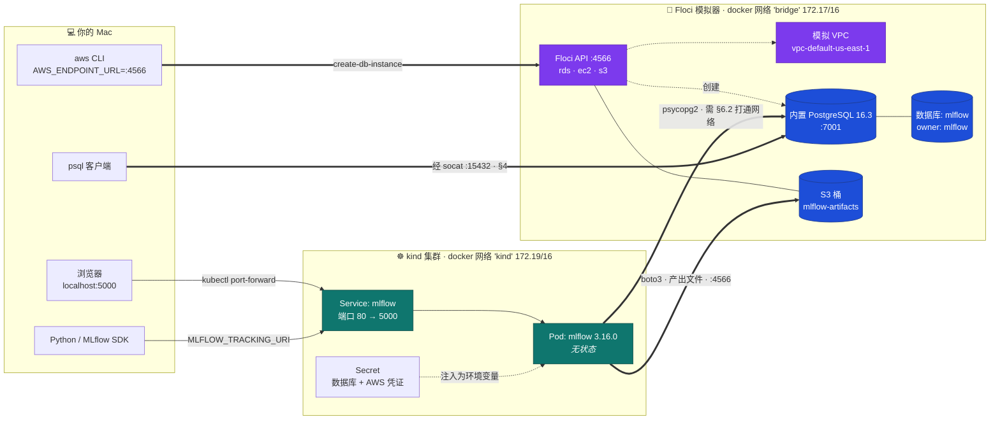
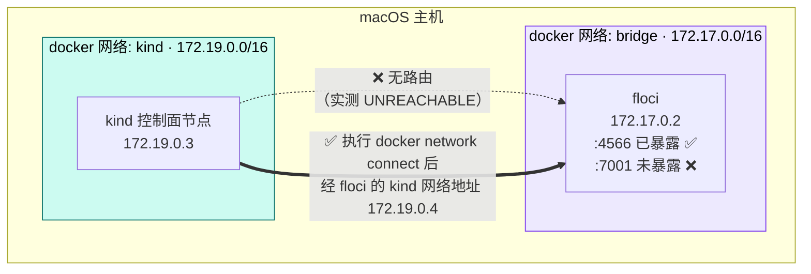
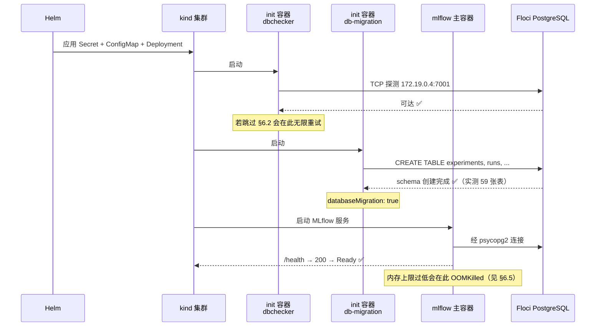
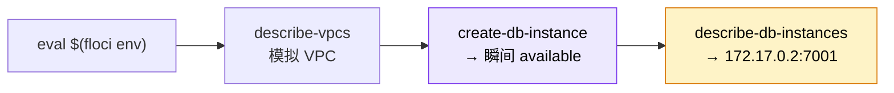
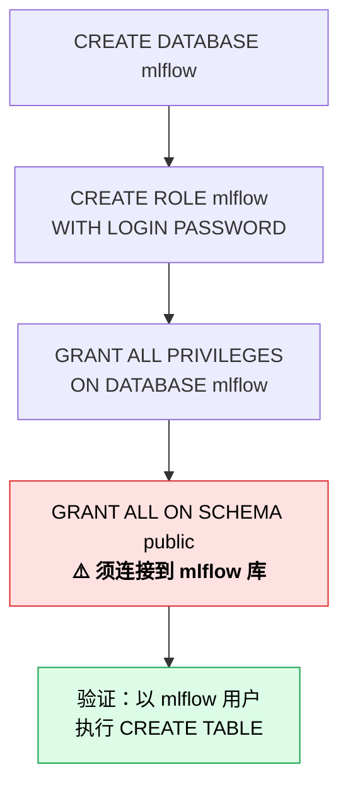
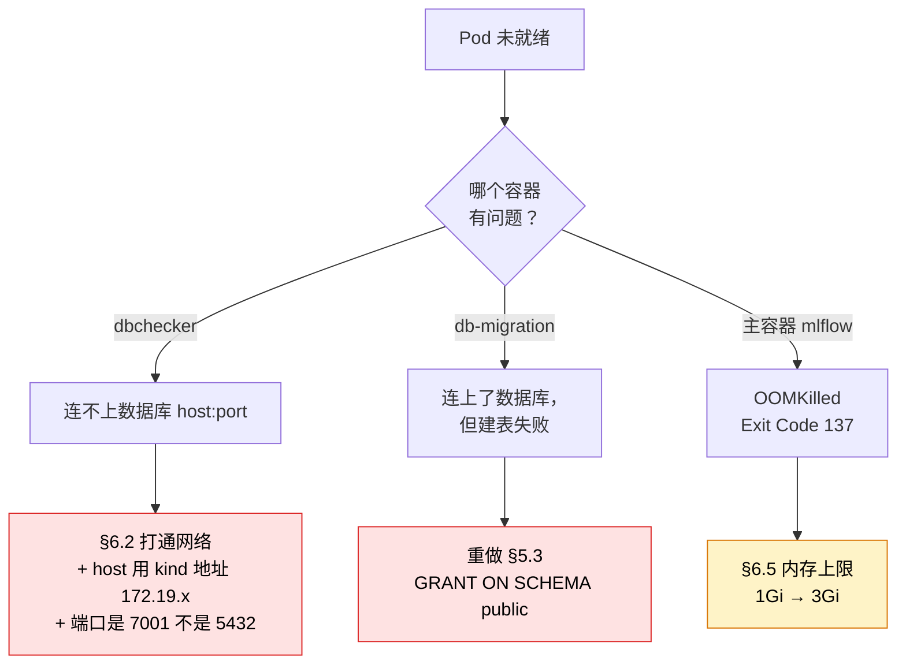

# MLflow 生产部署（一）搭建篇 — Kubernetes + PostgreSQL + Floci

把 MLflow 跑在本地 `kind` 集群上，后端用**通过 AWS CLI 创建的 PostgreSQL 数据库**，
对接 **[Floci](https://floci.io) 本地 AWS 模拟器**。RDS、VPC、S3 全部本地模拟 ——
**不碰任何真实 AWS 账号，不产生任何费用。**

核心目标：证明 MLflow 的状态存在**集群之外** —— 元数据在 PostgreSQL，产出文件在 S3。
你可以删掉所有 Pod，两者都不会丢。

- **读者：** 第一次在 Mac 上从头跑通这套环境的工程师。
- **耗时：** 约 15 分钟。Floci 创建 RDS 是瞬间完成的，没有真实 AWS 的 10 分钟等待。
- **费用：** 0 元。
- **接口：** 全程用普通的 `aws` CLI，只有 `AWS_ENDPOINT_URL` 与真实 AWS 不同。

### 本系列文档

| 文档 | 内容 |
| --- | --- |
| **本篇（搭建篇）** | 架构、前置条件、建库建表、装 MLflow、验证、故障排查 |
| [测试篇](MLFLOW_生产部署_测试篇.md) | 测试用例 A/B/C/D、结果对照表、环境清理 |
| [英文原版](MLFLOW_PRODUCTION_PLAN.md) | 本文档的英文版（内容一致） |
| [DVC 数据版本计划](DVC_DATA_VERSIONING_PLAN.md) | 在此基础上加数据版本管理 |
| [MLflow UI 使用指南](MLFLOW_UI_使用指南.md) | 界面怎么用、怎么做追溯 |

---

> ## ✅ 实测状态
>
> **本文档已在本机完整跑通**（2026-09-13），并据此修正了三处原计划的错误。
> 凡标有 🔧 **实测修正** 的地方，都是照原英文版会踩坑、本文已改正的内容：
>
> | # | 位置 | 原计划 | 实测结论 |
> | --- | --- | --- | --- |
> | ① | [§6.2](#62-把-floci-接入-kind-网络必做) | Pod 用 `$PGHOST`（`172.17.0.2`） | **不通**，必须用 floci 在 kind 网络的地址 |
> | ② | [§6.5](#65-编写-values-文件) | `memory: 1Gi` | **OOMKilled**，需 `3Gi` |
> | ③ | 测试篇 C1 | `artifact_location` 以 `s3://` 开头 | 实际是 `mlflow-artifacts:/1` 代理 URI |

> ## ⚠️ 开始前必读：两个网络陷阱
>
> 这套环境能否跑通，取决于两个网络事实。它们也是**不能直接照搬真实 AWS 教程**的原因。
>
> 1. **Floci 的 RDS 端点是 Docker 内网地址 + 非标准端口** —— 比如 `172.17.0.2:7001`，
>    而不是 `<id>.rds.amazonaws.com:5432`。Floci 只对外暴露了 API 端口 4566，
>    所以**数据库端口默认从 macOS 连不上**（[§4](#4-步骤2--从-mac-连上数据库) 解决）。
> 2. **`kind` 和 Floci 在不同的 Docker 网络上**（`kind` = 172.19.0.0/16，
>    `bridge` = 172.17.0.0/16），彼此不通。Pod 连不上数据库，直到你把网络打通
>    （[§6.2](#62-把-floci-接入-kind-网络必做)）。

---

## 目录

1. [架构](#1-架构)
2. [前置条件](#2-前置条件)
3. [步骤1 — 用 AWS CLI 创建 RDS + VPC](#3-步骤1--用-aws-cli-创建-rds--vpc)
4. [步骤2 — 从 Mac 连上数据库](#4-步骤2--从-mac-连上数据库)
5. [步骤3 — 创建 mlflow 库、用户和权限](#5-步骤3--创建-mlflow-库用户和权限)
6. [步骤4 — 创建 kind 集群并安装 MLflow](#6-步骤4--创建-kind-集群并安装-mlflow)
7. [步骤5&6 — 验证 Pod 与端口转发](#7-步骤56--验证-pod-与端口转发)
8. [故障排查](#8-故障排查)
9. [Floci 与真实 AWS 的差异](#9-floci-与真实-aws-的差异)
10. [命令速查](#10-命令速查)

---

## 1. 架构

一句话概括：**算力是一次性的，状态不是。** 虚线框里的一切由 Floci 在本地模拟，
但驱动它们用的是真正的 `aws` CLI。



**图例** — 🟦 持久状态 · 🟩 一次性算力 · 🟪 Floci 模拟的 AWS 控制面。

### 为什么这样设计

| 关注点 | 存在哪 | 原因 |
| --- | --- | --- |
| 实验、运行记录、指标、模型注册表 | Floci 内置的 PostgreSQL | Pod 重启、集群删除都不丢 |
| MLflow 服务进程 | kind Pod | 无状态 —— 可随意杀掉和扩缩容 |
| 数据库凭证 | Kubernetes Secret | 不写进镜像，也不出现在 Pod 启动参数里 |
| RDS / VPC 控制面 | Floci `:4566` | 用真正的 `aws` CLI 命令，无需云账号 |
| 产出文件（模型等） | Floci S3 桶 | Pod 重启也不丢 —— 见下方说明 |

> ✅ **产出文件同样是持久的 —— 存在 Floci 模拟的 S3 里。** Pod 以
> `readOnlyRootFilesystem: true` 运行，只有 `/tmp` 可写，所以 chart 的默认值
> （`./mlruns`）会把产出文件放进 Pod 的临时存储。因此我们改用
> `artifactRoot.s3` 对接 Floci 的 S3（[§6.5](#65-编写-values-文件)），
> 让**元数据和产出文件都比 Pod 活得久**。
>
> 实测确认：MLflow 写入了 `s3://mlflow-artifacts/...`，
> 用 `aws s3 ls` 读回了 **15 个对象**（3 个模型 × 5 个文件）。

### 两个网络（§6.2 存在的原因）



### 时序：`helm install` 时发生了什么



---

## 2. 前置条件

本机已全部具备：

| 工具 | 状态 | 缺失时安装 |
| --- | --- | --- |
| floci CLI 0.2.1 | ✅（服务端 2.0.1） | `brew install floci` |
| AWS CLI 2.31 | ✅ | `brew install awscli` |
| kubectl 1.34 | ✅ | `brew install kubectl` |
| kind 0.33 | ✅ | `brew install kind` |
| Helm 4.3 | ✅ | `brew install helm` |
| Docker 29.2 | ✅ 运行中 | Docker Desktop |
| **psql 18.6** | ✅ 已安装 | 见下方 §2.1 |

> 💾 **内存要求**：Docker Desktop 至少分配 **4 GB**（本机为 7.7 GB）。
> MLflow 3.16 启动时的内存占用超过 1 GB，见 [§6.5](#65-编写-values-文件)。

### 2.1 macOS 上的 PostgreSQL 客户端

本机通过 Homebrew 的 **`libpq`** 安装了 `psql` —— 它只有*客户端*，
不含数据库服务端，而这正是本文档需要的：

```bash
brew install libpq
brew link --force libpq     # 必须：libpq 是 keg-only
```

```bash
command -v psql             # → /opt/homebrew/bin/psql
psql --version              # → psql (PostgreSQL) 18.6
```

> ❗ **`brew link --force` 不是可选步骤。** `libpq` 是 *keg-only* —— Homebrew 会安装它，
> 但故意不放进 `PATH`，以免和完整版 `postgresql` 冲突。不做 link 的话，
> `brew install libpq` 会显示成功，而 `psql` 依然报「command not found」。
> 如果不想 link，也可以把目录加进 `PATH`：
>
> ```bash
> echo 'export PATH="/opt/homebrew/opt/libpq/bin:$PATH"' >> ~/.zshrc && exec zsh
> ```

**客户端比服务端新没问题。** `psql` 18.6 连 Floci 的 PostgreSQL 16.3 完全正常 ——
通信协议稳定，新客户端向后兼容。`brew install postgresql@16` 也能提供 `psql`，
但会顺带装一个你不需要的数据库服务端。

| 方案 | 评价 |
| --- | --- |
| `brew install libpq` + link | ✅ **推荐** —— 仅客户端，约 35 MB |
| `brew install postgresql@16` | 可用，但多装了不需要的服务端 |
| Postgres.app | 偏图形界面，也自带服务端 |
| **PopSQL**（本机已装） | 图形客户端 —— 浏览数据可以（§4），**无法**执行本文档的脚本式 SQL |

> 💡 **完全不想装 psql？** 下面每条 `psql` 命令在
> [§8](#8-故障排查) 都有 `postgres:16` 容器版的等价写法，可以零安装跑完全程。

### 2.2 启动 Floci 并加载环境变量

```bash
floci start          # 已在运行则无操作
floci status         # 期望看到：Reachable: yes
```

```bash
eval $(floci env)
env | grep AWS_
```

`floci env` 只导出四个变量：

```
AWS_ENDPOINT_URL=http://localhost.floci.io:4566
AWS_ACCESS_KEY_ID=test
AWS_SECRET_ACCESS_KEY=test
AWS_DEFAULT_REGION=us-east-1
```

> `AWS_ENDPOINT_URL` 就是把所有 `aws` 命令重定向到模拟器的开关。
> `localhost.floci.io` 是一个公网 DNS 名，解析到 `127.0.0.1`。
> **凭证就是字面量 `test`** —— Floci 不做校验。

确认 `rds`、`ec2`、`s3` 已启用：

```bash
floci services | grep -E "✓  (rds|ec2|s3)$"
```

> 🛡️ **安全检查 —— 确认没有指向真实 AWS。** 如果 `AWS_ENDPOINT_URL` 没设置，
> 下面所有命令都会打到你的真实账号（`529004977151`）。请验证：
>
> ```bash
> echo "${AWS_ENDPOINT_URL:?致命错误: 未设置 — 请执行 eval \$(floci env)}"
> aws sts get-caller-identity --query Account --output text   # Floci → 000000000000
> ```
>
> 真实 AWS 会返回 `529004977151`。**看到这个数字请立刻停下，重新执行 `eval $(floci env)`。**

> 💡 **每开一个新终端都要重新 `eval $(floci env)`** —— 环境变量不会跨终端保留。
> 这是后续命令突然「连不上」的最常见原因。

---

## 3. 步骤1 — 用 AWS CLI 创建 RDS + VPC

> **目标：** 用普通的 `aws rds` 命令，在 Floci 的模拟 VPC 里创建一个 PostgreSQL 实例。

### 3.1 查看模拟 VPC

Floci 预置了默认 VPC，无需自己创建：

```bash
aws ec2 describe-vpcs \
  --filters "Name=isDefault,Values=true" \
  --query 'Vpcs[0].{VpcId:VpcId,Cidr:CidrBlock}' --output json
```

```json
{ "VpcId": "vpc-default-us-east-1", "Cidr": "172.31.0.0/16" }
```

> 🧪 **模拟的边界。** 那个 `172.31.0.0/16` 网段只是元数据 —— 没有真实网络被创建，
> 而且 RDS 端点**不在**这个网段里。安全组会被接受并返回，但**不会真正生效**，
> 所以这里没有「把本机 IP 加进白名单」这一步。详见
> [§9](#9-floci-与真实-aws-的差异)。

### 3.2 设置 shell 变量

```bash
export DB_ID=mlflow-pg
export DB_CLASS=db.t3.micro
export MASTER_USER=postgres
export MASTER_PW='MasterPw12345'
export MLFLOW_DB_PW='MlflowPw12345'
```

> 对一个没有真实数据的本地模拟器，用固定密码没问题。在真实 AWS 上请随机生成
> （`LC_ALL=C tr -dc 'A-Za-z0-9' </dev/urandom | head -c 20`），且绝不提交到仓库。

### 3.3 创建数据库实例

```bash
aws rds create-db-instance \
  --db-instance-identifier "$DB_ID" \
  --db-instance-class "$DB_CLASS" \
  --engine postgres \
  --master-username "$MASTER_USER" \
  --master-user-password "$MASTER_PW" \
  --allocated-storage 20 \
  --publicly-accessible
```

Floci 会**立刻**返回 `"DBInstanceStatus": "available"`。`wait` 命令依然可用且瞬间返回，
所以同一份脚本不改一个字也能跑在真实 AWS 上：

```bash
aws rds wait db-instance-available --db-instance-identifier "$DB_ID"
echo "✅ RDS 可用"
```

实测返回：`Id: mlflow-pg, Status: available, Engine: 16.3`。

### 3.4 获取端点 —— 注意端口

```bash
export PGHOST=$(aws rds describe-db-instances \
  --db-instance-identifier "$DB_ID" \
  --query 'DBInstances[0].Endpoint.Address' --output text)

export PGPORT=$(aws rds describe-db-instances \
  --db-instance-identifier "$DB_ID" \
  --query 'DBInstances[0].Endpoint.Port' --output text)

echo "PGHOST=$PGHOST  PGPORT=$PGPORT"   # 实测：172.17.0.2  7001
```

> ❗ **与真实 AWS 最大的不同。** 你拿到的是 **Docker 桥接网络 IP + 非标准端口**
> （`172.17.0.2:7001`），而不是 5432 端口上的 DNS 主机名。请始终使用 `$PGPORT`，
> **不要硬编码 5432**。这个地址对*同在 `bridge` 网络的其他容器*可达，
> 但从 macOS 不可达（[§4](#4-步骤2--从-mac-连上数据库)），
> 从 `kind` 集群也不可达（[§6.2](#62-把-floci-接入-kind-网络必做)）。



---

## 4. 步骤2 — 从 Mac 连上数据库

Floci 只暴露了 API 端口 4566，所以 `172.17.0.2:7001` 从 macOS 不可达
（Docker Desktop 不给主机到容器 IP 的路由）。用一个极小的 `socat` 边车容器把它暴露出来：

```bash
docker run -d --name floci-pg-fwd \
  -p 15432:${PGPORT} \
  --network bridge \
  alpine/socat:latest \
  TCP-LISTEN:${PGPORT},fork,reuseaddr TCP:${PGHOST}:${PGPORT}
```

现在你的 Mac 可以通过 **`127.0.0.1:15432`** 访问数据库：

```bash
nc -z 127.0.0.1 15432 && echo "✅ 端口已开放"

export PGPASSWORD="$MASTER_PW"
psql -h 127.0.0.1 -p 15432 -U "$MASTER_USER" -d postgres -c "SELECT version();"
```

期望看到真实的服务端版本信息 —— Floci 跑的是真 PostgreSQL，不是模拟壳：

```
PostgreSQL 16.3 on aarch64-unknown-linux-musl, compiled by gcc (Alpine 13.2.1) ...
```

> ✅ **这条路径已在本机实测通过。** 用 `aws rds create-db-instance` 创建实例，
> 经边车容器从 Mac 终端连上，然后 `CREATE DATABASE mlflow`、`CREATE ROLE mlflow`、
> §5 的各项授权，以及**以 `mlflow` 用户身份**执行 `CREATE TABLE` + `INSERT` 全部成功 ——
> 表在重新连接后依然存在，且 `Owner` 显示为 `mlflow`。

> 🔑 **同一个数据库有两个地址，务必分清：**
>
> | 从哪访问 | 地址 | 用在哪 |
> | --- | --- | --- |
> | 你的 Mac（`psql`） | `127.0.0.1:15432` | §4、§5、测试篇用例 B |
> | 集群内部（Pod） | floci 在 **kind 网络**的地址（见 [§6.2](#62-把-floci-接入-kind-网络必做)） | §6.5 的 values 文件 |
>
> 把 `127.0.0.1` 写进 Helm values 是最常见的错误 —— 在 Pod 里这表示*Pod 自己*，
> init 容器会无限卡住。

---

## 5. 步骤3 — 创建 mlflow 库、用户和权限

> **目标：** 一个专用的最小权限角色。MLflow Pod 永远不使用主账号。

### 5.1 创建数据库

```bash
psql -h 127.0.0.1 -p 15432 -U "$MASTER_USER" -d postgres -c "CREATE DATABASE mlflow;"
psql -h 127.0.0.1 -p 15432 -U "$MASTER_USER" -d postgres -c "\l mlflow"
```

### 5.2 创建 mlflow 角色

```bash
psql -h 127.0.0.1 -p 15432 -U "$MASTER_USER" -d postgres <<SQL
CREATE ROLE mlflow WITH LOGIN PASSWORD '${MLFLOW_DB_PW}';
GRANT ALL PRIVILEGES ON DATABASE mlflow TO mlflow;
ALTER DATABASE mlflow OWNER TO mlflow;
SQL
```

### 5.3 授予 schema 权限（最容易被漏掉的一步）

从 PostgreSQL 15 开始，`GRANT ALL ON DATABASE` **不再包含建表权限**。
`public` schema 必须单独授权 —— 而且**必须连接到 `mlflow` 库**才能执行，
因为 schema 授权是按库生效的。Floci 跑的是 PostgreSQL 16.3，所以这条适用：

```bash
psql -h 127.0.0.1 -p 15432 -U "$MASTER_USER" -d mlflow <<SQL
GRANT ALL ON SCHEMA public TO mlflow;
ALTER SCHEMA public OWNER TO mlflow;
SQL
```

> ❗ 跳过这一步，`db-migration` init 容器会报
> `permission denied for schema public`，Pod 卡在 `Init:CrashLoopBackOff`。

### 5.4 验证角色真的能建表

不要相信授权语句的返回值 —— 实测它：

```bash
PGPASSWORD="$MLFLOW_DB_PW" psql -h 127.0.0.1 -p 15432 -U mlflow -d mlflow <<SQL
SELECT current_user, current_database();
CREATE TABLE grant_check (id int);
DROP TABLE grant_check;
SELECT '✅ mlflow 用户可以建表' AS result;
SQL
```



---

## 6. 步骤4 — 创建 kind 集群并安装 MLflow

### 6.1 创建集群

```bash
kind create cluster --name mlflow-demo
kubectl cluster-info --context kind-mlflow-demo
kubectl get nodes
```

> 💡 刚创建时节点会短暂显示 `NotReady`（CNI 还在启动），等几十秒就会变成 `Ready`。

### 6.2 把 Floci 接入 kind 网络（必做）

`kind` 会创建自己的 Docker 网络（`kind`，172.19.0.0/16），而 Floci 在 `bridge`
（172.17.0.0/16）。**两者之间没有路由** —— 实测从 kind 节点探测
`172.17.0.2:7001` 返回 `UNREACHABLE`。把 Floci 也接入 kind 网络：

```bash
docker network connect kind floci

# 确认 floci 现在同时拥有两个网络的地址
docker inspect floci \
  --format '{{range $k,$v := .NetworkSettings.Networks}}{{$k}}={{$v.IPAddress}} {{end}}'
# 实测输出：bridge=172.17.0.2 kind=172.19.0.4
```

> ### 🔧 实测修正 ①：Pod 必须用 kind 网络的地址
>
> **英文原版写的是**：容器加入第二个网络后会保留原 bridge IP，所以 `$PGHOST` 依然有效。
> **实测结论：IP 确实保留了，但从 kind 网络路由不到它。**
>
> | 从 kind 节点探测 | 结果 |
> | --- | --- |
> | `172.17.0.2:7001`（bridge 地址） | ❌ **UNREACHABLE**（连接网络后仍然不通，已复核） |
> | `172.19.0.4:7001`（kind 地址） | ✅ **REACHABLE** |
>
> 所以 Helm values 里的 `host` 和 `MLFLOW_S3_ENDPOINT_URL` **必须用 kind 网络的地址**。
> 照原版写法会让 `dbchecker` init 容器无限重试。

取出这个地址并保存：

```bash
export POD_PGHOST=$(docker inspect floci \
  --format '{{.NetworkSettings.Networks.kind.IPAddress}}')
export FLOCI_IP=$POD_PGHOST      # S3 API 同一个地址，端口 4566

echo "POD_PGHOST=$POD_PGHOST  （Pod 连数据库和 S3 都用它）"
echo "PGHOST=$PGHOST            （仅 §4 的 socat 边车用）"
```

确认集群现在能连上数据库端口：

```bash
docker exec mlflow-demo-control-plane \
  bash -c "timeout 4 bash -c '</dev/tcp/${POD_PGHOST}/${PGPORT}' && echo ✅ 可达 || echo ❌ 不可达"
```

> ❗ **看到 `✅ 可达` 再继续。** 否则 `dbchecker` init 容器会无限重试，Pod 永远起不来。

> 💡 kind 网络内部有 DNS，容器名 `floci` 也能解析 —— 但它返回的是 IPv6 地址，
> 可能引发连接问题，所以本文档明确使用 IPv4 地址。

### 6.3 创建存放产出文件的 S3 桶

和真实 AWS 完全相同的 `aws s3` 命令，只有端点不同：

```bash
export ARTIFACT_BUCKET=mlflow-artifacts
aws s3 mb "s3://${ARTIFACT_BUCKET}"
aws s3 ls
```

确认集群内部能访问 S3 API（这依赖 [§6.2](#62-把-floci-接入-kind-网络必做)）：

```bash
docker exec mlflow-demo-control-plane \
  bash -c "timeout 4 bash -c '</dev/tcp/${FLOCI_IP}/4566' && echo ✅ S3 API 可达 || echo ❌ 不可达"
```

> 🧪 **Floci 的 S3 是真正的对象存储，不是模拟壳。** 实测：`mb`、`cp`、`ls`
> 以及逐字节一致的 `get` 往返全部表现正常，MLflow 自己的 boto3 客户端也成功
> 通过它读写了产出文件。

### 6.4 添加 Helm 仓库

```bash
helm repo add community-charts https://community-charts.github.io/helm-charts
helm repo update community-charts
helm search repo community-charts/mlflow --versions | head -3
```

实测：chart `1.11.7`，应用版本 `3.16.0`。

### 6.5 编写 values 文件

凭证来自环境变量，所以**不需要手写任何明文密码到文件里**：

```bash
cat > /tmp/mlflow-values.yaml <<YAML
backendStore:
  databaseMigration: true
  databaseConnectionCheck: true
  postgres:
    enabled: true
    host: "${POD_PGHOST}"
    port: ${PGPORT}
    database: "mlflow"
    user: "mlflow"
    password: "${MLFLOW_DB_PW}"
    driver: "psycopg2"

# 产出文件存进 Floci 模拟的 S3，而不是 Pod 的临时目录
artifactRoot:
  proxiedArtifactStorage: true
  s3:
    enabled: true
    bucket: "${ARTIFACT_BUCKET}"
    path: "experiments"
    awsAccessKeyId: "test"
    awsSecretAccessKey: "test"

# 让 MLflow 的 boto3 客户端指向 Floci，而不是真实 AWS S3
extraEnvVars:
  MLFLOW_S3_ENDPOINT_URL: "http://${FLOCI_IP}:4566"
  AWS_DEFAULT_REGION: "us-east-1"
  MLFLOW_S3_IGNORE_TLS: "true"

resources:
  requests:
    cpu: 100m
    memory: 512Mi
  limits:
    memory: 3Gi
YAML

grep -E "host:|port:|bucket:|ENDPOINT|memory:" /tmp/mlflow-values.yaml
```

> ### 🔧 实测修正 ②：内存上限 1Gi 会 OOMKilled
>
> **英文原版写的是** `memory: 1Gi`。实测首次 `helm install` 5 分钟超时失败，
> Pod 处于 `CrashLoopBackOff`。
>
> **迷惑之处：容器日志看起来完全正常**（`Uvicorn running on http://0.0.0.0:5000`），
> 真正原因只在 `kubectl describe pod` 里：
>
> ```
> Last State:  Terminated
>   Reason:    OOMKilled
>   Exit Code: 137
> ```
>
> MLflow 3.16 启动时就会超过 1 GB。改成 **`3Gi`** 后一次通过
> （本机 Docker 有 7.7 GB 可用，很安全）。
>
> **排查提示**：`Exit Code 137` = 128 + 9（SIGKILL），几乎总是内存不足。
> 光看日志看不出来，一定要看 `describe`。

| 配置项 | 值 | 原因 |
| --- | --- | --- |
| `host` | `$POD_PGHOST` → `172.19.0.4` | **kind 网络地址**，不是 `127.0.0.1`，也不是 bridge 地址 |
| `port` | `$PGPORT` → `7001` | Floci 的端口，**不是** 5432 |
| `databaseMigration` | `true` | init 容器负责创建 MLflow 的表结构 |
| `databaseConnectionCheck` | `true` | 数据库不可达时快速失败并给出明确报错 |
| `driver` | `psycopg2` | 拼出 `postgresql+psycopg2://` |
| `s3.enabled` | `true` | 产出文件进 S3，而非 Pod 存储 |
| `s3.bucket` | `mlflow-artifacts` | 在 [§6.3](#63-创建存放产出文件的-s3-桶) 创建 |
| `proxiedArtifactStorage` | `true` | Pod 代理产出文件流量 —— **客户端无需任何 S3 配置** |
| `MLFLOW_S3_ENDPOINT_URL` | `http://$FLOCI_IP:4566` | 把 boto3 指向 Floci，**不是**真实 AWS |
| `limits.memory` | **`3Gi`** | 见上方实测修正 ② |

> 🔐 chart 会把数据库和 AWS 凭证放进 Kubernetes **Secret**
> （`PGUSER`/`PGPASSWORD`、`AWS_ACCESS_KEY_ID`/`AWS_SECRET_ACCESS_KEY`），
> 而不是放进 Pod 启动参数 —— 所以 `kubectl describe pod` 里看不到它们。

> 💡 **为什么 `proxiedArtifactStorage: true` 很关键。** 开启后服务端会加上
> `--serve-artifacts` 并代理产出文件流量，你的 Mac 只需要通过端口转发访问 MLflow 即可。
> 设为 `false` 则每个客户端都要*直连* S3，意味着每台跑测试的机器都得自己配
> `MLFLOW_S3_ENDPOINT_URL`。代理模式更简单，测试篇的用例也是基于它设计的。

### 6.6 安装

```bash
helm install mlflow community-charts/mlflow \
  --version 1.11.7 \
  --namespace mlflow --create-namespace \
  -f /tmp/mlflow-values.yaml \
  --wait --timeout 5m
```

`--wait` 会阻塞到 Pod 通过就绪检查。成功返回就意味着 MLflow 已经连上了 Floci 数据库。

> 💡 **如果 `helm install` 失败了**，release 记录仍会保留（状态 `failed`）。
> 修改 values 后用 `helm upgrade` 应用，不必先 `uninstall`：
>
> ```bash
> helm upgrade mlflow community-charts/mlflow --version 1.11.7 \
>   -n mlflow -f /tmp/mlflow-values.yaml --wait --timeout 5m
> ```

---

## 7. 步骤5&6 — 验证 Pod 与端口转发

### 7.1 确认 Pod 处于 Running 且 Ready

```bash
kubectl get pods -n mlflow
```

```
NAME                      READY   STATUS    RESTARTS   AGE
mlflow-65d748fc49-trnfg   1/1     Running   0          41s
```

> ⚠️ 关键在于 **`1/1`** 和 **`RESTARTS 0`**。如果看到 `0/1` 或重启次数在涨，
> 去看 [§8](#8-故障排查)。

确认两个 init 容器都已完成：

```bash
kubectl get pod -n mlflow -l app.kubernetes.io/name=mlflow \
  -o jsonpath='{range .items[0].status.initContainerStatuses[*]}{.name}: {.state.terminated.reason}{"\n"}{end}'
# 期望：dbchecker: Completed / mlflow-db-migration: Completed
```

### 7.2 从数据库侧证明表结构已建好

最可靠的确认在数据库这一端：

```bash
psql -h 127.0.0.1 -p 15432 -U "$MASTER_USER" -d mlflow -c "\dt"
```

应看到 MLflow 的各张表 —— `experiments`、`runs`、`metrics`、`params`、
`registered_models`、`model_versions` 等。

```bash
psql -h 127.0.0.1 -p 15432 -U "$MASTER_USER" -d mlflow -t \
  -c "SELECT COUNT(*) FROM information_schema.tables WHERE table_schema='public';"
# 实测：59
```

> ✅ 实测 **59 张表**，`Owner` 全部是 `mlflow` —— 说明表结构迁移成功，
> 且 §5.3 的 schema 授权生效了。

### 7.3 端口转发

```bash
kubectl port-forward -n mlflow svc/mlflow 5000:80
```

> Service 监听 **80**，容器监听 **5000**，所以映射写成 `5000:80` —— 本机端口在前。
> 这个命令要**一直开着**；测试请另开一个终端。

浏览器打开 **http://localhost:5000** —— MLflow 界面即可加载。

```bash
curl -s -o /dev/null -w "HTTP %{http_code}\n" http://localhost:5000/health   # 期望 200
```

> 💡 **5000 端口被占用**（macOS 的「隔空播放接收器」会占用它）时换一个：
>
> ```bash
> kubectl port-forward -n mlflow svc/mlflow 5555:80   # → http://localhost:5555
> ```


**搭建完成。** 接下来请看 [测试篇](MLFLOW_生产部署_测试篇.md) 验证状态持久性。

---

## 8. 故障排查

### 所有 `aws` 命令都报 `Could not connect to the endpoint URL`

Floci 没运行，或者环境变量丢了：

```bash
floci status                    # Reachable: yes ?
eval $(floci env)
floci doctor                    # 环境诊断
```

### `aws` 命令打到了真实 AWS

`AWS_ENDPOINT_URL` 丢失（换了终端，或被 `unset`）：

```bash
echo "$AWS_ENDPOINT_URL"                                   # 必须是 http://localhost.floci.io:4566
aws sts get-caller-identity --query Account --output text   # Floci → 000000000000
eval $(floci env)
```

### 连 `127.0.0.1:15432` 被拒绝

边车容器没了，或 `$PGPORT` 变了：

```bash
docker ps --filter name=floci-pg-fwd
docker logs floci-pg-fwd | tail -20
echo "PGHOST=$PGHOST PGPORT=$PGPORT"   # 为空则重做 §3.4
```

按 [§4](#4-步骤2--从-mac-连上数据库) 重建。若 **15432** 端口被占用，换一个并调整 `psql -p`：

```bash
docker run -d --name floci-pg-fwd -p 25432:${PGPORT} --network bridge \
  alpine/socat:latest TCP-LISTEN:${PGPORT},fork,reuseaddr TCP:${PGHOST}:${PGPORT}
```

### 没装 psql —— 用 Docker 容器代替

每条 `psql` 命令都能用一次性容器完成。因为它加入 `bridge` 网络，
可以**直连** `$PGHOST:$PGPORT`，连边车都不需要：

```bash
docker run --rm --network bridge -e PGPASSWORD="$MASTER_PW" postgres:16 \
  psql -h "$PGHOST" -p "$PGPORT" -U "$MASTER_USER" -d mlflow -c "\dt"
```

### Pod 卡在 `Init:0/2` 或 `Init:CrashLoopBackOff`



```bash
kubectl logs -n mlflow -l app.kubernetes.io/name=mlflow -c dbchecker
kubectl logs -n mlflow -l app.kubernetes.io/name=mlflow -c mlflow-db-migration
kubectl describe pod -n mlflow -l app.kubernetes.io/name=mlflow | tail -25
```

| 症状 | 原因 | 解决 |
| --- | --- | --- |
| `dbchecker` 无限重试 | 网络没打通 | [§6.2](#62-把-floci-接入-kind-网络必做) `docker network connect kind floci` |
| `dbchecker` 无限重试 | values 里 `host` 用了 `127.0.0.1` | 改用 `$POD_PGHOST` |
| `dbchecker` 无限重试 | values 里用了 bridge 地址 `172.17.x` | **改用 kind 地址 `172.19.x`** —— 实测修正 ① |
| `Connection refused` | values 里 `port: 5432` | 改用 `$PGPORT`（7001） |
| `permission denied for schema public` | 缺 schema 授权 | [§5.3](#53-授予-schema-权限最容易被漏掉的一步) |
| `password authentication failed` | `MLFLOW_DB_PW` 不对 | 改 values 后 `helm upgrade` |
| `database "mlflow" does not exist` | 跳过了 [§5.1](#51-创建数据库) | 建库，然后删掉 Pod 让它重建 |
| **主容器反复重启，日志却正常** | **内存不足 OOMKilled** | **`describe` 看 Exit Code 137 → 内存改 3Gi** |

查看 Pod 实际使用的配置：

```bash
kubectl get secret -n mlflow mlflow-env-secret -o jsonpath='{.data.PGUSER}' | base64 -d; echo
kubectl get configmap -n mlflow mlflow-env-configmap -o jsonpath='{.data}' | tr ',' '\n' | grep PG
```

### 产出文件写入失败，或 Artifacts 标签页为空

确认服务端实际的配置：

```bash
kubectl get pod -n mlflow -l app.kubernetes.io/name=mlflow \
  -o jsonpath='{.items[0].spec.containers[0].args}' | tr ',' '\n' | grep -E "artifact"
# 期望：--artifacts-destination=s3://mlflow-artifacts/experiments
#   以及：--serve-artifacts
```

```bash
kubectl exec -n mlflow deploy/mlflow -- printenv | grep -E "MLFLOW_S3|AWS_"
# 期望 MLFLOW_S3_ENDPOINT_URL=http://172.19.0.x:4566
```

| 症状 | 原因 | 解决 |
| --- | --- | --- |
| 参数里是 `--default-artifact-root=./mlruns` | 没启用 `artifactRoot.s3.enabled` | 重新应用 [§6.5](#65-编写-values-文件) |
| `EndpointConnectionError` / botocore 超时 | `MLFLOW_S3_ENDPOINT_URL` 缺失或 IP 不对 | 设为 `http://$FLOCI_IP:4566`（kind 地址） |
| `NoSuchBucket` | 桶没创建，或 Floci 重启过 | `aws s3 mb "s3://${ARTIFACT_BUCKET}"` |
| Pod 连 `4566` 被拒 | 网络没打通 | [§6.2](#62-把-floci-接入-kind-网络必做) |
| `log_model` 时客户端报 S3 错误 | `proxiedArtifactStorage: false` | 设为 `true`，让 Pod 代理 |

> ⚠️ **Floci 的 S3 默认存在内存里。** 重启模拟器会清空桶，于是重启前写入的产出文件消失，
> 而 PostgreSQL 里的元数据还在 —— 界面上就表现为「有记录但 Artifacts 为空」。
> 重建桶并重新训练，或使用 `floci snapshot`。

### 端口转发断开

它绑定在某一个 Pod 上，Pod 一没就断。重新执行即可：

```bash
kubectl port-forward -n mlflow svc/mlflow 5000:80
```

### Floci 重启后 RDS 端点变了

Floci 的状态默认在内存里 —— 重启会丢弃实例。要么重做
[§3](#3-步骤1--用-aws-cli-创建-rds--vpc)–[§5](#5-步骤3--创建-mlflow-库用户和权限)，要么用快照：

```bash
floci snapshot --help
```

> ⚠️ **重建集群后必须重做 [§6.2](#62-把-floci-接入-kind-网络必做)** ——
> 新集群会创建新的 Docker 网络，floci 的 kind 网络地址也会变。

---

## 9. Floci 与真实 AWS 的差异

模拟器复现了什么、没复现什么。**本文档的命令在两者之间完全一致** ——
只有 `AWS_ENDPOINT_URL` 和端点形态不同。

| 方面 | Floci（本地） | 真实 AWS |
| --- | --- | --- |
| `aws rds create-db-instance` | ✅ 命令和参数完全相同 | ✅ |
| 创建耗时 | **瞬间** | 5–10 分钟 |
| 端点地址 | `172.17.0.2`（容器 IP） | `<id>.<region>.rds.amazonaws.com` |
| 端点端口 | **7001** | 5432 |
| 从 Mac 可达 | 需 `socat` 边车（§4） | 直连，靠安全组放行 |
| 从 kind 可达 | 需 `docker network connect`（§6.2）**且用 kind 网络地址** | 直连，走公网 |
| PostgreSQL 引擎 | 真实 PostgreSQL **16.3** | 可选 17.6 |
| `aws s3 mb/cp/ls` | ✅ 真实对象存储 | ✅ |
| S3 端点 | 经 `MLFLOW_S3_ENDPOINT_URL` 指向 `http://<floci-ip>:4566` | AWS 默认端点 |
| S3 持久性 | **内存存储 —— `floci stop` 即丢** | 11 个 9 |
| S3 寻址方式 | path 和 virtual-host 都可用 | virtual-host |
| VPC / 子网 | 仅元数据，无真实网络 | 真实网络隔离 |
| **安全组** | **接受但不生效** | **真正生效，是访问控制的关口** |
| 凭证 | 字面量 `test` / `test` | 真实 IAM |
| 账号 ID | `000000000000` | `529004977151` |
| 多可用区、备份、快照 | 大多只是元数据 | 真实功能 |
| 费用 | **0 元** | `db.t4g.micro` 约 $0.02/小时 |

### 迁移到真实 AWS 要改什么

除了去掉 `AWS_ENDPOINT_URL`，还有四处：

1. **加安全组。** Floci 忽略它，真实 RDS 没有它就连不上。创建一个只放行
   你的 IP `/32` 的 5432 端口 —— **绝不要用 `0.0.0.0/0`**，几分钟内就会被扫描器发现。
2. **去掉边车和网络打通。** 真实端点是 5432 端口上的公网 DNS 名，
   §4 和 §6.2 都不再需要，`host` 直接写端点地址。
3. **删掉 `MLFLOW_S3_ENDPOINT_URL`。** 没有它 boto3 就会去连真实 S3。
   把静态的 `test`/`test` 换成 IRSA 角色（`serviceAccount.annotations`），
   这样集群里不存任何凭证。
4. **用完删实例** —— 真实 RDS 按小时计费。
   `aws rds wait db-instance-deleted` 之后再释放安全组。

| 本测试环境 | 生产环境 |
| --- | --- |
| Floci 模拟器 | 真实 RDS，私有子网，无公网 IP |
| Docker 上的 kind | 跨可用区的 EKS |
| 产出文件在 Floci S3（内存） | 真实 S3 桶，开版本控制和生命周期规则 |
| 密码写在 shell 变量里 | AWS Secrets Manager + External Secrets Operator |
| 无备份 | 保留 7–30 天，多可用区 |
| 无认证 | `auth.enabled: true` 或 OIDC |
| `port-forward` | Ingress + TLS |

---

## 10. 命令速查

```bash
# Floci
floci status && floci services | grep -E "✓  (rds|ec2|s3)$"
eval $(floci env)
floci logs | tail -50

# 对 Floci 使用 AWS CLI
aws rds describe-db-instances --query 'DBInstances[].{Id:DBInstanceIdentifier,Status:DBInstanceStatus,Host:Endpoint.Address,Port:Endpoint.Port}' --output table
aws ec2 describe-vpcs --query 'Vpcs[].VpcId' --output text

# Kubernetes
kubectl get all -n mlflow
helm list -n mlflow
kubectl logs -n mlflow -l app.kubernetes.io/name=mlflow -f
kubectl describe pod -n mlflow -l app.kubernetes.io/name=mlflow | tail -25   # 查 OOMKilled

# 修改 values 后应用
helm upgrade mlflow community-charts/mlflow --version 1.11.7 \
  -n mlflow -f /tmp/mlflow-values.yaml --wait

# 不安装，只看渲染后的清单
helm template mlflow community-charts/mlflow --version 1.11.7 \
  -f /tmp/mlflow-values.yaml | less

# S3 产出文件
aws s3 ls "s3://${ARTIFACT_BUCKET}/experiments/" --recursive | head
aws s3 cp "s3://${ARTIFACT_BUCKET}/<key>" -        # 打印某个文件内容

# 数据库（经边车）
psql -h 127.0.0.1 -p 15432 -U "$MASTER_USER" -d mlflow -c "\dt"
psql -h 127.0.0.1 -p 15432 -U "$MASTER_USER" -d mlflow -c "SELECT COUNT(*) FROM runs;"

# 网络连通性检查
docker inspect floci --format '{{range $k,$v := .NetworkSettings.Networks}}{{$k}}={{$v.IPAddress}} {{end}}'
docker exec mlflow-demo-control-plane bash -c "</dev/tcp/${POD_PGHOST}/${PGPORT} && echo OK"
```
