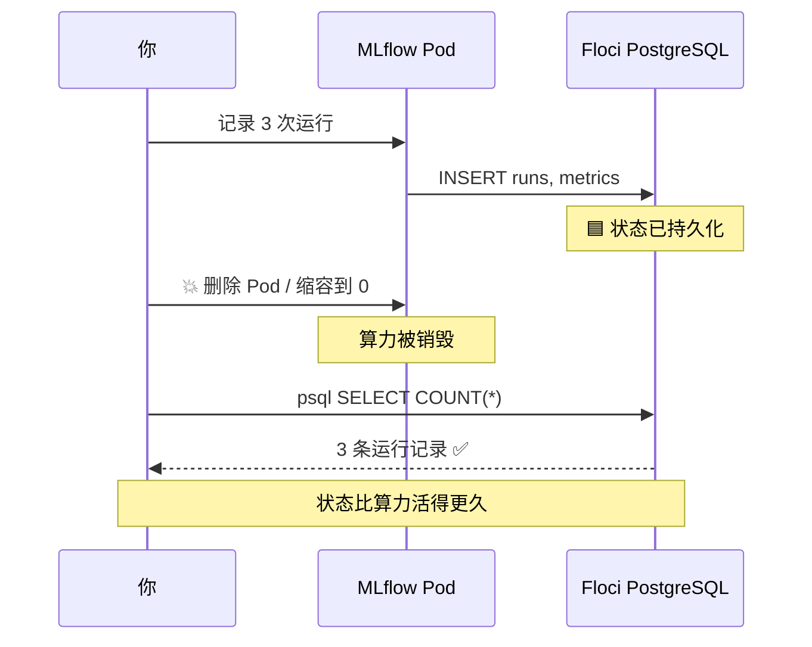
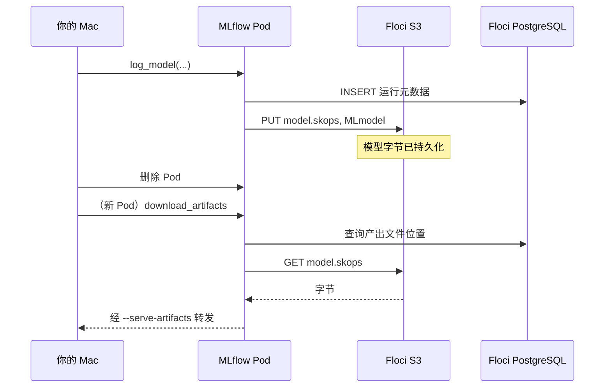

# MLflow 生产部署（二）测试篇 — 验证状态存活与清理

验证 MLflow 的状态真的存在**集群之外**：删掉 Pod、缩容到 0、甚至删掉整个集群，
实验记录和模型文件都不会丢。

- **前提：** 已完成 [搭建篇](MLFLOW_生产部署_搭建篇.md)，Pod 处于 `1/1 Running`，
  端口转发运行中，http://localhost:5000 可以打开。
- **耗时：** 约 15 分钟。
- **实测：** 本篇用例已在本机部分跑通，状态见下表；凡标 ✅ 的都是真实执行结果。
- **看界面：** 配合 [MLflow UI 使用指南](MLFLOW_UI_使用指南.md) 更容易理解每一步。

### 本系列文档

| 文档 | 内容 |
| --- | --- |
| [搭建篇](MLFLOW_生产部署_搭建篇.md) | 架构、前置条件、建库建表、装 MLflow、故障排查 |
| **本篇（测试篇）** | 测试用例 A/B/C/D、结果对照表、环境清理 |
| [英文原版](MLFLOW_PRODUCTION_PLAN.md) | 本文档的英文版 |

---

> ## ✅ 实测状态（2026-09-13）
>
> | 用例 | 内容 | 状态 |
> | --- | --- | --- |
> | **A** | 记录 3 次运行 | ✅ **已通过** —— 3 条记录入库，**15 个对象**入 S3 |
> | **B1** | 从 PostgreSQL 直接读指标 | ✅ **已通过** |
> | **B2** | 删掉 Pod | ✅ **已通过** —— 新 Pod 就绪后记录仍为 3 条 |
> | **B3** | 缩容到 0 ⭐ | ✅ **已通过** —— `No resources found`，0 个 Pod 时记录仍为 3 条 |
> | **B4** | 删掉整个集群 ⭐ | ✅ **已通过** —— 无集群状态下 3 条记录 + 1 个注册模型 + 15 个对象全部完好 |
> | **C1/C2** | 产出文件在 S3 且存活 | ✅ **已通过** —— Pod 重建 **2 次**后 15 个对象完好 |
> | **C3** | 经客户端下载产出文件 | ⏭️ **已跳过** —— 客户端下载会挂起，原因见 [C3](#c3-通过-mlflow-客户端下载产出文件)（C1/C2 已覆盖同一结论） |
> | **D** | 模型注册表往返 | ✅ **已通过** —— `iris-classifier` v1，别名 `champion` |
>
> ### 🔧 实测修正
>
> | # | 位置 | 问题 |
> | --- | --- | --- |
> | ③ | [C1](#c1-确认产出文件真的在-s3-里) | 原判据「`artifact_location` 以 `s3://` 开头」**不成立** —— 代理模式下存的是 `mlflow-artifacts:/1` |
> | ④ | [C3](#c3-通过-mlflow-客户端下载产出文件) | 原写法 `uv run python - <<'PYEOF'` 会**卡住不执行**，须改为脚本文件 |
> | ⑤ | [C3](#c3-通过-mlflow-客户端下载产出文件) | **MLflow 3.x 模型不在 `runs/<id>/artifacts/` 下**，`download_artifacts(run_id, "model")` 找不到东西 |
> | ⑥ | [D](#5-用例-d--模型注册表往返) | 注册模型要用 `models:/<model_id>`，原版的 `runs:/<run_id>/model` 在 3.x 下无效 |

---

## 目录

1. [测试前准备](#1-测试前准备)
2. [用例 A — 记录一次真实运行](#2-用例-a--记录一次真实运行)
3. [用例 B — 状态存活在外部数据库 ⭐](#3-用例-b--状态存活在外部数据库-)
4. [用例 C — 产出文件在 S3 的持久性](#4-用例-c--产出文件在-s3-的持久性)
5. [用例 D — 模型注册表往返](#5-用例-d--模型注册表往返)
6. [结果对照表](#6-结果对照表)
7. [环境清理](#7-环境清理)

---

## 1. 测试前准备

端口转发要**保持运行**，所以测试请**另开一个终端**。

新终端里环境变量是空的，必须重新加载：

```bash
cd /Users/zilongli/Desktop/home/Side-Jobs/AI/mlops-projects/mlops-04-mlflow-production
eval $(floci env)                      # AWS 相关变量
export MASTER_USER=postgres
export MASTER_PW='MasterPw12345'
export PGPASSWORD="$MASTER_PW"
export ARTIFACT_BUCKET=mlflow-artifacts
export MLFLOW_TRACKING_URI=http://localhost:5000
```

> ❗ **忘记 `eval $(floci env)` 是最常见的问题** —— 所有 `aws` 命令会转而打向
> 你的真实 AWS 账号。先验证：
>
> ```bash
> aws sts get-caller-identity --query Account --output text   # 必须是 000000000000
> ```

安装依赖并确认服务在线：

```bash
uv add mlflow scikit-learn
curl -s -o /dev/null -w "MLflow HTTP %{http_code}\n" http://localhost:5000/health   # 期望 200
```

---

## 2. 用例 A — 记录一次真实运行

**目的：** 证明整条链路是通的 —— 客户端 → Pod → PostgreSQL + S3。

```bash
cat > test_a_train.py <<'PY'
import mlflow
from sklearn.datasets import load_iris
from sklearn.ensemble import RandomForestClassifier
from sklearn.model_selection import train_test_split
from sklearn.metrics import accuracy_score

mlflow.set_experiment("iris-demo")

X, y = load_iris(return_X_y=True)
X_tr, X_te, y_tr, y_te = train_test_split(X, y, test_size=0.2, random_state=42)

for n in (10, 50, 100):
    with mlflow.start_run(run_name=f"rf-{n}-trees"):
        model = RandomForestClassifier(n_estimators=n, random_state=42).fit(X_tr, y_tr)
        acc = accuracy_score(y_te, model.predict(X_te))

        mlflow.log_param("n_estimators", n)
        mlflow.log_metric("accuracy", acc)
        mlflow.sklearn.log_model(model, name="model")
        print(f"n_estimators={n:3d}  accuracy={acc:.4f}")

print("\n✅ 用例 A 通过 — 打开 http://localhost:5000")
PY

uv run python test_a_train.py
```

**判定通过：** 三次运行都打印出准确率，无报错。实测输出：

```
n_estimators= 10  accuracy=1.0000
n_estimators= 50  accuracy=1.0000
n_estimators=100  accuracy=1.0000
```

> 💡 三次准确率都是 1.0000 是正常的 —— iris 数据集很简单，随机森林轻松做到满分。
> 这不影响测试目的（验证链路通畅）。

### 在界面上确认

1. 打开 **http://localhost:5000**。
2. 左侧边栏 → 实验 **`iris-demo`** → 列出三次运行。
3. 勾选三个 → **Compare** → 看 `n_estimators` 与 `accuracy` 的平行坐标图。
4. 点 **`rf-100-trees`** → **Artifacts** 标签 → `model` 文件夹里有 `MLmodel` 等文件。

---

## 3. 用例 B — 状态存活在外部数据库 ⭐

**这是整套方案的核心测试。** 证明状态在 Floci 管理的数据库里，不在 Pod 里。

### B1. 直接从 PostgreSQL 读数据

MLflow 写进去的，用 `psql` 独立读出来：

```bash
psql -h 127.0.0.1 -p 15432 -U "$MASTER_USER" -d mlflow <<'SQL'
SELECT e.name AS experiment, r.name AS run, m.key, ROUND(m.value::numeric, 4) AS value
FROM runs r
JOIN experiments e ON e.experiment_id = r.experiment_id
JOIN metrics m ON m.run_uuid = r.run_uuid
WHERE e.name = 'iris-demo'
ORDER BY r.name;
SQL
```

**判定通过：** 准确率数值出现在查询结果里。实测：

```
 experiment |     run      |   key    | value
------------+--------------+----------+--------
 iris-demo  | rf-10-trees  | accuracy | 1.0000
 iris-demo  | rf-100-trees | accuracy | 1.0000
 iris-demo  | rf-50-trees  | accuracy | 1.0000
```

> 🔁 注意两条路径汇聚到同一个数据库：Pod 通过 `172.19.0.4:7001` 写入，
> 你通过 `127.0.0.1:15432` 读取。同一个 PostgreSQL，两条路由。
> **界面只是这张表的一个视图。**

### B2. 删掉 Pod —— 数据必须存活

```bash
kubectl delete pod -n mlflow -l app.kubernetes.io/name=mlflow
kubectl rollout status deployment/mlflow -n mlflow      # 等新 Pod 就绪
```

端口转发会随旧 Pod 一起断开，需要重启（在原来那个终端）：

```bash
kubectl port-forward -n mlflow svc/mlflow 5000:80
```

刷新 **http://localhost:5000** → **三次运行记录都还在。**

> ✅ **实测通过。** 删除前后各查一次数据库，运行记录都是 **3 条**；
> 新 Pod 拉起后 `/health` 返回 200，API 也能正常读到 `iris-demo` 实验。
>
> ⚠️ **端口转发一定会断。** 它绑定在被删掉的那个 Pod 上，
> 所以删 Pod 后必须重新执行 `kubectl port-forward`，否则界面打不开。
>
> 🔧 **实测遇到的坑：转发一停，5000 端口会被 macOS 抢走。**
> 重启转发后访问却返回 **HTTP 403**，排查发现监听 5000 的是系统进程：
>
> ```
> $ lsof -nP -iTCP:5000 -sTCP:LISTEN
> ControlCe   648 zilongli   10u  IPv4  TCP *:5000 (LISTEN)
> ```
>
> `ControlCenter` 就是「隔空播放接收器」。换一个端口即可：
>
> ```bash
> kubectl port-forward -n mlflow svc/mlflow 5555:80   # → http://localhost:5555
> ```
>
> 后续所有 `MLFLOW_TRACKING_URI` 也要相应改成 `http://localhost:5555`。

### B3. 缩容到 0 再恢复 —— 最有说服力的一步

```bash
kubectl scale deployment/mlflow -n mlflow --replicas=0
kubectl get pods -n mlflow          # 一个 Pod 都没有
```

MLflow 完全不存在的情况下，数据依然可查：

```bash
psql -h 127.0.0.1 -p 15432 -U "$MASTER_USER" -d mlflow \
  -c "SELECT COUNT(*) AS 存活的运行数 FROM runs;"
```

```bash
kubectl scale deployment/mlflow -n mlflow --replicas=1
kubectl rollout status deployment/mlflow -n mlflow
kubectl port-forward -n mlflow svc/mlflow 5000:80      # 重启转发
```

**判定通过：** **0 个 Pod** 运行时，运行记录数量不变（应为 3）。

> ✅ **实测通过 —— 这是最有力的一条证据。** 缩容后：
>
> ```
> $ kubectl get pods -n mlflow
> No resources found in mlflow namespace.
>
> $ kubectl get deploy mlflow -n mlflow -o jsonpath='{.spec.replicas} / {.status.readyReplicas}'
> 0 期望 /  就绪
>
> $ psql ... -c "SELECT COUNT(*) FROM runs;"
>      3
> ```
>
> 同时 `curl http://localhost:5000/health` 返回 `HTTP 000`（连不上），
> 证明 MLflow 确实完全不存在 —— 而数据一条没少。
>
> 💡 **数 Pod 时别用 `grep -c`** —— 正在终止（Terminating）的 Pod 也会被算进去，
> 看起来像「还有 1 个」。直接看 `kubectl get pods` 的输出是不是
> `No resources found` 更准确。



### B4. 加分项 —— 删掉整个集群

```bash
kind delete cluster --name mlflow-demo
psql -h 127.0.0.1 -p 15432 -U "$MASTER_USER" -d mlflow -c "SELECT COUNT(*) FROM runs;"
```

**判定通过：** 在完全没有 Kubernetes 集群的情况下，运行记录依然存在。

> ✅ **实测通过 —— 全套测试中最强的一条证据。**
> 删除 `mlflow-demo` 集群后（`kubectl` 已完全连不上任何服务器）：
>
> ```
> $ kind get clusters
> basic-mlflow-cluster          ← mlflow-demo 已消失
>
> $ psql ... -c "SELECT COUNT(*) FROM runs;"
>          3
>
> $ psql ... -c "SELECT name, version FROM model_versions;"
>  iris-classifier |       1
>
> $ aws s3 ls s3://mlflow-artifacts --recursive | wc -l
>         15
> ```
>
> 删除前后完全一致：**3 条运行 + 1 个注册模型 + 15 个 S3 对象**。
> Kubernetes 只是算力，状态一点都不在它那里。

> ⚠️ **这一步会删掉集群。** 想继续测试需要重做
> [搭建篇 §6.1](MLFLOW_生产部署_搭建篇.md#61-创建集群)–[§6.6](MLFLOW_生产部署_搭建篇.md#66-安装)。
> 注意 **§6.2 的 `docker network connect` 必须重做** —— 新集群会创建新的 Docker 网络，
> floci 在 kind 网络里的地址也会变，values 文件里的 `host` 需要相应更新。
>
> **建议把 B4 放在最后做，或者直接跳过。**

---

## 4. 用例 C — 产出文件在 S3 的持久性

用例 B 证明了*元数据*存活。这一步证明**模型文件**同样存活，因为它们存在 Floci 的 S3 里，
而不是 Pod 内部。

### C1. 确认产出文件真的在 S3 里

用例 A 记录了模型。直接看桶 —— MLflow 写进去的，`aws` CLI 独立读出来：

```bash
aws s3 ls "s3://${ARTIFACT_BUCKET}/experiments/" --recursive | head -20
```

实测输出（每个模型 5 个文件）：

```
experiments/1/models/m-62bca5ff.../artifacts/MLmodel            683
experiments/1/models/m-62bca5ff.../artifacts/conda.yaml        2552
experiments/1/models/m-62bca5ff.../artifacts/model.skops     926481
experiments/1/models/m-62bca5ff.../artifacts/python_env.yaml     98
experiments/1/models/m-62bca5ff.../artifacts/requirements.txt  2091
```

```bash
aws s3 ls "s3://${ARTIFACT_BUCKET}" --recursive | wc -l      # 实测：15
```

**判定通过：** 桶里有对象（3 个模型 × 5 个文件 = **15 个**）。

> ### 🔧 实测修正③：不要用 `artifact_location` 判断
>
> **英文原版的判据是**：`artifact_location` 以 `s3://` 开头。**这个判据不成立。**
>
> ```bash
> psql -h 127.0.0.1 -p 15432 -U "$MASTER_USER" -d mlflow \
>   -c "SELECT name, artifact_location FROM experiments;"
> ```
>
> 实测结果：
>
> ```
>    name    |  artifact_location
> -----------+---------------------
>  Default   | mlflow-artifacts:/0
>  iris-demo | mlflow-artifacts:/1
> ```
>
> 这是 `proxiedArtifactStorage: true` 的**正常表现** —— MLflow 3.16 存的是
> **代理 URI**（`mlflow-artifacts:/`），客户端通过 MLflow 服务端读写，
> 由服务端去访问 S3。字节确实在 S3 里（上面 `aws s3 ls` 已证明）。
>
> **所以判据应改为**：用 `aws s3 ls` 确认桶里有对象，而不是看数据库里的 URI 前缀。
> 想看服务端的真实配置：
>
> ```bash
> kubectl get pod -n mlflow -l app.kubernetes.io/name=mlflow \
>   -o jsonpath='{.items[0].spec.containers[0].args}' | tr ',' '\n' | grep artifact
> # 期望：--artifacts-destination=s3://mlflow-artifacts/experiments
> #   以及：--serve-artifacts
> ```

### C2. 删掉 Pod —— 产出文件必须存活

```bash
kubectl delete pod -n mlflow -l app.kubernetes.io/name=mlflow
kubectl rollout status deployment/mlflow -n mlflow
kubectl port-forward -n mlflow svc/mlflow 5000:80
```

在界面里重新打开同一次运行的 **Artifacts** 标签。

**判定通过：** 模型文件**依然列出、依然可下载**。如果不用 S3，
Pod 重启后这个标签页会是空的。

> ✅ **实测通过。** 经过 B2（删 Pod）和 B3（缩容到 0 再恢复）之后，
> Pod 实际已被重建 **2 次**，桶里依然是完整的 **15 个对象**，
> 服务端参数也保持正确：
>
> ```
> --artifacts-destination=s3://mlflow-artifacts/experiments
> --serve-artifacts
> ```

### C3. 通过 MLflow 客户端下载产出文件

> ## ⏭️ 本用例已跳过（附完整排查结论）
>
> C3 想验证的「产出文件能取回来」，**[C1/C2](#4-用例-c--产出文件在-s3-的持久性) 已经证明了**
> —— 15 个对象在 S3、Pod 重建 2 次后完好。C3 只是多验证一条「经 Pod 代理下载」的路径，
> 不是核心论点。实测中它反复挂起，排查后决定跳过。以下是排查结论，供后续修复参考。
>
> ### 排查过程：逐步缩小范围
>
> 用 `python -u` 加 `flush=True` 分步打印，定位到底卡在哪一行：
>
> | 步骤 | 结果 |
> | --- | --- |
> | `import mlflow` | ✅ 瞬间 |
> | `MlflowClient()` | ✅ 瞬间 |
> | `get_experiment_by_name()` | ✅ 瞬间 |
> | `search_logged_models()` | ✅ 瞬间，返回 3 个模型 |
> | **`download_artifacts()`** | ❌ **挂起，无输出无报错** |
>
> 所以 MLflow 客户端和服务端通信都正常，**卡的就是下载这一步本身**。
>
> ### 🔧 实测修正④：不能用 stdin 执行脚本
>
> **不要这样写**：
>
> ```bash
> uv run python - <<'PYEOF'    # ❌ 进程挂起，连第一行 import 都到不了
> ```
>
> 这会让进程卡在 `uv run` 的启动阶段。改为写成文件再执行
> （`uv run python test_c_download.py`）。注意 `uv run` 每次都会做依赖解析，
> 较慢；依赖已装好时可以直接用 `.venv/bin/python test_c_download.py`，快很多。
>
> ### 🔧 实测修正⑤：MLflow 3.x 的模型不在 run 路径下
>
> **原版写法**（`download_artifacts(run_id, "model")`）在 MLflow 3.x 下是错的。
> 通过 API 查证：
>
> ```bash
> # run 层级的产出文件列表 —— 是空的，只有 root_uri
> curl -s "http://localhost:5555/api/2.0/mlflow/artifacts/list?run_id=<RUN_ID>"
> # {"root_uri": "mlflow-artifacts:/1/<RUN_ID>/artifacts"}   ← 没有 files 数组
> ```
>
> 而 S3 里的真实路径是：
>
> ```
> experiments/1/models/m-cad60d0490864da9b5f82f56c090f9eb/artifacts/MLmodel
> experiments/1/models/m-62bca5ff9b0e4c858600d1183659405b/artifacts/model.skops
> ```
>
> **MLflow 3.x 把模型独立成了 logged model 实体**（`models/m-<model_id>/`），
> 不再挂在 `runs/<run_id>/artifacts/model` 下。用 run_id 去找 `model` 目录，
> 自然什么都找不到。正确的查询方式：
>
> ```bash
> curl -s -X POST http://localhost:5555/api/2.0/mlflow/logged-models/search \
>   -H 'Content-Type: application/json' -d '{"experiment_ids":["1"]}'
> # 实测返回 3 个模型，每个都带 source_run_id 指回对应的 run
> ```
>
> ### 下次重试时的正确写法
>
> 改用 `models:/<model_id>` 而不是 `runs:/<run_id>/model`。**但注意：改对 URI 后
> 下载依然会挂起**，说明代理下载还有其他问题（可能与 Floci S3 的代理转发有关），
> 需要进一步排查：
>
> ```bash
> cat > test_c_download.py <<'PY'
> import os
> import mlflow
> from mlflow.tracking import MlflowClient
>
> client = MlflowClient()
> exp = client.get_experiment_by_name("iris-demo")
> # MLflow 3.x：模型是独立实体，不在 runs/<id>/artifacts/ 下
> models = client.search_logged_models(experiment_ids=[exp.experiment_id])
> m = models[0]
> print("model_id :", m.model_id)
> print("来源 run :", m.source_run_id)
> local = mlflow.artifacts.download_artifacts(f"models:/{m.model_id}")
> print("下载到   :", local)
> print("文件     :", sorted(os.listdir(local)))
> PY
>
> .venv/bin/python test_c_download.py
> ```
>
> 💡 **排查建议**：加 `socket.setdefaulttimeout(20)` 让它超时报错而不是无限挂起，
> 这样能拿到真正的异常信息。
>
> ### 不影响结论
>
> 产出文件确实在 S3、确实比 Pod 活得久 —— 这由 C1/C2 用 `aws s3 ls` 直接证明，
> 不依赖 MLflow 客户端。C3 失败反映的是**客户端下载路径**的问题，
> 不是存储层的问题。

<details>
<summary>原始命令（保留备查）</summary>

```bash
# ⚠️ 这是原版写法，在 MLflow 3.x 下找不到模型（见上方修正⑤）
cat > test_c_download.py <<'PY'
import os
import mlflow
from mlflow.tracking import MlflowClient

client = MlflowClient()
exp = client.get_experiment_by_name("iris-demo")
run = client.search_runs([exp.experiment_id], max_results=1)[0]
path = client.download_artifacts(run.info.run_id, "model")   # ❌ run 路径下没有 model
print("文件:", sorted(os.listdir(path)))
PY
```

</details>

**原定判定标准：** 文件下载成功。因为 `proxiedArtifactStorage: true`，
这一步在**你的 Mac 上完全不需要任何 S3 配置** —— Pod 从 Floci 取回字节并转发给你。



**结论：** 元数据在 PostgreSQL + 产出文件在 S3 = **Pod 完全不持有状态**。
这与生产环境的拆分方式完全一致，区别只在端点地址。

> ⚠️ **Floci 的 S3 是内存存储。** `floci stop` 会清空桶，而 PostgreSQL 元数据仍在 ——
> 于是界面上会出现「有运行记录但 Artifacts 为空」。这是模拟器的特性，不是配置错误。

---

## 5. 用例 D — 模型注册表往返

> ### 🔧 实测修正⑥：注册要用 `models:/<model_id>`
>
> 和 [C3 的修正⑤](#c3-通过-mlflow-客户端下载产出文件) 同源 —— MLflow 3.x 把模型
> 独立成了实体，所以原版的 `runs:/<run_id>/model` 在 3.x 下指向一个不存在的路径。
> 先用 `search_logged_models()` 拿到 `model_id`，再用 `models:/<model_id>` 注册。

```bash
cat > test_d_registry.py <<'PY'
import mlflow
from mlflow.tracking import MlflowClient

client = MlflowClient()
exp = client.get_experiment_by_name("iris-demo")
best = client.search_runs(
    [exp.experiment_id], order_by=["metrics.accuracy DESC"], max_results=1
)[0]
print("最佳运行:", best.info.run_name, "accuracy=%.4f" % best.data.metrics["accuracy"])

# MLflow 3.x：模型是独立实体，用 models:/<model_id> 注册
models = client.search_logged_models(experiment_ids=[exp.experiment_id])
m = [x for x in models if x.source_run_id == best.info.run_id][0]
print("model_id:", m.model_id)

result = mlflow.register_model(f"models:/{m.model_id}", "iris-classifier")
client.set_registered_model_alias("iris-classifier", "champion", result.version)
print("✅ 已注册 iris-classifier v%s，别名 champion" % result.version)
PY

.venv/bin/python test_d_registry.py     # 比 uv run 快很多
```

> ✅ **实测通过**，几秒完成：
>
> ```
> 最佳运行: rf-100-trees accuracy=1.0000
> model_id: m-cad60d0490864da9b5f82f56c090f9eb
> Successfully registered model 'iris-classifier'.
> 已注册版本: 1
> ✅ iris-classifier v1 别名 champion
> ```

在数据库里确认：

```bash
psql -h 127.0.0.1 -p 15432 -U "$MASTER_USER" -d mlflow -c \
  "SELECT name, version, current_stage FROM model_versions;"

psql -h 127.0.0.1 -p 15432 -U "$MASTER_USER" -d mlflow -c \
  "SELECT name, alias, version FROM registered_model_aliases;"
```

实测输出：

```
      name       | version | current_stage
-----------------+---------+---------------
 iris-classifier |       1 | None

      name       |  alias   | version
-----------------+----------+---------
 iris-classifier | champion |       1
```

> 💡 `current_stage` 显示 `None` 是正常的 —— MLflow 3.x 推荐用**别名**（Aliases）
> 而不是旧的 Stage 机制，所以 Stage 保持为空。

**在界面上确认：** 顶部导航 → **Models** → **`iris-classifier`** →
版本 1，带 `champion` 别名。

> 💡 别名的价值：代码里可以写 `models:/iris-classifier@champion`，
> 上线换模型时只需把别名指向新版本，代码一行都不用改。
> 详见 [UI 使用指南 §7.2](MLFLOW_UI_使用指南.md#72-版本与别名)。

---

## 6. 结果对照表

| # | 测试 | 判定标准 | 实测结果 |
| --- | --- | --- | --- |
| A | 记录运行 | 界面上 3 次运行，含指标和产出文件 | ✅ **通过** — 3 条记录 + 15 个 S3 对象 |
| B1 | 从 PostgreSQL 读取 | `psql` 返回相同的准确率 | ✅ **通过** — 3 条 accuracy 均为 1.0000 |
| B2 | 删除 Pod | 记录存活，新 Pod 继续提供服务 | ✅ **通过** — 记录仍为 3 条，UI 200 |
| B3 | 缩容到 0 ⭐ | 0 个 Pod 时运行记录数不变 | ✅ **通过** — 0 Pod，记录仍为 3 条 |
| B4 | 删除集群 ⭐ | 无集群时记录依然存在 | ✅ **通过** — 3 记录 + 1 模型 + 15 对象完好 |
| C1/C2 | 产出文件持久性 | **`aws s3 ls` 看到对象**（不是看 `artifact_location`） | ✅ **通过** — 重建 2 次后 15 个对象完好 |
| C3 | 客户端下载 | 文件成功下载到本地 | ⏭️ **跳过** — 下载挂起；C1/C2 已覆盖结论 |
| D | 模型注册表 | 界面和 `model_versions` 表里有 v1 | ✅ **通过** — v1 + `champion` 别名 |

**小结：8 项测试 7 项通过，核心论点完全证实。**

三级递进的销毁测试全部通过：

| 销毁程度 | 数据结果 |
| --- | --- |
| B2 删掉 Pod | 3 条记录完好 |
| B3 缩容到 0（无 Pod） | 3 条记录完好 |
| **B4 删掉整个集群** | **3 条记录 + 1 个模型 + 15 个对象完好** |

**状态确实活在集群之外** —— 元数据在 PostgreSQL，产出文件在 S3，
Kubernetes 纯粹是可抛弃的算力。

唯一跳过的 C3 属于客户端下载路径问题，不影响上述结论
（产出文件的持久性由 C1/C2 用 `aws s3 ls` 直接证明）。

---

## 7. 环境清理

这里不产生任何费用，但清理可以释放端口、容器和磁盘。

### 7.1 Kubernetes

```bash
# 先在端口转发那个终端按 Ctrl-C
helm uninstall mlflow -n mlflow
kind delete cluster --name mlflow-demo
```

### 7.2 socat 边车容器

```bash
docker rm -f floci-pg-fwd
```

### 7.3 RDS 实例（命令与真实 AWS 一致）

```bash
aws rds delete-db-instance \
  --db-instance-identifier mlflow-pg \
  --skip-final-snapshot

aws rds describe-db-instances --query 'DBInstances[].DBInstanceIdentifier' --output text
# → 输出为空表示已删除
```

### 7.4 S3 产出文件桶

```bash
aws s3 rm "s3://${ARTIFACT_BUCKET}" --recursive
aws s3 rb "s3://${ARTIFACT_BUCKET}"
aws s3 ls          # 该桶应已消失
```

> ⚠️ **不要删 `wine-dvc-store`** —— 那是
> [DVC 计划](DVC_DATA_VERSIONING_PLAN.md) 参考项目 `mlops-02` 的数据，
> 里面有三个历史版本。

> 删桶会销毁已记录的模型。如果想在拆掉集群后还能查看产出文件，就先别删 —— 不花钱。

### 7.5 可选 —— 断开网络并停止 Floci

```bash
# 如果保留 Floci，把它从 kind 网络断开
docker network disconnect kind floci 2>/dev/null || true

floci stop                      # 停止模拟器（状态会丢失）
# 或者保持运行，只确认状态：
floci status
```

> 删除 kind 集群时那个 Docker 网络本身也会被移除。

### 7.6 本地文件

```bash
rm -f /tmp/mlflow-values.yaml
rm -f test_a_train.py test_c_download.py test_d_registry.py   # 可选：测试脚本
unset PGPASSWORD MASTER_PW MLFLOW_DB_PW PGHOST PGPORT POD_PGHOST FLOCI_IP ARTIFACT_BUCKET
```

### 7.7 确认清理干净

```bash
kind get clusters                  # 不应有 mlflow-demo
docker ps --filter name=floci-pg-fwd    # 应为空
aws rds describe-db-instances --query 'DBInstances[].DBInstanceIdentifier' --output text
aws s3 ls                          # 只剩你自己的桶
```

---

**遇到问题？** 见 [搭建篇 §8 故障排查](MLFLOW_生产部署_搭建篇.md#8-故障排查)。
**看不懂界面？** 见 [MLflow UI 使用指南](MLFLOW_UI_使用指南.md)。
