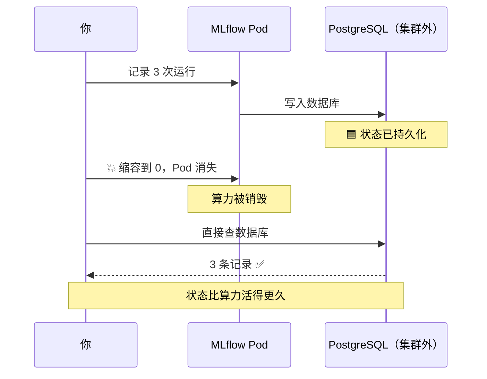
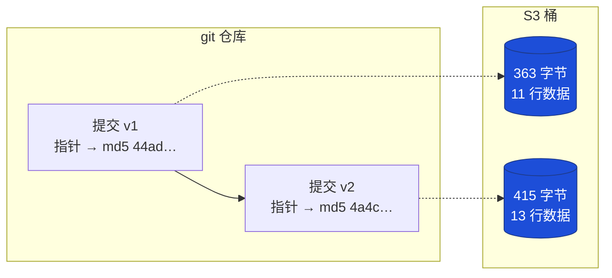

# MLflow 生产部署（二）测试篇 — 手动测试手册

**照着一步步敲就能做完。** 每一步都告诉你：敲什么命令、应该看到什么、算不算通过。

- **前提：** 已完成 [搭建篇](MLFLOW_生产部署_搭建篇.md)，Pod 是 `1/1 Running`。
- **耗时：** 第一组约 15 分钟，第二组约 20 分钟。
- **一共 12 步**，每步都有 ✅ 判定标准。

### 这份测试在验证什么

| 组别 | 要证明的事 | 怎么证明 |
| --- | --- | --- |
| **第一组** | 状态**不在** Kubernetes 里 | 删 Pod → 缩容到 0 → 删整个集群，数据都不丢 |
| **第二组** | 数据版本**可追溯** | 只凭一个 run_id，把当初的训练数据逐字节取回来 |

### 本系列文档

| 文档 | 内容 |
| --- | --- |
| [搭建篇](MLFLOW_生产部署_搭建篇.md) | 环境怎么搭、出问题怎么查 |
| **本篇（测试篇）** | 手动测试手册（你在看的） |
| [UI 使用指南](MLFLOW_UI_使用指南.md) | 界面怎么看 |
| [英文原版](MLFLOW_PRODUCTION_PLAN.md) | 英文版计划 |

---

## 📋 测试清单

做到哪一步了，对着勾：

**第一组：MLflow 状态存活**

- [ ] [步骤 0](#步骤-0--准备终端) 准备终端（必做）
- [ ] [步骤 1](#步骤-1--记录-3-次训练) 记录 3 次训练
- [ ] [步骤 2](#步骤-2--从数据库直接读数据) 从数据库直接读数据
- [ ] [步骤 3](#步骤-3--删掉-pod) 删掉 Pod
- [ ] [步骤 4](#步骤-4--缩容到-0-) 缩容到 0 ⭐
- [ ] [步骤 5](#步骤-5--确认模型文件在-s3) 确认模型文件在 S3
- [ ] [步骤 6](#步骤-6--注册模型) 注册模型
- [ ] [步骤 7](#步骤-7--删掉整个集群-) 删掉整个集群 ⭐

**第二组：DVC 数据版本**

- [ ] [步骤 8](#步骤-8--准备-dvc) 准备 DVC
- [ ] [步骤 9](#步骤-9--做出两个数据版本) 做出两个数据版本
- [ ] [步骤 10](#步骤-10--训练两次分别用两个版本-) 训练两次，分别用两个版本 ⭐
- [ ] [步骤 11](#步骤-11--凭-run_id-找回原始数据-) 凭 run_id 找回原始数据 ⭐
- [ ] [步骤 12](#步骤-12--抓出被偷偷改过的数据) 抓出被偷偷改过的数据

**收尾**

- [ ] [清理环境](#清理环境)

> ⏭️ **步骤 7 会删掉集群**，做完就得重建才能继续。所以放在第一组最后。
> 如果想接着做第二组，**先跳过步骤 7，等第二组做完再回来做**。

---

## 步骤 0 — 准备终端

> 🎯 **这一步做什么：** 打开一个新终端，设好变量，清掉旧数据。
> **不做这步后面全会出错**，务必完整执行。

### 0-1. 开一个新终端

端口转发要一直开着，所以**测试要用另一个终端**。

```bash
cd /Users/zilongli/Desktop/home/Side-Jobs/AI/mlops-projects/mlops-04-mlflow-production
```

### 0-2. 设置环境变量

**整段复制粘贴**，一次执行：

```bash
eval $(floci env)
export MASTER_USER=postgres
export MASTER_PW='MasterPw12345'
export PGPASSWORD="$MASTER_PW"
export ARTIFACT_BUCKET=mlflow-artifacts
export DVC_BUCKET=wine-dvc-store-k8s
export MLFLOW_URL=http://localhost:5555
export MLFLOW_TRACKING_URI=$MLFLOW_URL
export MLFLOW_DISABLE_AGENT_HINT=1
```

> 💡 **后面每条命令都用 `$MLFLOW_URL`**，所以万一你的端口不是 5555，
> 只改这一行就行，其它命令一个字都不用动。

### 0-3. 三项检查（都要通过才能往下）

```bash
# ① 确认没连到真实 AWS —— 必须输出 000000000000
aws sts get-caller-identity --query Account --output text

# ② 确认 MLflow 活着 —— 必须输出 200
curl -s -o /dev/null -w "%{http_code}\n" $MLFLOW_URL/health

# ③ 确认数据库能连 —— 必须输出一个数字
psql -h 127.0.0.1 -p 15432 -U $MASTER_USER -d mlflow -t -c "SELECT COUNT(*) FROM runs;"
```

| 检查 | 期望 | 不对怎么办 |
| --- | --- | --- |
| ① 账号 | `000000000000` | 重新执行 `eval $(floci env)` |
| ② MLflow | `200` | 见下方「端口问题」 |
| ③ 数据库 | 任意数字 | 见 [搭建篇 §8](MLFLOW_生产部署_搭建篇.md#8-故障排查) |

> ### ❗ 端口问题（很常见）
>
> 如果 ② 返回 **403** 或连不上，多半是 **macOS 抢走了 5000 端口**
> （「隔空播放接收器」）。确认一下：
>
> ```bash
> lsof -nP -iTCP:5000 -sTCP:LISTEN
> # 看到 ControlCe 就是它干的
> ```
>
> 在**端口转发那个终端**改用 5555：
>
> ```bash
> kubectl port-forward -n mlflow svc/mlflow 5555:80
> ```
>
> 本文档默认就是 5555，所以不用改任何命令。

### 0-4. 清空旧数据（重要）

如果之前跑过测试，残留数据会让你看到的数字对不上（比如 6 条而不是 3 条）。
**先清空，从零开始**：

```bash
cat > reset_mlflow.py <<'PY'
import time
import mlflow
from mlflow.tracking import MlflowClient

c = MlflowClient()

for m in c.search_registered_models():
    c.delete_registered_model(m.name)
    print("删除模型:", m.name)

# 先改名再删除：MLflow 是软删除，不改名的话同名实验建不回来
for e in c.search_experiments():
    if e.name != "Default":
        c.rename_experiment(e.experiment_id, "%s-old-%d" % (e.name, int(time.time())))
        c.delete_experiment(e.experiment_id)
        print("归档实验:", e.name)

print("✅ 已清空")
PY

uv run python reset_mlflow.py
```

旧的模型文件也要清掉，否则步骤 5 数出来的对象数会累加：

```bash
aws s3 rm "s3://${ARTIFACT_BUCKET}" --recursive
aws s3 ls "s3://${ARTIFACT_BUCKET}" --recursive | wc -l     # 应为 0
```

> 💡 **为什么要单独清 S3：** 上面的脚本只清数据库里的实验记录，
> S3 里的模型文件不会跟着删。不清的话，跑第二轮时步骤 5 会看到 30 个对象、
> 第三轮 45 个 —— 和文档写的 15 对不上，容易以为出错了。

> ### 🔧 为什么要「先改名再删除」
>
> MLflow 的 `delete_experiment` 是**软删除** —— 记录还在数据库里，
> 只是标记成 `deleted`。直接删的话，下一步建同名实验会报错：
>
> ```
> Cannot set a deleted experiment 'iris-demo' as the active experiment.
> ```
>
> 改名后再删，原来的名字就空出来了，可以正常重建。**这是实测踩过的坑。**

**✅ 通过标准：** 输出 `✅ 已清空`，且下面这条只返回 `Default`：

```bash
psql -h 127.0.0.1 -p 15432 -U $MASTER_USER -d mlflow -t \
  -c "SELECT name FROM experiments WHERE lifecycle_stage='active';"
```

### 0-5. 装依赖

```bash
uv add mlflow scikit-learn
```

> ### 💡 统一用 `uv run` 运行
>
> 本文档所有 Python 和 DVC 命令都用 `uv run` 开头：
>
> ```bash
> uv run python reset_mlflow.py     # 跑脚本
> uv run dvc status                 # 跑 DVC
> ```
>
> `uv run` 会自动确保依赖同步后再执行，不用手动激活虚拟环境。
> 实测依赖装好后**只要 1 秒**，没有额外开销。
>
> ⚠️ **唯一要避免的写法**是把代码从管道喂给 Python：
>
> ```bash
> uv run python - <<'PYEOF'    # ❌ 会卡住，别这么写
> ```
>
> 一定要**写成 `.py` 文件再执行**。原因见[文末附录](#附录c3-客户端下载为什么跳过)。

---

## 步骤 1 — 记录 3 次训练

> 🎯 **这一步做什么：** 跑一个训练脚本，往 MLflow 写 3 条运行记录。
> 后面所有测试都基于这 3 条数据。

### 1-1. 创建脚本

```bash
cat > test_a_train.py <<'PY'
import mlflow
from sklearn.datasets import load_iris
from sklearn.ensemble import RandomForestClassifier
from sklearn.model_selection import train_test_split
from sklearn.metrics import accuracy_score

mlflow.set_experiment("iris-demo")

X, y = load_iris(return_X_y=True)
X_tr, X_te, y_tr, y_te = train_test_split(X, y, test_size=0.2, random_state=42)

for n in (10, 50, 100):
    with mlflow.start_run(run_name=f"rf-{n}-trees"):
        model = RandomForestClassifier(n_estimators=n, random_state=42).fit(X_tr, y_tr)
        acc = accuracy_score(y_te, model.predict(X_te))

        mlflow.log_param("n_estimators", n)
        mlflow.log_metric("accuracy", acc)
        mlflow.sklearn.log_model(model, name="model")
        print(f"n_estimators={n:3d}  accuracy={acc:.4f}")

print("\n完成")
PY
```

### 1-2. 运行

```bash
uv run python test_a_train.py
```

**应该看到：**

```
n_estimators= 10  accuracy=1.0000
n_estimators= 50  accuracy=1.0000
n_estimators=100  accuracy=1.0000

完成
```

> 💡 准确率都是 1.0000 很正常 —— iris 数据集简单，随机森林轻松满分。
> 这不影响测试目的（验证链路通畅）。

### 1-3. 在界面上看

打开 **http://localhost:5555**：

1. 左侧点实验 **`iris-demo`** → 应该有 **3 条运行**
2. 全部勾选 → 点 **Compare** → 能看到平行坐标图
3. 点 **`rf-100-trees`** → **Artifacts** 标签 → 有 `model` 文件夹

**✅ 通过标准：** 界面上有 3 条运行，Artifacts 里有模型文件。

---

## 步骤 2 — 从数据库直接读数据

> 🎯 **这一步做什么：** 绕开 MLflow 界面，直接查 PostgreSQL。
> **证明界面只是数据库的一个视图** —— 数据真的存在外部数据库里。

```bash
psql -h 127.0.0.1 -p 15432 -U $MASTER_USER -d mlflow <<'SQL'
SELECT e.name AS experiment, r.name AS run, m.key, ROUND(m.value::numeric, 4) AS value
FROM runs r
JOIN experiments e ON e.experiment_id = r.experiment_id
JOIN metrics m ON m.run_uuid = r.run_uuid
WHERE e.name = 'iris-demo'
ORDER BY r.name;
SQL
```

**应该看到：**

```
 experiment |     run      |   key    | value
------------+--------------+----------+--------
 iris-demo  | rf-10-trees  | accuracy | 1.0000
 iris-demo  | rf-100-trees | accuracy | 1.0000
 iris-demo  | rf-50-trees  | accuracy | 1.0000
```

**✅ 通过标准：** 查出 3 行，准确率和步骤 1 打印的一致。

> 🔁 **注意这里有两条路径通向同一个数据库：**
> Pod 从集群内部写入（`172.19.0.4:7001`），你从 Mac 读取（`127.0.0.1:15432`）。
> 同一个 PostgreSQL，两个入口。

---

## 步骤 3 — 删掉 Pod

> 🎯 **这一步做什么：** 把跑 MLflow 的容器删掉，看数据还在不在。
> 这是「状态在集群外」的第一级验证。

### 3-1. 先记下当前数字

```bash
psql -h 127.0.0.1 -p 15432 -U $MASTER_USER -d mlflow -t -c "SELECT COUNT(*) FROM runs;"
```

记住这个数（应该是 **3**）。

### 3-2. 删掉 Pod

```bash
kubectl delete pod -n mlflow -l app.kubernetes.io/name=mlflow
kubectl rollout status deployment/mlflow -n mlflow
```

等到显示 `successfully rolled out`。

### 3-3. 重启端口转发 ⚠️

**端口转发一定会断** —— 它绑在刚被删掉的那个 Pod 上。
到**端口转发那个终端**（可能已经报错退出了），重新执行：

```bash
kubectl port-forward -n mlflow svc/mlflow 5555:80
```

### 3-4. 验证数据还在

回到测试终端：

```bash
psql -h 127.0.0.1 -p 15432 -U $MASTER_USER -d mlflow -t -c "SELECT COUNT(*) FROM runs;"
curl -s -o /dev/null -w "MLflow: %{http_code}\n" $MLFLOW_URL/health
```

**✅ 通过标准：**
- 运行数还是 **3**（和 3-1 一样）
- MLflow 返回 **200**
- 刷新 http://localhost:5555 → 3 条运行都在

---

## 步骤 4 — 缩容到 0 ⭐

> 🎯 **这一步做什么：** 把 Pod 数量降到 0 —— MLflow **彻底不存在**了。
> 然后证明数据依然完好。**这是最有说服力的一步。**

### 4-1. 缩到 0

```bash
kubectl scale deployment/mlflow -n mlflow --replicas=0
kubectl get pods -n mlflow
```

**应该看到：**

```
No resources found in mlflow namespace.
```

> 💡 **别用 `grep -c` 数 Pod** —— 正在关闭（Terminating）的 Pod 也会被算进去，
> 看起来像「还剩 1 个」。直接看是不是 `No resources found` 最准。

### 4-2. 确认 MLflow 真的没了

```bash
curl -s -m 5 -o /dev/null -w "MLflow: %{http_code}\n" $MLFLOW_URL/health
```

**应该看到 `MLflow: 000`**（连不上）—— 这正是我们要的，证明服务确实没了。

### 4-3. 关键一问：数据还在吗？

```bash
psql -h 127.0.0.1 -p 15432 -U $MASTER_USER -d mlflow \
  -c "SELECT COUNT(*) AS 存活的运行数 FROM runs;"
```

**应该看到：**

```
 存活的运行数
--------------
            3
```

**✅ 通过标准：0 个 Pod 的情况下，运行记录依然是 3 条。**

### 4-4. 恢复

```bash
kubectl scale deployment/mlflow -n mlflow --replicas=1
kubectl rollout status deployment/mlflow -n mlflow
```

再到端口转发终端重新执行：

```bash
kubectl port-forward -n mlflow svc/mlflow 5555:80
```



---

## 步骤 5 — 确认模型文件在 S3

> 🎯 **这一步做什么：** 步骤 2-4 证明了*元数据*（参数、指标）存活。
> 这一步看**模型文件本身**存在哪。

```bash
aws s3 ls "s3://${ARTIFACT_BUCKET}" --recursive | head -6
aws s3 ls "s3://${ARTIFACT_BUCKET}" --recursive | wc -l
```

**应该看到 15 个对象**（3 个模型 × 5 个文件）：

```
experiments/1/models/m-62bca5ff.../artifacts/MLmodel            683
experiments/1/models/m-62bca5ff.../artifacts/conda.yaml        2552
experiments/1/models/m-62bca5ff.../artifacts/model.skops     926481
experiments/1/models/m-62bca5ff.../artifacts/python_env.yaml     98
experiments/1/models/m-62bca5ff.../artifacts/requirements.txt  2091
```

**✅ 通过标准：** 对象数是 **15**，且经过步骤 3、4 的两次 Pod 重建后依然存在。

> 💡 **如果数出来比 15 多**（30、45…），说明之前跑过测试但没清 S3。
> 不影响结论，只是旧实验的文件还在。想看干净的数字，
> 回到 [步骤 0-4](#0-4-清空旧数据重要) 把桶清空后重跑。
>
> 只看当前这次实验的文件：
>
> ```bash
> EXP_ID=$(psql -h 127.0.0.1 -p 15432 -U $MASTER_USER -d mlflow -t \
>   -c "SELECT experiment_id FROM experiments WHERE name='iris-demo';" | tr -d ' ')
> aws s3 ls "s3://${ARTIFACT_BUCKET}/experiments/${EXP_ID}/" --recursive | wc -l    # 15
> ```

> ### ⚠️ 别用 `artifact_location` 判断
>
> 你可能想查数据库确认，但会看到这个：
>
> ```bash
> psql -h 127.0.0.1 -p 15432 -U $MASTER_USER -d mlflow \
>   -c "SELECT name, artifact_location FROM experiments;"
> #  iris-demo | mlflow-artifacts:/1     ← 不是 s3:// 开头
> ```
>
> **这是正常的**，不是配置错误。因为开启了代理模式（`proxiedArtifactStorage`），
> MLflow 存的是代理地址，实际字节在 S3 —— 上面 `aws s3 ls` 已经证明了。
> **判断产出文件在不在，看 `aws s3 ls`，不看数据库里的 URI。**

> ### ⏭️ 关于「用客户端下载模型」
>
> 原计划还有一步：用 `download_artifacts()` 把模型下载到本地。
> **实测这个 API 会挂起**（无输出无报错），所以从手册里移除了。
> 排查结论见[文末附录](#附录c3-客户端下载为什么跳过)。
>
> 不影响结论 —— 模型文件确实在 S3 且比 Pod 活得久，上面 `aws s3 ls` 已直接证明。

---

## 步骤 6 — 注册模型

> 🎯 **这一步做什么：** 把最好的那个模型注册进模型注册表，
> 打上 `champion` 别名 —— 这是模型上线的标准流程。

### 6-1. 创建脚本

```bash
cat > test_d_registry.py <<'PY'
import mlflow
from mlflow.tracking import MlflowClient

client = MlflowClient()
exp = client.get_experiment_by_name("iris-demo")
best = client.search_runs(
    [exp.experiment_id], order_by=["metrics.accuracy DESC"], max_results=1
)[0]
print("最佳运行:", best.info.run_name, "accuracy=%.4f" % best.data.metrics["accuracy"])

# MLflow 3.x：模型是独立实体，要先查 model_id
models = client.search_logged_models(experiment_ids=[exp.experiment_id])
m = [x for x in models if x.source_run_id == best.info.run_id][0]
print("model_id:", m.model_id)

result = mlflow.register_model(f"models:/{m.model_id}", "iris-classifier")
client.set_registered_model_alias("iris-classifier", "champion", result.version)
print("✅ 已注册 iris-classifier v%s，别名 champion" % result.version)
PY
```

> ### 🔧 注意这里用 `models:/<model_id>`
>
> 很多教程写的是 `runs:/<run_id>/model`，**在 MLflow 3.x 下会失败** ——
> 3.x 把模型独立成了实体，不再挂在 run 的路径下。
> 必须先用 `search_logged_models()` 拿到 `model_id`。**这是实测踩过的坑。**

### 6-2. 运行

```bash
uv run python test_d_registry.py
```

**应该看到：**

```
最佳运行: rf-100-trees accuracy=1.0000
model_id: m-cad60d0490864da9b5f82f56c090f9eb
Successfully registered model 'iris-classifier'.
✅ 已注册 iris-classifier v1，别名 champion
```

### 6-3. 数据库确认

```bash
psql -h 127.0.0.1 -p 15432 -U $MASTER_USER -d mlflow -c \
  "SELECT name, version FROM model_versions;"

psql -h 127.0.0.1 -p 15432 -U $MASTER_USER -d mlflow -c \
  "SELECT name, alias, version FROM registered_model_aliases;"
```

**应该看到：**

```
      name       | version
-----------------+---------
 iris-classifier |       1

      name       |  alias   | version
-----------------+----------+---------
 iris-classifier | champion |       1
```

### 6-4. 界面确认

顶部导航 → **Models** → **`iris-classifier`** → 版本 1，带 `champion` 别名。

**✅ 通过标准：** 数据库两张表都有记录，界面能看到 v1 和别名。

> 💡 **别名的用处：** 代码里写 `models:/iris-classifier@champion`，
> 换模型时只要把别名指向新版本，**代码一行都不用改**。

---

## 步骤 7 — 删掉整个集群 ⭐

> 🎯 **这一步做什么：** 把整个 Kubernetes 集群删了，看数据还在不在。
> **这是最强的证明。**

> ### ⏭️ 要不要现在做？
>
> **想接着做第二组（DVC）→ 先跳过这步**，等步骤 12 做完再回来。
> 因为删掉集群后，步骤 8-12 里的 DVC-E 就没法跑了。
>
> **只做第一组 → 现在就做。**

### 7-1. 先记录基线

```bash
psql -h 127.0.0.1 -p 15432 -U $MASTER_USER -d mlflow -t -c "SELECT '运行 '||COUNT(*) FROM runs;"
psql -h 127.0.0.1 -p 15432 -U $MASTER_USER -d mlflow -t -c "SELECT '模型 '||COUNT(*) FROM model_versions;"
echo "S3 对象 $(aws s3 ls s3://${ARTIFACT_BUCKET} --recursive | wc -l | tr -d ' ')"
```

记下这三个数字（应该是 **3 / 1 / 15**）。

### 7-2. 删掉集群

```bash
kind delete cluster --name mlflow-demo
kind get clusters
```

`mlflow-demo` 应该从列表里消失了。

### 7-3. 验证数据存活

```bash
psql -h 127.0.0.1 -p 15432 -U $MASTER_USER -d mlflow -c "SELECT COUNT(*) AS 运行数 FROM runs;"
psql -h 127.0.0.1 -p 15432 -U $MASTER_USER -d mlflow -c "SELECT name, version FROM model_versions;"
aws s3 ls "s3://${ARTIFACT_BUCKET}" --recursive | wc -l
```

**✅ 通过标准：三个数字和 7-1 完全一样（3 / 1 / 15）。**

在**完全没有 Kubernetes** 的情况下，所有数据完好无损。

### 7-4. 想继续用就重建

```bash
kind create cluster --name mlflow-demo
docker network connect kind floci 2>/dev/null || echo "已连接"

# 重新取 floci 在 kind 网络里的地址（可能会变！）
export POD_PGHOST=$(docker inspect floci --format '{{.NetworkSettings.Networks.kind.IPAddress}}')
echo "POD_PGHOST=$POD_PGHOST"

# 如果地址变了，要改 values 文件里的 host 再安装
helm install mlflow community-charts/mlflow --version 1.11.7 \
  --namespace mlflow --create-namespace \
  -f /tmp/mlflow-values.yaml --wait --timeout 6m

kubectl port-forward -n mlflow svc/mlflow 5555:80
```

> 💡 重建后打开界面，**之前的实验和模型都会回来** —— 因为它们从来就不在集群里。

---

## 步骤 8 — 准备 DVC

> 🎯 **第二组开始。** 要回答的问题：
> **「这个模型是用哪份数据训练的？半年后还能找回那份数据吗？」**
>
> MLflow 只记参数和指标 —— 数据文件被人改了，界面上**看不出任何差别**。
> 这就是要用 DVC 的原因。

### 8-1. 装 DVC

```bash
uv add "dvc[s3]>=3.67.1"
uv run dvc --version      # 应输出 3.67.1 或更高
```

### 8-2. 初始化

```bash
uv run dvc init
```

> 如果提示 `.dvc` 已存在，说明之前初始化过，跳过即可。

### 8-3. 准备数据

```bash
mkdir -p data
cp ../mlops-02-wine-perdiction-demo/data/wine_sample.csv data/
wc -l data/wine_sample.csv      # 应为 12 行
md5 -q data/wine_sample.csv     # 应为 44ad334235b5efb230fdeebf40098383
```

### 8-4. 配置 S3 远端

```bash
aws s3 mb "s3://${DVC_BUCKET}" 2>/dev/null || echo "桶已存在"

uv run dvc remote add -d -f floci "s3://${DVC_BUCKET}"
uv run dvc remote modify floci endpointurl "http://localhost.floci.io:4566"
uv run dvc remote modify --local floci access_key_id test
uv run dvc remote modify --local floci secret_access_key test
```

确认凭证没进 git：

```bash
cat .dvc/config            # 只有 url 和 endpointurl
git check-ignore -v .dvc/config.local    # 应显示被忽略
```

**✅ 通过标准：** `.dvc/config` 里没有密钥，`config.local` 被 git 忽略。

> 💡 **用的是 `wine-dvc-store-k8s`，不是 `wine-dvc-store`** ——
> 后者是 `mlops-02` 的数据，不要动它。

---

## 步骤 9 — 做出两个数据版本

> 🎯 **这一步做什么：** 造两个版本的数据集，都存进 S3。
> 后面用它们证明「哪次训练用了哪个版本」。

### 9-1. 跟踪 v1 并上传

```bash
uv run dvc add data/wine_sample.csv
uv run dvc push
cat data/wine_sample.csv.dvc
```

**应该看到指针文件：**

```yaml
outs:
- md5: 44ad334235b5efb230fdeebf40098383
  size: 363
  hash: md5
  path: wine_sample.csv
```

### 9-2. 验证 S3 里的字节就是这份数据

```bash
export V1_MD5=$(grep 'md5:' data/wine_sample.csv.dvc | awk '{print $3}')
aws s3api head-object --bucket "${DVC_BUCKET}" \
  --key "files/md5/${V1_MD5:0:2}/${V1_MD5:2}" --query 'ETag' --output text
```

**✅ 通过标准：输出的 ETag 和 `$V1_MD5` 完全一样。**

```
指针 md5: 44ad334235b5efb230fdeebf40098383
S3 ETag : "44ad334235b5efb230fdeebf40098383"    ← 一模一样
```

> 💡 这证明桶里的字节**就是** DVC 跟踪的那份数据，不是「差不多」。

### 9-3. 提交 v1 指针

```bash
git add data/wine_sample.csv.dvc data/.gitignore .dvc/config .dvc/.gitignore .dvcignore
git commit -m "Track wine dataset v1"
export V1_COMMIT=$(git rev-parse --short HEAD)
echo "V1_COMMIT=$V1_COMMIT"
```

> 💡 **注意 git 里只有指针文件**（几十字节），CSV 本体被自动 gitignore 了。
> 数据在 S3，git 只存"指向哪份数据"。

### 9-4. 造 v2（加两行）

```bash
cat >> data/wine_sample.csv <<'CSV'
7.9,0.60,0.06,1.6,0.069,5
8.9,0.62,0.18,3.8,0.176,6
CSV

uv run dvc add data/wine_sample.csv
uv run dvc push
export V2_MD5=$(grep 'md5:' data/wine_sample.csv.dvc | awk '{print $3}')

git add data/wine_sample.csv.dvc
git commit -m "Track wine dataset v2"
export V2_COMMIT=$(git rev-parse --short HEAD)

echo "v1 = $V1_MD5"
echo "v2 = $V2_MD5"
```

### 9-5. 确认两个版本共存

```bash
aws s3 ls "s3://${DVC_BUCKET}" --recursive --human-readable --summarize
```

**应该看到 2 个对象：**

```
363 Bytes  files/md5/44/ad334235b5efb230fdeebf40098383   ← v1
415 Bytes  files/md5/4a/4c6282070f3535a8612505cf719b11   ← v2
Total Objects: 2
```

**✅ 通过标准：两个 md5 不同，桶里有 2 个对象。**



---

## 步骤 10 — 训练两次，分别用两个版本 ⭐

> 🎯 **这一步做什么：** 用两个数据版本各训练一次，
> 证明 MLflow 能记住**每次用的是哪份数据**。

### 10-1. 创建训练脚本

这个脚本比步骤 1 的多做一件事：**把数据的 md5 记进 MLflow**。

```bash
cat > train_dvc.py <<'PY'
import hashlib
import subprocess
from pathlib import Path

import mlflow
import pandas as pd
import yaml
from sklearn.ensemble import RandomForestRegressor
from sklearn.metrics import mean_squared_error
from sklearn.model_selection import train_test_split

DATA = Path("data/wine_sample.csv")


def dvc_md5():
    """DVC 记录的 md5（数据应该是什么样）"""
    pointer = Path(str(DATA) + ".dvc")
    if not pointer.exists():
        return None
    return yaml.safe_load(pointer.read_text())["outs"][0]["md5"]


def file_md5():
    """磁盘上的实际 md5（数据现在是什么样）"""
    return hashlib.md5(DATA.read_bytes()).hexdigest()


def git_rev():
    try:
        return subprocess.check_output(
            ["git", "rev-parse", "--short", "HEAD"], text=True
        ).strip()
    except Exception:
        return "unknown"


df = pd.read_csv(DATA)
X = df.drop(columns=["quality"])
y = df["quality"]
X_tr, X_te, y_tr, y_te = train_test_split(X, y, test_size=0.3, random_state=42)

tracked, actual = dvc_md5(), file_md5()

mlflow.set_experiment("wine-dvc")
with mlflow.start_run() as run:
    model = RandomForestRegressor(n_estimators=50, random_state=42).fit(X_tr, y_tr)
    rmse = mean_squared_error(y_te, model.predict(X_te)) ** 0.5

    # --- 关键：记录数据血缘 ---
    mlflow.log_param("data_md5", tracked)
    mlflow.log_param("data_rows", len(df))
    mlflow.set_tag("git_commit", git_rev())
    mlflow.set_tag("data_verified", str(tracked == actual))

    mlflow.log_metric("rmse", rmse)
    mlflow.sklearn.log_model(model, name="model")

    print("run_id   :", run.info.run_id, flush=True)
    print("data_md5 :", tracked, flush=True)
    print("rows     : %d   rmse: %.4f" % (len(df), rmse), flush=True)
    if tracked != actual:
        print("⚠️  数据不一致 — 磁盘 %s，DVC 记录 %s" % (actual, tracked), flush=True)
PY
```

| 记的东西 | 类型 | 为什么 |
| --- | --- | --- |
| `data_md5` | 参数 | **版本身份证**，不可改、可搜索 |
| `data_rows` | 参数 | 方便人眼核对 |
| `git_commit` | 标签 | 代码版本 |
| `data_verified` | 标签 | `False` = 数据被改过 |

> 💡 **`data_md5` 必须是参数不能是标签** —— 参数不可修改，标签可以被人事后改掉。
> 追溯链要靠它，所以必须用不可改的。

### 10-2. 用 v2 训练（当前磁盘就是 v2）

```bash
uv run python -u train_dvc.py
```

**应该看到：**

```
run_id   : dfa334b3...
data_md5 : 4a4c6282070f3535a8612505cf719b11    ← v2
rows     : 13   rmse: 0.6832
```

### 10-3. 切回 v1 再训练一次

```bash
git checkout "$V1_COMMIT" -- data/wine_sample.csv.dvc
uv run dvc checkout data/wine_sample.csv.dvc
wc -l data/wine_sample.csv      # 应变回 12 行

uv run python -u train_dvc.py
```

**应该看到：**

```
run_id   : 2ef803b4...
data_md5 : 44ad334235b5efb230fdeebf40098383    ← v1
rows     : 11   rmse: 1.1651
```

> 💡 `dvc checkout` 就是**数据时光机** —— 把磁盘上的数据换成指针指向的那个版本。

### 10-4. 对比两次运行

```bash
psql -h 127.0.0.1 -p 15432 -U $MASTER_USER -d mlflow <<'SQL'
SELECT substring(r.run_uuid,1,8) AS run,
       MAX(CASE WHEN p.key='data_md5'  THEN substring(p.value,1,12) END) AS data_md5,
       MAX(CASE WHEN p.key='data_rows' THEN p.value END) AS rows,
       ROUND(MAX(m.value)::numeric,4) AS rmse
FROM runs r
JOIN experiments e ON e.experiment_id=r.experiment_id
JOIN params p ON p.run_uuid=r.run_uuid
LEFT JOIN metrics m ON m.run_uuid=r.run_uuid AND m.key='rmse'
WHERE e.name='wine-dvc'
GROUP BY r.run_uuid ORDER BY MAX(r.start_time);
SQL
```

**应该看到：**

```
   run    |   data_md5   | rows |  rmse
----------+--------------+------+--------
 dfa334b3 | 4a4c6282070f | 13   | 0.6832   ← v2
 2ef803b4 | 44ad334235b5 | 11   | 1.1651   ← v1
```

**✅ 通过标准：两条运行的 `data_md5` 和 `rows` 都不同。**

> 💡 **这就是价值所在：** 数据从 11 行增到 13 行，rmse 从 1.1651 降到 0.6832。
> 如果没记 `data_md5`，你只会看到两个指标不同的运行，**却不知道原因是数据变了**。

**界面确认：** 实验 `wine-dvc` → 勾选两条 → **Compare** → `data_md5` 高亮显示差异。

---

## 步骤 11 — 凭 run_id 找回原始数据 ⭐

> 🎯 **这一步做什么：** 模拟真实场景 —— 线上模型出问题了，
> 要查它到底用什么数据训练的，并把那份数据**原样取回来**。

### 11-1. 从运行里读出数据指纹

```bash
cat > test_dvc_c.py <<'PY'
import mlflow
from mlflow.tracking import MlflowClient

client = MlflowClient()
exp = client.get_experiment_by_name("wine-dvc")
runs = client.search_runs([exp.experiment_id], order_by=["attributes.start_time ASC"])
oldest = runs[0]
print("run_id  :", oldest.info.run_id)
print("data_md5:", oldest.data.params["data_md5"])
print("rows    :", oldest.data.params["data_rows"])
print("git     :", oldest.data.tags.get("git_commit"))
PY

uv run python -u test_dvc_c.py
```

**应该看到：**

```
run_id  : dfa334b31f4a4d4eaee8e65cd22e9d4e
data_md5: 4a4c6282070f3535a8612505cf719b11
rows    : 13
git     : 36d7482
```

### 11-2. 按 md5 把数据取回来

把上一步的 `data_md5` 填进去：

```bash
export OLD_MD5=4a4c6282070f3535a8612505cf719b11    # ← 改成你上一步看到的值

aws s3 cp "s3://${DVC_BUCKET}/files/md5/${OLD_MD5:0:2}/${OLD_MD5:2}" /tmp/restored.csv
```

### 11-3. 验证是不是原来那份

```bash
echo "取回的 md5: $(md5 -q /tmp/restored.csv)"
echo "期望的 md5: $OLD_MD5"
echo "取回的行数: $(wc -l < /tmp/restored.csv | tr -d ' ')   （13 行数据 + 1 行表头 = 14）"
echo "磁盘现在是: $(wc -l < data/wine_sample.csv | tr -d ' ')   （步骤 10 切成 v1 了，是 12）"
```

**✅ 通过标准：取回的 md5 和期望完全一致，行数是 14。**

```
取回的 md5: 4a4c6282070f3535a8612505cf719b11
期望的 md5: 4a4c6282070f3535a8612505cf719b11    ← 一模一样
取回的行数: 14
磁盘现在是: 12
```

> 💡 **注意最后两行**：磁盘上现在是 v1（12 行），但你依然精确取回了
> 那次训练用的 v2（14 行）。**只凭一个 run_id 就完全复现了。**


---

## 步骤 12 — 抓出被偷偷改过的数据

> 🎯 **这一步做什么：** 模拟最隐蔽的事故 —— 有人直接改了数据文件。
> git 看不出来（文件被 gitignore），但 DVC 能抓到。

### 12-1. 偷偷改一行

```bash
echo "9.9,0.99,0.99,9.9,0.999,9" >> data/wine_sample.csv
uv run dvc status
```

**应该看到 DVC 立刻发现：**

```
data/wine_sample.csv.dvc:
        changed outs:
                modified:           data/wine_sample.csv
```

### 12-2. 用被改过的数据训练

```bash
uv run python -u train_dvc.py
```

**应该看到警告：**

```
⚠️  数据不一致 — 磁盘 db64725c24de2efab6af0da1ff5fe956，
                DVC 记录 44ad334235b5efb230fdeebf40098383
```

### 12-3. 确认污染被记进 MLflow

```bash
psql -h 127.0.0.1 -p 15432 -U $MASTER_USER -d mlflow <<'SQL'
SELECT substring(r.run_uuid,1,8) AS run, t.value AS data_verified
FROM tags t
JOIN runs r ON r.run_uuid=t.run_uuid
JOIN experiments e ON e.experiment_id=r.experiment_id
WHERE e.name='wine-dvc' AND t.key='data_verified';
SQL
```

**应该看到：**

```
   run    | data_verified
----------+---------------
 dfa334b3 | True
 2ef803b4 | True
 7e4e83e4 | False          ← 这次的数据被改过，结果不可信
```

**✅ 通过标准：被污染那次标记为 `False`，其它两次是 `True`。**

**界面确认：** 打开那条运行 → **Tags** → `data_verified` 显示 `False`。

### 12-4. 恢复数据

```bash
uv run dvc checkout --force data/wine_sample.csv.dvc
uv run dvc status      # 应显示 Data and pipelines are up to date.
```

> ### 🔧 为什么要加 `--force`
>
> 不加的话 DVC 会拒绝：
>
> ```
> ERROR: Can't remove the following unsaved files without confirmation.
> Use `--force` to force.
> ```
>
> 这是**安全保护**，防止误删你还没保存的改动。
> 确认改动可以丢弃时才加 `--force`。**这是实测踩过的坑。**

---

## （可选）步骤 13 — 集群内的 Job 按版本取数据

> 🎯 前面都在 Mac 上跑。这一步验证**集群里的 Pod 也能按 md5 取数据** ——
> 真实的训练任务就是这么跑的。
>
> ⚠️ **需要集群还在**（没做过步骤 7，或已重建）。

```bash
export FLOCI_IP=$(docker inspect floci --format '{{.NetworkSettings.Networks.kind.IPAddress}}')
echo "FLOCI_IP=$FLOCI_IP"

cat > /tmp/dvc-job.yaml <<YAML
apiVersion: batch/v1
kind: Job
metadata:
  name: wine-dvc-pull
  namespace: mlflow
spec:
  backoffLimit: 0
  template:
    spec:
      restartPolicy: Never
      containers:
        - name: dvc-pull
          image: python:3.12-slim
          env:
            - name: AWS_ENDPOINT_URL
              value: "http://${FLOCI_IP}:4566"
            - name: AWS_ACCESS_KEY_ID
              value: "test"
            - name: AWS_SECRET_ACCESS_KEY
              value: "test"
            - name: AWS_DEFAULT_REGION
              value: "us-east-1"
            - name: DATA_MD5
              value: "${V2_MD5}"
            - name: DVC_BUCKET
              value: "${DVC_BUCKET}"
          command: ["sh", "-c"]
          args:
            - |
              set -e
              pip install -q "dvc[s3]>=3.67.1" 2>&1 | tail -1
              PREFIX=\$(echo "\$DATA_MD5" | cut -c1-2)
              REST=\$(echo "\$DATA_MD5" | cut -c3-)
              echo "拉取 md5=\$DATA_MD5"
              python -m dvc get-url "s3://\${DVC_BUCKET}/files/md5/\${PREFIX}/\${REST}" /tmp/pulled.csv
              echo "行数: \$(wc -l < /tmp/pulled.csv)"
              echo "md5 : \$(md5sum /tmp/pulled.csv | cut -d' ' -f1)"
              echo "期望: \$DATA_MD5"
YAML

kubectl apply -f /tmp/dvc-job.yaml
kubectl wait --for=condition=complete job/wine-dvc-pull -n mlflow --timeout=5m
kubectl logs -n mlflow job/wine-dvc-pull
```

**应该看到（约 25 秒）：**

```
拉取 md5=4a4c6282070f3535a8612505cf719b11
行数: 14
md5 : 4a4c6282070f3535a8612505cf719b11
期望: 4a4c6282070f3535a8612505cf719b11      ← 完全匹配
```

**✅ 通过标准：Job 状态 `Complete`，md5 与期望一致。**

清理：

```bash
kubectl delete job wine-dvc-pull -n mlflow
```

> ⚠️ **端点必须用 `$FLOCI_IP`，不能用 `localhost`** ——
> 在 Pod 里 `localhost` 指的是 Pod 自己，连不到 Floci。

---

## 全部完成 🎉

| 你证明了什么 | 靠哪几步 |
| --- | --- |
| **状态不在 Kubernetes 里** | 步骤 3（删 Pod）、4（缩容到 0）、7（删集群）数据都没丢 |
| **模型文件也在集群外** | 步骤 5，Pod 重建多次后 S3 对象完好 |
| **每次训练都知道用了哪份数据** | 步骤 10，两个版本的 `data_md5` 清晰可辨 |
| **能凭 run_id 复现** | 步骤 11，取回的数据逐字节一致 |
| **数据被改会被发现** | 步骤 12，标记 `data_verified=False` |

---

## 清理环境

> 这里不花钱，清理只是释放端口、容器和磁盘。**想继续用就别清。**

### 只清测试数据，保留环境

```bash
uv run python reset_mlflow.py     # 清空实验和模型
```

### 全部拆掉

```bash
# 1. Kubernetes（先在端口转发终端按 Ctrl-C）
helm uninstall mlflow -n mlflow
kind delete cluster --name mlflow-demo

# 2. 数据库转发容器
docker rm -f floci-pg-fwd

# 3. 数据库实例
aws rds delete-db-instance --db-instance-identifier mlflow-pg --skip-final-snapshot

# 4. 两个桶
aws s3 rm "s3://${ARTIFACT_BUCKET}" --recursive && aws s3 rb "s3://${ARTIFACT_BUCKET}"
aws s3 rm "s3://${DVC_BUCKET}" --recursive && aws s3 rb "s3://${DVC_BUCKET}"

# 5. 本地文件
rm -f test_a_train.py test_d_registry.py train_dvc.py test_dvc_c.py reset_mlflow.py
rm -f /tmp/mlflow-values.yaml /tmp/dvc-job.yaml /tmp/restored.csv
```

> ⚠️ **千万别删 `wine-dvc-store`** —— 那是 `mlops-02` 的数据（三个历史版本）。
> 本测试用的是 **`wine-dvc-store-k8s`**，名字差一点，别搞混。

### 确认清干净了

```bash
kind get clusters                                  # 不该有 mlflow-demo
docker ps --filter name=floci-pg-fwd               # 应为空
aws rds describe-db-instances --query 'DBInstances[].DBInstanceIdentifier' --output text
aws s3 ls                                          # 只剩 wine-dvc-store
```

---

## 附录：C3 客户端下载为什么跳过

原计划有一步「用 `download_artifacts()` 把模型下载到本地」，实测**会挂起**，
所以从手册里移除了。这里留下排查结论，供以后修复参考。

### 现象

进程一直活着，但**一个字节都不输出**，也不报错。

### 排查过程

用 `python -u` 加 `flush=True` 分步打印，定位卡在哪：

| 步骤 | 结果 |
| --- | --- |
| `import mlflow` | ✅ 瞬间 |
| `MlflowClient()` | ✅ 瞬间 |
| `get_experiment_by_name()` | ✅ 瞬间 |
| `search_logged_models()` | ✅ 瞬间，返回 3 个模型 |
| **`download_artifacts()`** | ❌ **挂起** |

客户端和服务端通信都正常，**卡的就是下载这一步**。

### 两个已确认的坑

**① 不能用 stdin 执行脚本**

```bash
uv run python - <<'PYEOF'    # ❌ 卡在 uv 启动阶段，连 import 都到不了
```

要写成 `.py` 文件再执行 —— `uv run python xxx.py` 就能正常工作（实测 1 秒）。
**问题出在「从管道读代码」这个用法上，不是 `uv run` 本身。**

**② MLflow 3.x 模型不在 run 路径下**

```bash
curl -s "$MLFLOW_URL/api/2.0/mlflow/artifacts/list?run_id=<RUN_ID>"
# {"root_uri": "mlflow-artifacts:/1/<RUN_ID>/artifacts"}   ← 没有 files 列表
```

S3 里的真实路径是 `experiments/1/models/m-<model_id>/artifacts/...`。
3.x 把模型独立成了实体，用 run_id 找 `model` 目录自然找不到。

### 但改对了还是挂起

改用 `models:/<model_id>` 后**下载依然挂起**，说明代理下载还有别的问题
（可能和 Floci S3 的代理转发有关），需要进一步排查。

**建议：** 加 `socket.setdefaulttimeout(20)` 让它超时报错而不是无限挂起，
这样能拿到真正的异常信息。

### 不影响结论

模型文件确实在 S3、确实比 Pod 活得久 —— 这由[步骤 5](#步骤-5--确认模型文件在-s3)
用 `aws s3 ls` 直接证明，不依赖 MLflow 客户端。
挂起反映的是**客户端下载路径**的问题，不是存储层的问题。

---

**遇到问题？** 见 [搭建篇 §8 故障排查](MLFLOW_生产部署_搭建篇.md#8-故障排查)。
**看不懂界面？** 见 [MLflow UI 使用指南](MLFLOW_UI_使用指南.md)。
