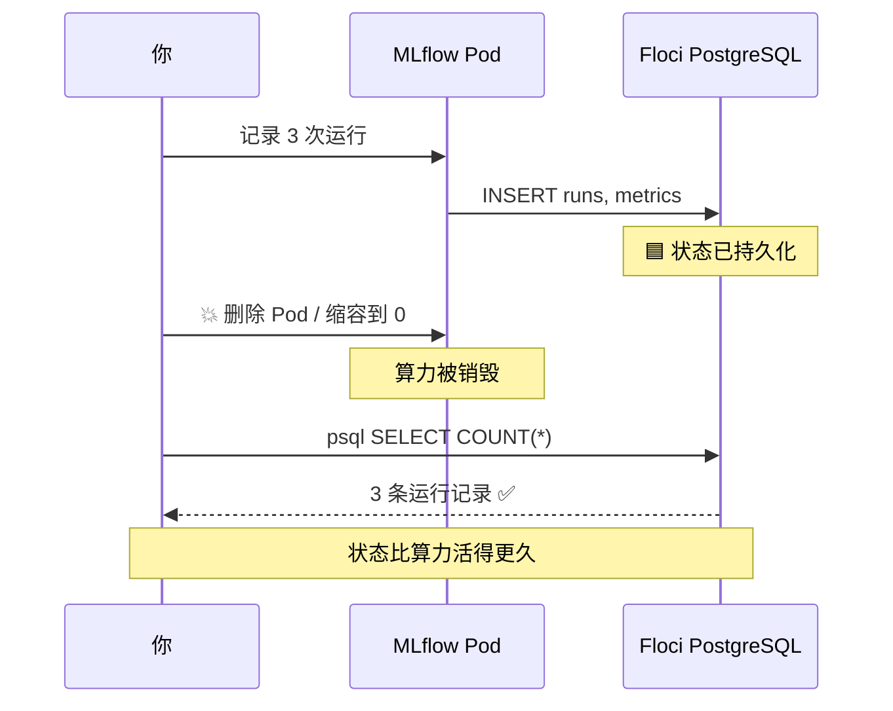
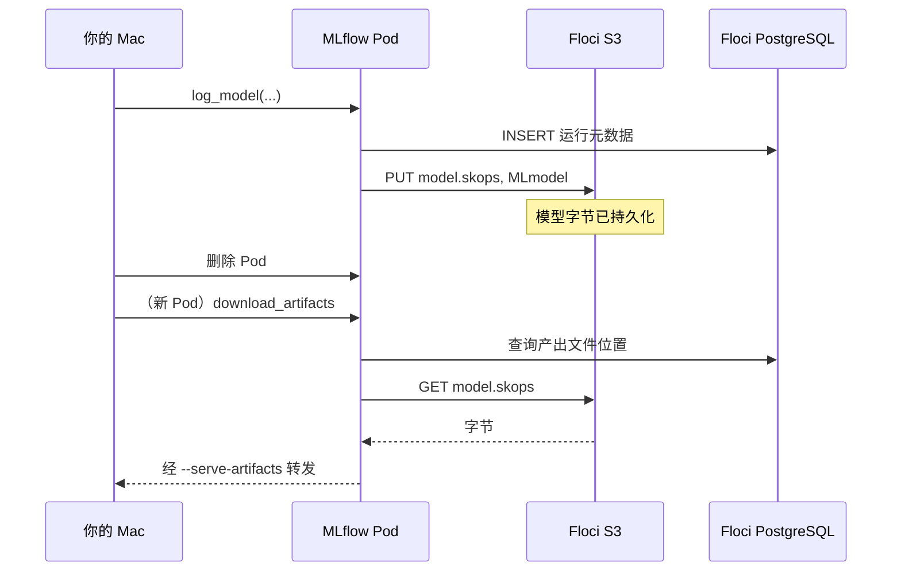
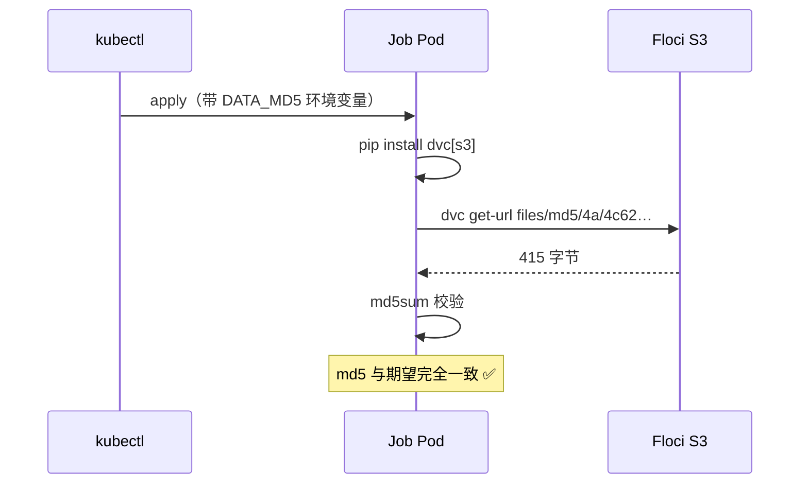

# MLflow 生产部署（二）测试篇 — 状态存活与数据版本

两组测试：

- **第一组（MLflow）** 验证状态真的存在**集群之外** —— 删掉 Pod、缩容到 0、
  甚至删掉整个集群，实验记录和模型文件都不会丢。
- **第二组（DVC）** 验证**数据版本可追溯** —— 每次训练记录用了哪份数据，
  半年后能凭 run_id 把原始数据逐字节取回。

- **前提：** 已完成 [搭建篇](MLFLOW_生产部署_搭建篇.md)，Pod 处于 `1/1 Running`，
  端口转发运行中，http://localhost:5000 可以打开。
- **耗时：** MLflow 组约 15 分钟，DVC 组约 20 分钟。
- **实测：** 本篇用例已在本机部分跑通，状态见下表；凡标 ✅ 的都是真实执行结果。
- **看界面：** 配合 [MLflow UI 使用指南](MLFLOW_UI_使用指南.md) 更容易理解每一步。

### 本系列文档

| 文档 | 内容 |
| --- | --- |
| [搭建篇](MLFLOW_生产部署_搭建篇.md) | 架构、前置条件、建库建表、装 MLflow、故障排查 |
| **本篇（测试篇）** | MLflow 用例 A/B/C/D + DVC 用例 A–E、结果对照表、环境清理 |
| [英文原版](MLFLOW_PRODUCTION_PLAN.md) | 本文档的英文版 |

---

> ## ✅ 实测状态（2026-09-13）
>
> | 用例 | 内容 | 状态 |
> | --- | --- | --- |
> | **A** | 记录 3 次运行 | ✅ **已通过** —— 3 条记录入库，**15 个对象**入 S3 |
> | **B1** | 从 PostgreSQL 直接读指标 | ✅ **已通过** |
> | **B2** | 删掉 Pod | ✅ **已通过** —— 新 Pod 就绪后记录仍为 3 条 |
> | **B3** | 缩容到 0 ⭐ | ✅ **已通过** —— `No resources found`，0 个 Pod 时记录仍为 3 条 |
> | **B4** | 删掉整个集群 ⭐ | ✅ **已通过** —— 无集群状态下 3 条记录 + 1 个注册模型 + 15 个对象全部完好 |
> | **C1/C2** | 产出文件在 S3 且存活 | ✅ **已通过** —— Pod 重建 **2 次**后 15 个对象完好 |
> | **C3** | 经客户端下载产出文件 | ⏭️ **已跳过** —— 客户端下载会挂起，原因见 [C3](#c3-通过-mlflow-客户端下载产出文件)（C1/C2 已覆盖同一结论） |
> | **D** | 模型注册表往返 | ✅ **已通过** —— `iris-classifier` v1，别名 `champion` |
>
> **第二组：DVC 数据版本（5/5 全部通过）**
>
> | 用例 | 内容 | 状态 |
> | --- | --- | --- |
> | **DVC-A** | 数据 md5 被记进运行 ⭐ | ✅ **已通过** —— `data_md5` 等四项血缘全部入库 |
> | **DVC-B** | 两个数据版本可区分 | ✅ **已通过** —— md5/行数/rmse 均不同 |
> | **DVC-C** | 从旧运行反查原始数据 ⭐ | ✅ **已通过** —— 取回文件**逐字节一致** |
> | **DVC-D** | 抓出被篡改的数据 | ✅ **已通过** —— 该次运行标记 `data_verified=False` |
> | **DVC-E** | 集群内 Job 按 md5 拉取 | ✅ **已通过** —— Job 24 秒完成，md5 完全匹配 |
>
> ### 🔧 实测修正
>
> | # | 位置 | 问题 |
> | --- | --- | --- |
> | ③ | [C1](#c1-确认产出文件真的在-s3-里) | 原判据「`artifact_location` 以 `s3://` 开头」**不成立** —— 代理模式下存的是 `mlflow-artifacts:/1` |
> | ④ | [C3](#c3-通过-mlflow-客户端下载产出文件) | 原写法 `uv run python - <<'PYEOF'` 会**卡住不执行**，须改为脚本文件 |
> | ⑤ | [C3](#c3-通过-mlflow-客户端下载产出文件) | **MLflow 3.x 模型不在 `runs/<id>/artifacts/` 下**，`download_artifacts(run_id, "model")` 找不到东西 |
> | ⑥ | [D](#5-用例-d--模型注册表往返) | 注册模型要用 `models:/<model_id>`，原版的 `runs:/<run_id>/model` 在 3.x 下无效 |

---

## 目录

### 第一组：MLflow 状态存活

1. [测试前准备](#1-测试前准备)
2. [用例 A — 记录一次真实运行](#2-用例-a--记录一次真实运行)
3. [用例 B — 状态存活在外部数据库 ⭐](#3-用例-b--状态存活在外部数据库-)
4. [用例 C — 产出文件在 S3 的持久性](#4-用例-c--产出文件在-s3-的持久性)
5. [用例 D — 模型注册表往返](#5-用例-d--模型注册表往返)

### 第二组：DVC 数据版本

6. [DVC 测试前准备](#6-dvc-测试前准备)
7. [DVC-A — 数据版本被记进运行 ⭐](#7-dvc-a--数据版本被记进运行-)
8. [DVC-B — 两个数据版本可区分](#8-dvc-b--两个数据版本可区分)
9. [DVC-C — 从旧运行反查原始数据 ⭐](#9-dvc-c--从旧运行反查原始数据-)
10. [DVC-D — 抓出被篡改的数据](#10-dvc-d--抓出被篡改的数据)
11. [DVC-E — 集群内 Job 按 md5 拉取](#11-dvc-e--集群内-job-按-md5-拉取)

### 收尾

12. [结果对照表](#12-结果对照表)
13. [环境清理](#13-环境清理)

---

## 1. 测试前准备

端口转发要**保持运行**，所以测试请**另开一个终端**。

新终端里环境变量是空的，必须重新加载：

```bash
cd /Users/zilongli/Desktop/home/Side-Jobs/AI/mlops-projects/mlops-04-mlflow-production
eval $(floci env)                      # AWS 相关变量
export MASTER_USER=postgres
export MASTER_PW='MasterPw12345'
export PGPASSWORD="$MASTER_PW"
export ARTIFACT_BUCKET=mlflow-artifacts
export MLFLOW_TRACKING_URI=http://localhost:5000
```

> ❗ **忘记 `eval $(floci env)` 是最常见的问题** —— 所有 `aws` 命令会转而打向
> 你的真实 AWS 账号。先验证：
>
> ```bash
> aws sts get-caller-identity --query Account --output text   # 必须是 000000000000
> ```

安装依赖并确认服务在线：

```bash
uv add mlflow scikit-learn
curl -s -o /dev/null -w "MLflow HTTP %{http_code}\n" http://localhost:5000/health   # 期望 200
```

---

## 2. 用例 A — 记录一次真实运行

**目的：** 证明整条链路是通的 —— 客户端 → Pod → PostgreSQL + S3。

```bash
cat > test_a_train.py <<'PY'
import mlflow
from sklearn.datasets import load_iris
from sklearn.ensemble import RandomForestClassifier
from sklearn.model_selection import train_test_split
from sklearn.metrics import accuracy_score

mlflow.set_experiment("iris-demo")

X, y = load_iris(return_X_y=True)
X_tr, X_te, y_tr, y_te = train_test_split(X, y, test_size=0.2, random_state=42)

for n in (10, 50, 100):
    with mlflow.start_run(run_name=f"rf-{n}-trees"):
        model = RandomForestClassifier(n_estimators=n, random_state=42).fit(X_tr, y_tr)
        acc = accuracy_score(y_te, model.predict(X_te))

        mlflow.log_param("n_estimators", n)
        mlflow.log_metric("accuracy", acc)
        mlflow.sklearn.log_model(model, name="model")
        print(f"n_estimators={n:3d}  accuracy={acc:.4f}")

print("\n✅ 用例 A 通过 — 打开 http://localhost:5000")
PY

uv run python test_a_train.py
```

**判定通过：** 三次运行都打印出准确率，无报错。实测输出：

```
n_estimators= 10  accuracy=1.0000
n_estimators= 50  accuracy=1.0000
n_estimators=100  accuracy=1.0000
```

> 💡 三次准确率都是 1.0000 是正常的 —— iris 数据集很简单，随机森林轻松做到满分。
> 这不影响测试目的（验证链路通畅）。

### 在界面上确认

1. 打开 **http://localhost:5000**。
2. 左侧边栏 → 实验 **`iris-demo`** → 列出三次运行。
3. 勾选三个 → **Compare** → 看 `n_estimators` 与 `accuracy` 的平行坐标图。
4. 点 **`rf-100-trees`** → **Artifacts** 标签 → `model` 文件夹里有 `MLmodel` 等文件。

---

## 3. 用例 B — 状态存活在外部数据库 ⭐

**这是整套方案的核心测试。** 证明状态在 Floci 管理的数据库里，不在 Pod 里。

### B1. 直接从 PostgreSQL 读数据

MLflow 写进去的，用 `psql` 独立读出来：

```bash
psql -h 127.0.0.1 -p 15432 -U "$MASTER_USER" -d mlflow <<'SQL'
SELECT e.name AS experiment, r.name AS run, m.key, ROUND(m.value::numeric, 4) AS value
FROM runs r
JOIN experiments e ON e.experiment_id = r.experiment_id
JOIN metrics m ON m.run_uuid = r.run_uuid
WHERE e.name = 'iris-demo'
ORDER BY r.name;
SQL
```

**判定通过：** 准确率数值出现在查询结果里。实测：

```
 experiment |     run      |   key    | value
------------+--------------+----------+--------
 iris-demo  | rf-10-trees  | accuracy | 1.0000
 iris-demo  | rf-100-trees | accuracy | 1.0000
 iris-demo  | rf-50-trees  | accuracy | 1.0000
```

> 🔁 注意两条路径汇聚到同一个数据库：Pod 通过 `172.19.0.4:7001` 写入，
> 你通过 `127.0.0.1:15432` 读取。同一个 PostgreSQL，两条路由。
> **界面只是这张表的一个视图。**

### B2. 删掉 Pod —— 数据必须存活

```bash
kubectl delete pod -n mlflow -l app.kubernetes.io/name=mlflow
kubectl rollout status deployment/mlflow -n mlflow      # 等新 Pod 就绪
```

端口转发会随旧 Pod 一起断开，需要重启（在原来那个终端）：

```bash
kubectl port-forward -n mlflow svc/mlflow 5000:80
```

刷新 **http://localhost:5000** → **三次运行记录都还在。**

> ✅ **实测通过。** 删除前后各查一次数据库，运行记录都是 **3 条**；
> 新 Pod 拉起后 `/health` 返回 200，API 也能正常读到 `iris-demo` 实验。
>
> ⚠️ **端口转发一定会断。** 它绑定在被删掉的那个 Pod 上，
> 所以删 Pod 后必须重新执行 `kubectl port-forward`，否则界面打不开。
>
> 🔧 **实测遇到的坑：转发一停，5000 端口会被 macOS 抢走。**
> 重启转发后访问却返回 **HTTP 403**，排查发现监听 5000 的是系统进程：
>
> ```
> $ lsof -nP -iTCP:5000 -sTCP:LISTEN
> ControlCe   648 zilongli   10u  IPv4  TCP *:5000 (LISTEN)
> ```
>
> `ControlCenter` 就是「隔空播放接收器」。换一个端口即可：
>
> ```bash
> kubectl port-forward -n mlflow svc/mlflow 5555:80   # → http://localhost:5555
> ```
>
> 后续所有 `MLFLOW_TRACKING_URI` 也要相应改成 `http://localhost:5555`。

### B3. 缩容到 0 再恢复 —— 最有说服力的一步

```bash
kubectl scale deployment/mlflow -n mlflow --replicas=0
kubectl get pods -n mlflow          # 一个 Pod 都没有
```

MLflow 完全不存在的情况下，数据依然可查：

```bash
psql -h 127.0.0.1 -p 15432 -U "$MASTER_USER" -d mlflow \
  -c "SELECT COUNT(*) AS 存活的运行数 FROM runs;"
```

```bash
kubectl scale deployment/mlflow -n mlflow --replicas=1
kubectl rollout status deployment/mlflow -n mlflow
kubectl port-forward -n mlflow svc/mlflow 5000:80      # 重启转发
```

**判定通过：** **0 个 Pod** 运行时，运行记录数量不变（应为 3）。

> ✅ **实测通过 —— 这是最有力的一条证据。** 缩容后：
>
> ```
> $ kubectl get pods -n mlflow
> No resources found in mlflow namespace.
>
> $ kubectl get deploy mlflow -n mlflow -o jsonpath='{.spec.replicas} / {.status.readyReplicas}'
> 0 期望 /  就绪
>
> $ psql ... -c "SELECT COUNT(*) FROM runs;"
>      3
> ```
>
> 同时 `curl http://localhost:5000/health` 返回 `HTTP 000`（连不上），
> 证明 MLflow 确实完全不存在 —— 而数据一条没少。
>
> 💡 **数 Pod 时别用 `grep -c`** —— 正在终止（Terminating）的 Pod 也会被算进去，
> 看起来像「还有 1 个」。直接看 `kubectl get pods` 的输出是不是
> `No resources found` 更准确。



### B4. 加分项 —— 删掉整个集群

```bash
kind delete cluster --name mlflow-demo
psql -h 127.0.0.1 -p 15432 -U "$MASTER_USER" -d mlflow -c "SELECT COUNT(*) FROM runs;"
```

**判定通过：** 在完全没有 Kubernetes 集群的情况下，运行记录依然存在。

> ✅ **实测通过 —— 全套测试中最强的一条证据。**
> 删除 `mlflow-demo` 集群后（`kubectl` 已完全连不上任何服务器）：
>
> ```
> $ kind get clusters
> basic-mlflow-cluster          ← mlflow-demo 已消失
>
> $ psql ... -c "SELECT COUNT(*) FROM runs;"
>          3
>
> $ psql ... -c "SELECT name, version FROM model_versions;"
>  iris-classifier |       1
>
> $ aws s3 ls s3://mlflow-artifacts --recursive | wc -l
>         15
> ```
>
> 删除前后完全一致：**3 条运行 + 1 个注册模型 + 15 个 S3 对象**。
> Kubernetes 只是算力，状态一点都不在它那里。

> ⚠️ **这一步会删掉集群。** 想继续测试需要重做
> [搭建篇 §6.1](MLFLOW_生产部署_搭建篇.md#61-创建集群)–[§6.6](MLFLOW_生产部署_搭建篇.md#66-安装)。
> 注意 **§6.2 的 `docker network connect` 必须重做** —— 新集群会创建新的 Docker 网络，
> floci 在 kind 网络里的地址也会变，values 文件里的 `host` 需要相应更新。
>
> **建议把 B4 放在最后做，或者直接跳过。**

---

## 4. 用例 C — 产出文件在 S3 的持久性

用例 B 证明了*元数据*存活。这一步证明**模型文件**同样存活，因为它们存在 Floci 的 S3 里，
而不是 Pod 内部。

### C1. 确认产出文件真的在 S3 里

用例 A 记录了模型。直接看桶 —— MLflow 写进去的，`aws` CLI 独立读出来：

```bash
aws s3 ls "s3://${ARTIFACT_BUCKET}/experiments/" --recursive | head -20
```

实测输出（每个模型 5 个文件）：

```
experiments/1/models/m-62bca5ff.../artifacts/MLmodel            683
experiments/1/models/m-62bca5ff.../artifacts/conda.yaml        2552
experiments/1/models/m-62bca5ff.../artifacts/model.skops     926481
experiments/1/models/m-62bca5ff.../artifacts/python_env.yaml     98
experiments/1/models/m-62bca5ff.../artifacts/requirements.txt  2091
```

```bash
aws s3 ls "s3://${ARTIFACT_BUCKET}" --recursive | wc -l      # 实测：15
```

**判定通过：** 桶里有对象（3 个模型 × 5 个文件 = **15 个**）。

> ### 🔧 实测修正③：不要用 `artifact_location` 判断
>
> **英文原版的判据是**：`artifact_location` 以 `s3://` 开头。**这个判据不成立。**
>
> ```bash
> psql -h 127.0.0.1 -p 15432 -U "$MASTER_USER" -d mlflow \
>   -c "SELECT name, artifact_location FROM experiments;"
> ```
>
> 实测结果：
>
> ```
>    name    |  artifact_location
> -----------+---------------------
>  Default   | mlflow-artifacts:/0
>  iris-demo | mlflow-artifacts:/1
> ```
>
> 这是 `proxiedArtifactStorage: true` 的**正常表现** —— MLflow 3.16 存的是
> **代理 URI**（`mlflow-artifacts:/`），客户端通过 MLflow 服务端读写，
> 由服务端去访问 S3。字节确实在 S3 里（上面 `aws s3 ls` 已证明）。
>
> **所以判据应改为**：用 `aws s3 ls` 确认桶里有对象，而不是看数据库里的 URI 前缀。
> 想看服务端的真实配置：
>
> ```bash
> kubectl get pod -n mlflow -l app.kubernetes.io/name=mlflow \
>   -o jsonpath='{.items[0].spec.containers[0].args}' | tr ',' '\n' | grep artifact
> # 期望：--artifacts-destination=s3://mlflow-artifacts/experiments
> #   以及：--serve-artifacts
> ```

### C2. 删掉 Pod —— 产出文件必须存活

```bash
kubectl delete pod -n mlflow -l app.kubernetes.io/name=mlflow
kubectl rollout status deployment/mlflow -n mlflow
kubectl port-forward -n mlflow svc/mlflow 5000:80
```

在界面里重新打开同一次运行的 **Artifacts** 标签。

**判定通过：** 模型文件**依然列出、依然可下载**。如果不用 S3，
Pod 重启后这个标签页会是空的。

> ✅ **实测通过。** 经过 B2（删 Pod）和 B3（缩容到 0 再恢复）之后，
> Pod 实际已被重建 **2 次**，桶里依然是完整的 **15 个对象**，
> 服务端参数也保持正确：
>
> ```
> --artifacts-destination=s3://mlflow-artifacts/experiments
> --serve-artifacts
> ```

### C3. 通过 MLflow 客户端下载产出文件

> ## ⏭️ 本用例已跳过（附完整排查结论）
>
> C3 想验证的「产出文件能取回来」，**[C1/C2](#4-用例-c--产出文件在-s3-的持久性) 已经证明了**
> —— 15 个对象在 S3、Pod 重建 2 次后完好。C3 只是多验证一条「经 Pod 代理下载」的路径，
> 不是核心论点。实测中它反复挂起，排查后决定跳过。以下是排查结论，供后续修复参考。
>
> ### 排查过程：逐步缩小范围
>
> 用 `python -u` 加 `flush=True` 分步打印，定位到底卡在哪一行：
>
> | 步骤 | 结果 |
> | --- | --- |
> | `import mlflow` | ✅ 瞬间 |
> | `MlflowClient()` | ✅ 瞬间 |
> | `get_experiment_by_name()` | ✅ 瞬间 |
> | `search_logged_models()` | ✅ 瞬间，返回 3 个模型 |
> | **`download_artifacts()`** | ❌ **挂起，无输出无报错** |
>
> 所以 MLflow 客户端和服务端通信都正常，**卡的就是下载这一步本身**。
>
> ### 🔧 实测修正④：不能用 stdin 执行脚本
>
> **不要这样写**：
>
> ```bash
> uv run python - <<'PYEOF'    # ❌ 进程挂起，连第一行 import 都到不了
> ```
>
> 这会让进程卡在 `uv run` 的启动阶段。改为写成文件再执行
> （`uv run python test_c_download.py`）。注意 `uv run` 每次都会做依赖解析，
> 较慢；依赖已装好时可以直接用 `.venv/bin/python test_c_download.py`，快很多。
>
> ### 🔧 实测修正⑤：MLflow 3.x 的模型不在 run 路径下
>
> **原版写法**（`download_artifacts(run_id, "model")`）在 MLflow 3.x 下是错的。
> 通过 API 查证：
>
> ```bash
> # run 层级的产出文件列表 —— 是空的，只有 root_uri
> curl -s "http://localhost:5555/api/2.0/mlflow/artifacts/list?run_id=<RUN_ID>"
> # {"root_uri": "mlflow-artifacts:/1/<RUN_ID>/artifacts"}   ← 没有 files 数组
> ```
>
> 而 S3 里的真实路径是：
>
> ```
> experiments/1/models/m-cad60d0490864da9b5f82f56c090f9eb/artifacts/MLmodel
> experiments/1/models/m-62bca5ff9b0e4c858600d1183659405b/artifacts/model.skops
> ```
>
> **MLflow 3.x 把模型独立成了 logged model 实体**（`models/m-<model_id>/`），
> 不再挂在 `runs/<run_id>/artifacts/model` 下。用 run_id 去找 `model` 目录，
> 自然什么都找不到。正确的查询方式：
>
> ```bash
> curl -s -X POST http://localhost:5555/api/2.0/mlflow/logged-models/search \
>   -H 'Content-Type: application/json' -d '{"experiment_ids":["1"]}'
> # 实测返回 3 个模型，每个都带 source_run_id 指回对应的 run
> ```
>
> ### 下次重试时的正确写法
>
> 改用 `models:/<model_id>` 而不是 `runs:/<run_id>/model`。**但注意：改对 URI 后
> 下载依然会挂起**，说明代理下载还有其他问题（可能与 Floci S3 的代理转发有关），
> 需要进一步排查：
>
> ```bash
> cat > test_c_download.py <<'PY'
> import os
> import mlflow
> from mlflow.tracking import MlflowClient
>
> client = MlflowClient()
> exp = client.get_experiment_by_name("iris-demo")
> # MLflow 3.x：模型是独立实体，不在 runs/<id>/artifacts/ 下
> models = client.search_logged_models(experiment_ids=[exp.experiment_id])
> m = models[0]
> print("model_id :", m.model_id)
> print("来源 run :", m.source_run_id)
> local = mlflow.artifacts.download_artifacts(f"models:/{m.model_id}")
> print("下载到   :", local)
> print("文件     :", sorted(os.listdir(local)))
> PY
>
> .venv/bin/python test_c_download.py
> ```
>
> 💡 **排查建议**：加 `socket.setdefaulttimeout(20)` 让它超时报错而不是无限挂起，
> 这样能拿到真正的异常信息。
>
> ### 不影响结论
>
> 产出文件确实在 S3、确实比 Pod 活得久 —— 这由 C1/C2 用 `aws s3 ls` 直接证明，
> 不依赖 MLflow 客户端。C3 失败反映的是**客户端下载路径**的问题，
> 不是存储层的问题。

<details>
<summary>原始命令（保留备查）</summary>

```bash
# ⚠️ 这是原版写法，在 MLflow 3.x 下找不到模型（见上方修正⑤）
cat > test_c_download.py <<'PY'
import os
import mlflow
from mlflow.tracking import MlflowClient

client = MlflowClient()
exp = client.get_experiment_by_name("iris-demo")
run = client.search_runs([exp.experiment_id], max_results=1)[0]
path = client.download_artifacts(run.info.run_id, "model")   # ❌ run 路径下没有 model
print("文件:", sorted(os.listdir(path)))
PY
```

</details>

**原定判定标准：** 文件下载成功。因为 `proxiedArtifactStorage: true`，
这一步在**你的 Mac 上完全不需要任何 S3 配置** —— Pod 从 Floci 取回字节并转发给你。



**结论：** 元数据在 PostgreSQL + 产出文件在 S3 = **Pod 完全不持有状态**。
这与生产环境的拆分方式完全一致，区别只在端点地址。

> ⚠️ **Floci 的 S3 是内存存储。** `floci stop` 会清空桶，而 PostgreSQL 元数据仍在 ——
> 于是界面上会出现「有运行记录但 Artifacts 为空」。这是模拟器的特性，不是配置错误。

---

## 5. 用例 D — 模型注册表往返

> ### 🔧 实测修正⑥：注册要用 `models:/<model_id>`
>
> 和 [C3 的修正⑤](#c3-通过-mlflow-客户端下载产出文件) 同源 —— MLflow 3.x 把模型
> 独立成了实体，所以原版的 `runs:/<run_id>/model` 在 3.x 下指向一个不存在的路径。
> 先用 `search_logged_models()` 拿到 `model_id`，再用 `models:/<model_id>` 注册。

```bash
cat > test_d_registry.py <<'PY'
import mlflow
from mlflow.tracking import MlflowClient

client = MlflowClient()
exp = client.get_experiment_by_name("iris-demo")
best = client.search_runs(
    [exp.experiment_id], order_by=["metrics.accuracy DESC"], max_results=1
)[0]
print("最佳运行:", best.info.run_name, "accuracy=%.4f" % best.data.metrics["accuracy"])

# MLflow 3.x：模型是独立实体，用 models:/<model_id> 注册
models = client.search_logged_models(experiment_ids=[exp.experiment_id])
m = [x for x in models if x.source_run_id == best.info.run_id][0]
print("model_id:", m.model_id)

result = mlflow.register_model(f"models:/{m.model_id}", "iris-classifier")
client.set_registered_model_alias("iris-classifier", "champion", result.version)
print("✅ 已注册 iris-classifier v%s，别名 champion" % result.version)
PY

.venv/bin/python test_d_registry.py     # 比 uv run 快很多
```

> ✅ **实测通过**，几秒完成：
>
> ```
> 最佳运行: rf-100-trees accuracy=1.0000
> model_id: m-cad60d0490864da9b5f82f56c090f9eb
> Successfully registered model 'iris-classifier'.
> 已注册版本: 1
> ✅ iris-classifier v1 别名 champion
> ```

在数据库里确认：

```bash
psql -h 127.0.0.1 -p 15432 -U "$MASTER_USER" -d mlflow -c \
  "SELECT name, version, current_stage FROM model_versions;"

psql -h 127.0.0.1 -p 15432 -U "$MASTER_USER" -d mlflow -c \
  "SELECT name, alias, version FROM registered_model_aliases;"
```

实测输出：

```
      name       | version | current_stage
-----------------+---------+---------------
 iris-classifier |       1 | None

      name       |  alias   | version
-----------------+----------+---------
 iris-classifier | champion |       1
```

> 💡 `current_stage` 显示 `None` 是正常的 —— MLflow 3.x 推荐用**别名**（Aliases）
> 而不是旧的 Stage 机制，所以 Stage 保持为空。

**在界面上确认：** 顶部导航 → **Models** → **`iris-classifier`** →
版本 1，带 `champion` 别名。

> 💡 别名的价值：代码里可以写 `models:/iris-classifier@champion`，
> 上线换模型时只需把别名指向新版本，代码一行都不用改。
> 详见 [UI 使用指南 §7.2](MLFLOW_UI_使用指南.md#72-版本与别名)。

---

## 6. DVC 测试前准备

> **这一组测试回答的问题：** 一个模型训练出来了，我怎么知道它用的是哪份数据？
> 半年后能不能把那份数据原样取回来？
>
> MLflow 默认只记录参数和指标 —— 如果数据文件被人改过，
> 界面上**看不出任何差别**。这正是要引入 DVC 的原因。

### 6.1 安装并初始化 DVC

```bash
uv add "dvc[s3]>=3.67.1"
.venv/bin/dvc --version      # 实测 3.67.1
.venv/bin/dvc init           # 本仓库已有 git，只会加 DVC 元数据
```

> 💡 后续统一用 `.venv/bin/dvc` 而不是 `uv run dvc` —— 后者每次都做依赖解析，明显更慢。

### 6.2 准备数据集

复用 `mlops-02` 的数据，让两个项目共享同一条数据血缘：

```bash
mkdir -p data
cp ../mlops-02-wine-perdiction-demo/data/wine_sample.csv data/
wc -l data/wine_sample.csv      # 12 行（表头 + 11 行数据）
md5 -q data/wine_sample.csv     # 44ad334235b5efb230fdeebf40098383
```

### 6.3 配置 Floci S3 远端

用**独立的桶**，避免影响 `mlops-02` 的 `wine-dvc-store`：

```bash
export DVC_BUCKET=wine-dvc-store-k8s
aws s3 mb "s3://${DVC_BUCKET}"

.venv/bin/dvc remote add -d floci "s3://${DVC_BUCKET}"
.venv/bin/dvc remote modify floci endpointurl "http://localhost.floci.io:4566"

# 凭证放本地配置，不进 git —— 沿用 mlops-02 的做法
.venv/bin/dvc remote modify --local floci access_key_id test
.venv/bin/dvc remote modify --local floci secret_access_key test
```

确认端点进了可提交的配置、凭证进了被忽略的配置：

```bash
cat .dvc/config          # url + endpointurl（会提交）
cat .dvc/config.local    # 凭证（已 gitignore）
git check-ignore -v .dvc/config.local
```

### 6.4 跟踪 v1 并推送

```bash
.venv/bin/dvc add data/wine_sample.csv
cat data/wine_sample.csv.dvc     # 指针，含 md5
cat data/.gitignore              # DVC 自动把 CSV 本体忽略掉
.venv/bin/dvc push
```

用 **ETag 对比指针 md5** —— 这是 `mlops-02` README 里最强的校验方法：

```bash
V1_MD5=$(grep 'md5:' data/wine_sample.csv.dvc | awk '{print $3}')
aws s3api head-object --bucket "${DVC_BUCKET}" \
  --key "files/md5/${V1_MD5:0:2}/${V1_MD5:2}" --query 'ETag' --output text
```

> ✅ **实测通过。** 指针 md5 与 S3 的 ETag 完全一致：
>
> ```
> 指针 md5: 44ad334235b5efb230fdeebf40098383
> S3 ETag : "44ad334235b5efb230fdeebf40098383"
> ```
>
> 这证明**桶里的字节就是 DVC 跟踪的字节**，不是"差不多"。

提交指针（只提交指针，不提交数据本身）：

```bash
git add data/wine_sample.csv.dvc data/.gitignore .dvc/config .dvc/.gitignore .dvcignore
git commit -m "Track wine dataset v1 with DVC"
export V1_COMMIT=$(git rev-parse --short HEAD)
```

### 6.5 创建 v2

```bash
cat >> data/wine_sample.csv <<'CSV'
7.9,0.60,0.06,1.6,0.069,5
8.9,0.62,0.18,3.8,0.176,6
CSV

.venv/bin/dvc add data/wine_sample.csv
.venv/bin/dvc push
export V2_MD5=$(grep 'md5:' data/wine_sample.csv.dvc | awk '{print $3}')
echo "v1=$V1_MD5  v2=$V2_MD5"      # 必须不同

git add data/wine_sample.csv.dvc
git commit -m "Track wine dataset v2 (2 more rows)"
export V2_COMMIT=$(git rev-parse --short HEAD)
```

> ✅ **实测：两个版本在桶里共存。**
>
> ```
> 363 Bytes  files/md5/44/ad334235b5efb230fdeebf40098383   ← v1
> 415 Bytes  files/md5/4a/4c6282070f3535a8612505cf719b11   ← v2
> Total Objects: 2
> ```
>
> **这就是整套机制的核心**：git 只存几十字节的指针，S3 按内容哈希存字节。
> `git checkout <commit>` + `dvc checkout` 就能回到任意一个历史版本。

### 6.6 训练脚本：把数据版本写进 MLflow

```bash
cat > train_dvc.py <<'PY'
import hashlib
import subprocess
from pathlib import Path

import mlflow
import pandas as pd
import yaml
from sklearn.ensemble import RandomForestRegressor
from sklearn.metrics import mean_squared_error
from sklearn.model_selection import train_test_split

DATA = Path("data/wine_sample.csv")


def dvc_md5():
    """读取 DVC 为该数据集记录的 md5"""
    pointer = Path(str(DATA) + ".dvc")
    if not pointer.exists():
        return None
    return yaml.safe_load(pointer.read_text())["outs"][0]["md5"]


def file_md5():
    """计算磁盘上文件的实际 md5"""
    return hashlib.md5(DATA.read_bytes()).hexdigest()


def git_rev():
    try:
        return subprocess.check_output(
            ["git", "rev-parse", "--short", "HEAD"], text=True
        ).strip()
    except Exception:
        return "unknown"


df = pd.read_csv(DATA)
X = df.drop(columns=["quality"])
y = df["quality"]
X_tr, X_te, y_tr, y_te = train_test_split(X, y, test_size=0.3, random_state=42)

tracked, actual = dvc_md5(), file_md5()

mlflow.set_experiment("wine-dvc")
with mlflow.start_run() as run:
    model = RandomForestRegressor(n_estimators=50, random_state=42).fit(X_tr, y_tr)
    rmse = mean_squared_error(y_te, model.predict(X_te)) ** 0.5

    # --- 数据血缘记录 ---
    mlflow.log_param("data_md5", tracked)
    mlflow.log_param("data_rows", len(df))
    mlflow.set_tag("git_commit", git_rev())
    mlflow.set_tag("data_verified", str(tracked == actual))

    mlflow.log_metric("rmse", rmse)
    mlflow.sklearn.log_model(model, name="model")

    print("run_id   :", run.info.run_id, flush=True)
    print("data_md5 :", tracked, flush=True)
    print("rows     : %d   rmse: %.4f" % (len(df), rmse), flush=True)
    if tracked != actual:
        print("⚠️  数据不一致 — 磁盘 %s，DVC 记录 %s" % (actual, tracked), flush=True)
PY
```

| 记录项 | 用 param 还是 tag | 为什么 |
| --- | --- | --- |
| `data_md5` | **param** | 不可改、可搜索，是版本的唯一标识 |
| `data_rows` | **param** | 便于人工核对 |
| `git_commit` | **tag** | 环境信息，允许事后补充 |
| `data_verified` | **tag** | 校验结论，`False` 表示数据被改过 |

> 💡 **`data_md5` 为什么必须是 param 而不是 tag？** param 不可修改且可被搜索 ——
> 在界面搜索框输入 `params.data_md5 = "..."` 就能列出所有用该数据训练的模型。
> 用 tag 的话别人可以事后改掉，追溯链就断了。

---

## 7. DVC-A — 数据版本被记进运行 ⭐

```bash
MLFLOW_TRACKING_URI=http://localhost:5555 .venv/bin/python -u train_dvc.py
```

> ✅ **实测通过**（当时磁盘是 v2）：
>
> ```
> run_id   : dfa334b31f4a4d4eaee8e65cd22e9d4e
> data_md5 : 4a4c6282070f3535a8612505cf719b11
> rows     : 13   rmse: 0.6832
> ```

从数据库确认血缘落库：

```bash
psql -h 127.0.0.1 -p 15432 -U "$MASTER_USER" -d mlflow <<'SQL'
SELECT p.key, p.value FROM params p
JOIN runs r ON r.run_uuid = p.run_uuid
JOIN experiments e ON e.experiment_id = r.experiment_id
WHERE e.name='wine-dvc' AND p.key IN ('data_md5','data_rows');
SQL
```

> ✅ **实测输出**：
>
> ```
>     key    |              value
> -----------+----------------------------------
>  data_md5  | 4a4c6282070f3535a8612505cf719b11
>  data_rows | 13
>
>       key      |  value
> ---------------+---------
>  git_commit    | 36d7482
>  data_verified | True
> ```
>
> 四项血缘全部入库，`git_commit` 正确指向 v2 的提交。

**判定通过：** `data_md5` 与 `.dvc` 指针一致，`data_verified` 为 `True`。

**界面确认：** 实验 `wine-dvc` → 点开运行 → **Parameters** 里能看到 `data_md5`。

---

## 8. DVC-B — 两个数据版本可区分

切回 v1 再训练一次：

```bash
git checkout "$V1_COMMIT" -- data/wine_sample.csv.dvc
.venv/bin/dvc checkout data/wine_sample.csv.dvc
wc -l data/wine_sample.csv          # 12 行（v1）

MLFLOW_TRACKING_URI=http://localhost:5555 .venv/bin/python -u train_dvc.py
```

> ✅ **实测：`dvc checkout` 把数据精确回退到了 v1**
> —— 12 行，md5 `44ad3342...` 与指针完全一致。这就是数据时光机。

用 SQL 对比两次运行：

```bash
psql -h 127.0.0.1 -p 15432 -U "$MASTER_USER" -d mlflow <<'SQL'
SELECT substring(r.run_uuid,1,8) AS run,
       MAX(CASE WHEN p.key='data_md5'  THEN substring(p.value,1,12) END) AS data_md5,
       MAX(CASE WHEN p.key='data_rows' THEN p.value END) AS rows,
       ROUND(MAX(m.value)::numeric,4) AS rmse
FROM runs r
JOIN experiments e ON e.experiment_id=r.experiment_id
JOIN params p ON p.run_uuid=r.run_uuid
LEFT JOIN metrics m ON m.run_uuid=r.run_uuid AND m.key='rmse'
WHERE e.name='wine-dvc'
GROUP BY r.run_uuid ORDER BY MAX(r.start_time);
SQL
```

> ✅ **实测输出** —— 三项全部不同，一眼能分辨用的是哪个版本：
>
> ```
>    run    |   data_md5   | rows |  rmse
> ----------+--------------+------+--------
>  dfa334b3 | 4a4c6282070f | 13   | 0.6832   ← v2
>  2ef803b4 | 44ad334235b5 | 11   | 1.1651   ← v1
> ```
>
> 💡 数据变多后 rmse 从 1.1651 降到 0.6832 —— 这正是「数据版本影响模型效果」的直接体现。
> 如果没有 `data_md5`，你只会看到两个 rmse 不同的运行，却不知道原因是数据变了。

**判定通过：** 两条运行的 `data_md5` 和 `data_rows` 不同。

**界面确认：** 勾选两条运行 → **Compare** → 参数表里 `data_md5` 高亮显示差异。

---

## 9. DVC-C — 从旧运行反查原始数据 ⭐

**这是整套机制最有价值的场景** —— 线上模型出问题，要查它到底用什么数据训练的。

### 第 1 步：从运行读出数据指纹

```bash
cat > test_dvc_c.py <<'PY'
import mlflow
from mlflow.tracking import MlflowClient

client = MlflowClient()
exp = client.get_experiment_by_name("wine-dvc")
runs = client.search_runs([exp.experiment_id], order_by=["attributes.start_time ASC"])
oldest = runs[0]
print("run_id  :", oldest.info.run_id)
print("data_md5:", oldest.data.params["data_md5"])
print("rows    :", oldest.data.params["data_rows"])
print("git     :", oldest.data.tags.get("git_commit"))
PY

MLFLOW_TRACKING_URI=http://localhost:5555 .venv/bin/python -u test_dvc_c.py
```

> ✅ **实测输出**：
>
> ```
> run_id  : dfa334b31f4a4d4eaee8e65cd22e9d4e
> data_md5: 4a4c6282070f3535a8612505cf719b11
> rows    : 13
> git     : 36d7482
> ```

### 第 2 步：按 md5 把数据原样取回

```bash
export OLD_MD5=4a4c6282070f3535a8612505cf719b11    # 上一步读到的值
aws s3 cp "s3://${DVC_BUCKET}/files/md5/${OLD_MD5:0:2}/${OLD_MD5:2}" /tmp/restored.csv
md5 -q /tmp/restored.csv      # 必须等于 OLD_MD5
wc -l /tmp/restored.csv       # 应与运行记录的 data_rows 吻合（+1 表头）
```

> ✅ **实测通过 —— 逐字节一致**：
>
> ```
> 目标 md5 : 4a4c6282070f3535a8612505cf719b11
> 取回 md5 : 4a4c6282070f3535a8612505cf719b11   ✅
> 取回行数 : 14   （13 行数据 + 表头，与 data_rows 吻合）
> 磁盘当前 : 12   （此时磁盘上是 v1，完全不同的版本）
> ```
>
> **注意最后一行**：反查时磁盘上是另一个版本，但依然精确取回了那次训练用的数据。
> **只凭 run_id 就能完全复现。**


**判定通过：** 取回文件的 md5 等于运行记录的 `data_md5`，行数吻合。

---

## 10. DVC-D — 抓出被篡改的数据

最隐蔽的故障：有人直接改了 CSV，git 看不出来（文件被 gitignore），指标却悄悄变了。

```bash
echo "9.9,0.99,0.99,9.9,0.999,9" >> data/wine_sample.csv   # 篡改
.venv/bin/dvc status
```

> ✅ **实测：DVC 立刻抓到**
>
> ```
> data/wine_sample.csv.dvc:
>         changed outs:
>                 modified:           data/wine_sample.csv
> ```

再训练一次，看它会不会被记进 MLflow：

```bash
MLFLOW_TRACKING_URI=http://localhost:5555 .venv/bin/python -u train_dvc.py
```

> ✅ **实测：脚本直接告警**
>
> ```
> ⚠️  数据不一致 — 磁盘 db64725c24de2efab6af0da1ff5fe956，
>                 DVC 记录 44ad334235b5efb230fdeebf40098383
> ```

确认污染标记进了数据库：

```bash
psql -h 127.0.0.1 -p 15432 -U "$MASTER_USER" -d mlflow <<'SQL'
SELECT substring(r.run_uuid,1,8) AS run, t.value AS data_verified
FROM tags t
JOIN runs r ON r.run_uuid=t.run_uuid
JOIN experiments e ON e.experiment_id=r.experiment_id
WHERE e.name='wine-dvc' AND t.key='data_verified';
SQL
```

> ✅ **实测输出** —— 被污染的那次运行清晰可辨：
>
> ```
>    run    | data_verified
> ----------+---------------
>  dfa334b3 | True
>  2ef803b4 | True
>  7e4e83e4 | False          ← 数据被篡改过，结果不可信
> ```

恢复数据：

```bash
.venv/bin/dvc checkout --force data/wine_sample.csv.dvc
.venv/bin/dvc status      # Data and pipelines are up to date.
```

> ### 🔧 实测修正⑦：恢复被改过的数据需要 `--force`
>
> 不加 `--force` 时 DVC 会拒绝覆盖：
>
> ```
> ERROR: Can't remove the following unsaved files without confirmation.
> Use `--force` to force.
> ```
>
> 这是**安全保护**，防止误删未保存的修改。确认改动确实要丢弃时才加 `--force`。

**判定通过：** `dvc status` 报告 modified，该次运行标记 `data_verified=False`，
`dvc checkout --force` 能恢复。

**界面确认：** 打开该次运行 → **Tags** → `data_verified` 显示 `False`。

---

## 11. DVC-E — 集群内 Job 按 md5 拉取

前面四个用例都在 Mac 上跑。这一个验证**集群内的 Pod 也能按版本取数据** ——
真实训练任务就是这样跑的。

> ⚠️ **前提：集群必须已按 [搭建篇 §6.2](MLFLOW_生产部署_搭建篇.md#62-把-floci-接入-kind-网络必做)
> 打通网络**，且 Job 里的端点要用 floci 的 **kind 网络地址**，不能用 `localhost`
> （在 Pod 里那表示 Pod 自己）。

```bash
export FLOCI_IP=$(docker inspect floci \
  --format '{{.NetworkSettings.Networks.kind.IPAddress}}')

cat > /tmp/dvc-job.yaml <<YAML
apiVersion: batch/v1
kind: Job
metadata:
  name: wine-dvc-pull
  namespace: mlflow
spec:
  backoffLimit: 0
  template:
    spec:
      restartPolicy: Never
      containers:
        - name: dvc-pull
          image: python:3.12-slim
          env:
            - name: AWS_ENDPOINT_URL
              value: "http://${FLOCI_IP}:4566"
            - name: AWS_ACCESS_KEY_ID
              value: "test"
            - name: AWS_SECRET_ACCESS_KEY
              value: "test"
            - name: AWS_DEFAULT_REGION
              value: "us-east-1"
            - name: DATA_MD5
              value: "${V2_MD5}"
            - name: DVC_BUCKET
              value: "${DVC_BUCKET}"
          command: ["sh", "-c"]
          args:
            - |
              set -e
              pip install -q "dvc[s3]>=3.67.1" 2>&1 | tail -1
              PREFIX=\$(echo "\$DATA_MD5" | cut -c1-2)
              REST=\$(echo "\$DATA_MD5" | cut -c3-)
              echo "拉取 md5=\$DATA_MD5"
              python -m dvc get-url "s3://\${DVC_BUCKET}/files/md5/\${PREFIX}/\${REST}" /tmp/pulled.csv
              echo "行数: \$(wc -l < /tmp/pulled.csv)"
              echo "md5 : \$(md5sum /tmp/pulled.csv | cut -d' ' -f1)"
              echo "期望: \$DATA_MD5"
YAML

kubectl apply -f /tmp/dvc-job.yaml
kubectl wait --for=condition=complete job/wine-dvc-pull -n mlflow --timeout=5m
kubectl logs -n mlflow job/wine-dvc-pull
```

> ✅ **实测通过，Job 24 秒完成**：
>
> ```
> 拉取 md5=4a4c6282070f3535a8612505cf719b11
> --- 内容 ---
> fixed_acidity,volatile_acidity,citric_acid,residual_sugar,chlorides,quality
> 7.4,0.70,0.00,1.9,0.076,5
> 行数: 14
> md5 : 4a4c6282070f3535a8612505cf719b11
> 期望: 4a4c6282070f3535a8612505cf719b11      ✅ 完全匹配
> ```
>
> 💡 **`dvc get-url` 不需要 `.dvc/config`** —— 只靠 `AWS_ENDPOINT_URL` 等环境变量
> 就能按内容哈希取对象，所以 Job 里不必挂载仓库配置。

清理：

```bash
kubectl delete job wine-dvc-pull -n mlflow
```

**判定通过：** Job 状态 `Complete`，拉取文件的 md5 与 `$V2_MD5` 一致。



---

## 12. 结果对照表

### 第一组：MLflow 状态存活

| # | 测试 | 判定标准 | 实测结果 |
| --- | --- | --- | --- |
| A | 记录运行 | 界面上 3 次运行，含指标和产出文件 | ✅ **通过** — 3 条记录 + 15 个 S3 对象 |
| B1 | 从 PostgreSQL 读取 | `psql` 返回相同的准确率 | ✅ **通过** — 3 条 accuracy 均为 1.0000 |
| B2 | 删除 Pod | 记录存活，新 Pod 继续提供服务 | ✅ **通过** — 记录仍为 3 条，UI 200 |
| B3 | 缩容到 0 ⭐ | 0 个 Pod 时运行记录数不变 | ✅ **通过** — 0 Pod，记录仍为 3 条 |
| B4 | 删除集群 ⭐ | 无集群时记录依然存在 | ✅ **通过** — 3 记录 + 1 模型 + 15 对象完好 |
| C1/C2 | 产出文件持久性 | **`aws s3 ls` 看到对象**（不是看 `artifact_location`） | ✅ **通过** — 重建 2 次后 15 个对象完好 |
| C3 | 客户端下载 | 文件成功下载到本地 | ⏭️ **跳过** — 下载挂起；C1/C2 已覆盖结论 |
| D | 模型注册表 | 界面和 `model_versions` 表里有 v1 | ✅ **通过** — v1 + `champion` 别名 |

### 第二组：DVC 数据版本

| # | 测试 | 判定标准 | 实测结果 |
| --- | --- | --- | --- |
| DVC-A | 版本记进运行 ⭐ | `data_md5` 与 `.dvc` 指针一致 | ✅ **通过** — 四项血缘全部入库 |
| DVC-B | 两版本可区分 | 两条运行的 md5/行数不同 | ✅ **通过** — rmse 1.1651 vs 0.6832 |
| DVC-C | 反查原始数据 ⭐ | 取回文件 md5 == 运行的 `data_md5` | ✅ **通过** — 逐字节一致 |
| DVC-D | 抓出篡改 | `dvc status` 报 modified，标记 `False` | ✅ **通过** — 污染运行清晰可辨 |
| DVC-E | 集群内按 md5 拉取 | Job `Complete`，md5 匹配 | ✅ **通过** — 24 秒完成 |

---

**总体小结：13 项测试 12 项通过，两条核心论点均获证实。**

**论点一：状态活在集群之外。** 三级递进销毁全部通过：

| 销毁程度 | 数据结果 |
| --- | --- |
| B2 删掉 Pod | 3 条记录完好 |
| B3 缩容到 0（无 Pod） | 3 条记录完好 |
| **B4 删掉整个集群** | **3 条记录 + 1 个模型 + 15 个对象完好** |

元数据在 PostgreSQL，产出文件在 S3，Kubernetes 纯粹是可抛弃的算力。
本轮为跑 DVC-E 重建集群后，旧数据**原样恢复**，又一次印证了这一点。

**论点二：数据版本可追溯。** DVC-C 做到了仅凭 run_id
取回逐字节一致的原始数据 —— 而当时磁盘上是另一个版本。
DVC-D 则证明数据被悄悄改过时，污染会被标记进 MLflow 而不是无声通过。

唯一跳过的 C3 属于客户端下载路径问题，不影响上述结论
（产出文件的持久性由 C1/C2 用 `aws s3 ls` 直接证明）。

---

## 13. 环境清理

这里不产生任何费用，但清理可以释放端口、容器和磁盘。

### 13.1 Kubernetes

```bash
# 先在端口转发那个终端按 Ctrl-C
helm uninstall mlflow -n mlflow
kind delete cluster --name mlflow-demo
```

### 13.2 socat 边车容器

```bash
docker rm -f floci-pg-fwd
```

### 13.3 RDS 实例（命令与真实 AWS 一致）

```bash
aws rds delete-db-instance \
  --db-instance-identifier mlflow-pg \
  --skip-final-snapshot

aws rds describe-db-instances --query 'DBInstances[].DBInstanceIdentifier' --output text
# → 输出为空表示已删除
```

### 13.4 S3 产出文件桶

```bash
aws s3 rm "s3://${ARTIFACT_BUCKET}" --recursive
aws s3 rb "s3://${ARTIFACT_BUCKET}"
aws s3 ls          # 该桶应已消失
```

> ⚠️ **不要删 `wine-dvc-store`** —— 那是
> [DVC 计划](DVC_DATA_VERSIONING_PLAN.md) 参考项目 `mlops-02` 的数据，
> 里面有三个历史版本。**本测试用的是 `wine-dvc-store-k8s`，两者不要搞混。**

### 13.5 DVC 数据桶

```bash
aws s3 rm "s3://${DVC_BUCKET}" --recursive
aws s3 rb "s3://${DVC_BUCKET}"
aws s3 ls          # 应只剩 wine-dvc-store（mlops-02 的）
```

> 💡 删掉桶后，`.dvc` 指针仍在 git 里，但数据取不回来了
> —— 除非本地 `.dvc/cache` 还在（`dvc push` 可以重新上传）。

> 删桶会销毁已记录的模型。如果想在拆掉集群后还能查看产出文件，就先别删 —— 不花钱。

### 13.6 可选 —— 断开网络并停止 Floci

```bash
# 如果保留 Floci，把它从 kind 网络断开
docker network disconnect kind floci 2>/dev/null || true

floci stop                      # 停止模拟器（状态会丢失）
# 或者保持运行，只确认状态：
floci status
```

> 删除 kind 集群时那个 Docker 网络本身也会被移除。

### 13.7 本地文件

```bash
rm -f /tmp/mlflow-values.yaml
rm -f test_a_train.py test_c_download.py test_d_registry.py   # 可选：MLflow 测试脚本
rm -f train_dvc.py test_dvc_c.py /tmp/dvc-job.yaml             # 可选：DVC 测试脚本
unset PGPASSWORD MASTER_PW MLFLOW_DB_PW PGHOST PGPORT POD_PGHOST FLOCI_IP ARTIFACT_BUCKET
unset DVC_BUCKET V1_COMMIT V2_COMMIT V1_MD5 V2_MD5
```

### 13.8 确认清理干净

```bash
kind get clusters                  # 不应有 mlflow-demo
docker ps --filter name=floci-pg-fwd    # 应为空
aws rds describe-db-instances --query 'DBInstances[].DBInstanceIdentifier' --output text
aws s3 ls                          # 只剩你自己的桶
```

---

**遇到问题？** 见 [搭建篇 §8 故障排查](MLFLOW_生产部署_搭建篇.md#8-故障排查)。
**看不懂界面？** 见 [MLflow UI 使用指南](MLFLOW_UI_使用指南.md)。
